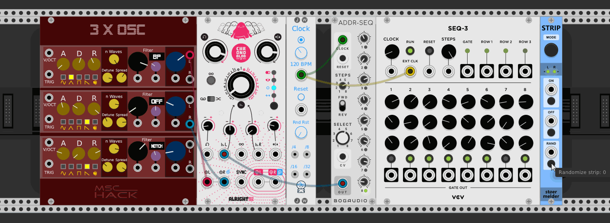
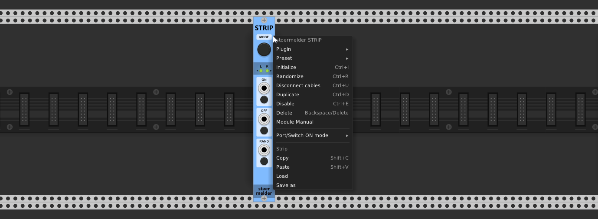
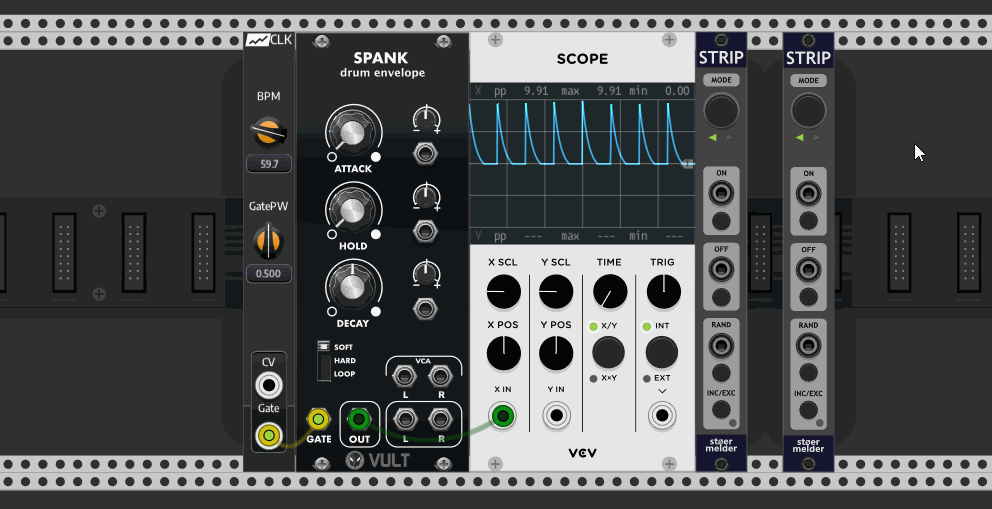

# stoermelder STRIP

STRIP is a module for managing a strip of modules. A "strip" is a group of modules formed in a single row of Rack without any empty spaces between them, directly next to STRIP on the left or right side. STRIP provides functionality to disable, to randomize and to save or load strips of modules. Copy and paste is possible, too.

STRIP uses Rack v1's expander-mechanism to traverse the modules in a group. Changing the modules in a strip is simply moving them a bit in Rack and creating an empty space between the rest of the modules. 

### MODE

STRIP can be configured which modules will be considered as managed. By default STRIP handles all modules left and right of itself, but the MODE-button allows you to toggle to left-only or right-only. Which modules are affected is shown by the LEDs next to the direction-triangles on the panel.

### ON, OFF, RAND

The sections ON, OFF and RAND provide CV control of options only available in the context menu of modules: ON and OFF triggers "Disable" with different modes, RAND triggers "Randomize". 

The modes for the ON-section are:

- Default: ON enables the modules, OFF disables the modules.
- Toggle: ON toggles enable/disable of the modules, OFF disables the modules.
- High/Low: ON in high-state (button pressed or voltage >=1V) enables the modules, ON in low-state (voltage <1V) disables the modules.

### Loading and saving, copying and pasting strips

A useful feature of STRIP is its ability to save strips to files and load them afterwards. This allows you to build blocks of modules for some purpose (e.g. synth voices, fx sections, mixer consoles) and reuse them later in a different patch or quickly clone them within the same patch.

All settings of the modules, all cables (with color) between modules within the strip and all parameter mappings (e.g. by VCV MIDI-MAP or stoermelder CV-MAP) are saved. Also, copy and paste is available, by option in the context menu or by using keyboard shortcuts Shift+sC and Shift+V. When using left-only or right-only mode only affected modules will be saved and loaded, even if a different mode was used for saving or copying. Existing modules will be moved right and left, respectively, to provide enough empty space for newly loaded or copied modules.

The file-format "vcvss" for storing strips is very close to Rack's own format for storing patches or module presets. Compatibility in future versions should be no problem as long Rack will be able to load preset files from older Rack versions.

This module was added in v1.0.4 of PackOne.