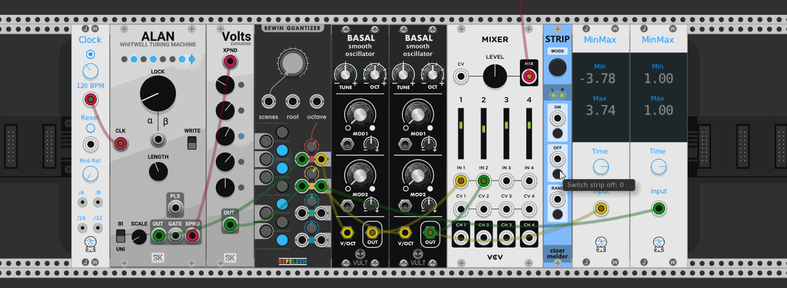

# stoermelder STRIP

(Added in v1.0.4) A module for disabling or enabling a group of modules using CV. A group of modules is formed in a single row without a space between them, directly attached left or right to STRIP. The module uses Rack v1's expander-mechanism to traverse the affected modules.

The ON-section can be configured through the context menu to enable only (Default) or to toggle On/Off.

