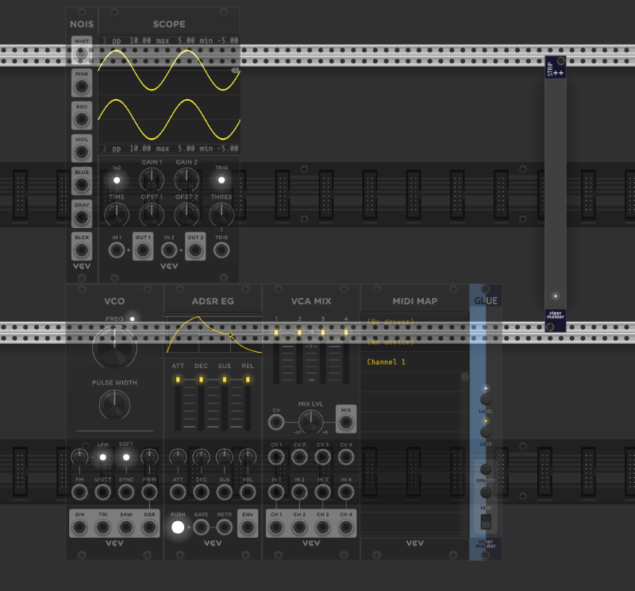
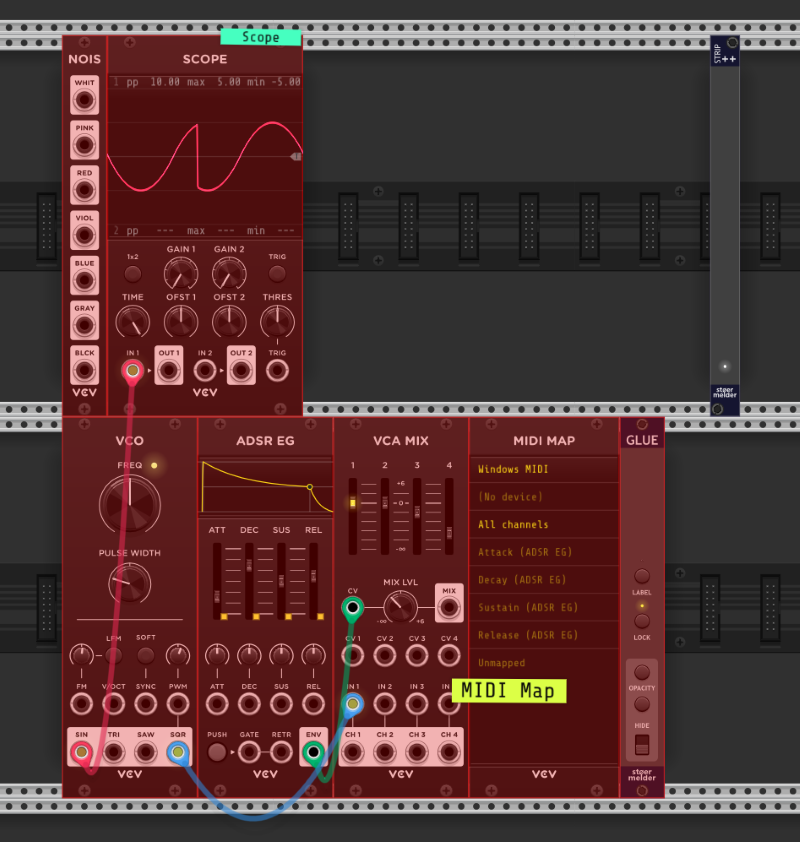

# stoermelder STRIP++

STRIP++ is a utility module for importing and pasting Rack selections while preserving parameter mappings and **[GLUE labels](Glue.md)**.

### How It Works

STRIP++ does not require its presence during saving — it works with any `.vcvs` file.

- Add STRIP++ to your patch.
- Right-click the module, select **Import** from the context menu, and choose your `.vcvs` file. Alternatively, trigger import via **Ctrl+Shift+B** hotkey.
- A semi-transparent preview of the selection will appear.
   - Move your mouse to determine placement.
   - Commit the import with a **left-click** or abort with a **right-click + Escape**.

- Import selections stored in the clipboard by selecting **Paste from Clipboard** from the context menu or pressing **Ctrl+Shift+V**.

STRIP++ functions solely as an import utility and can be removed after completing the operation.

## Changelog

- v2.0.0
    - Initial release of STRIP++