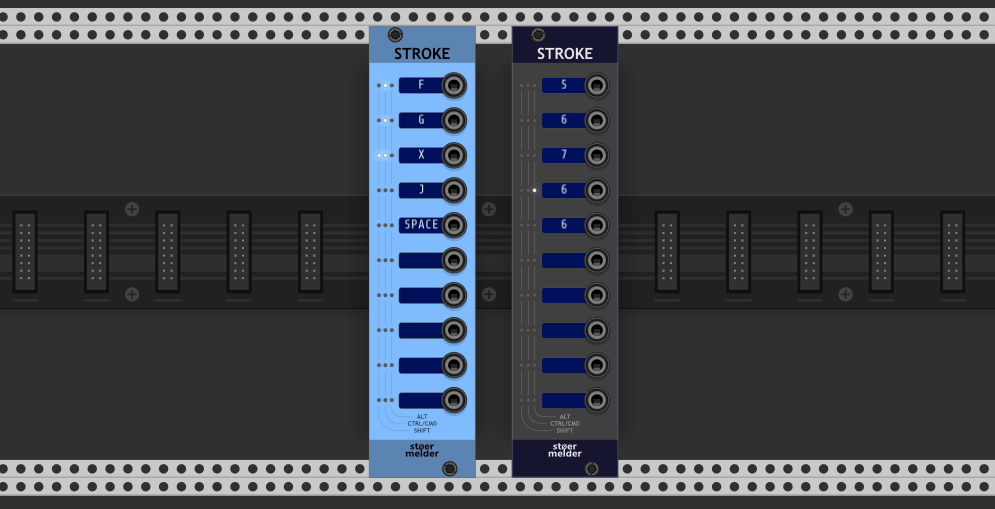
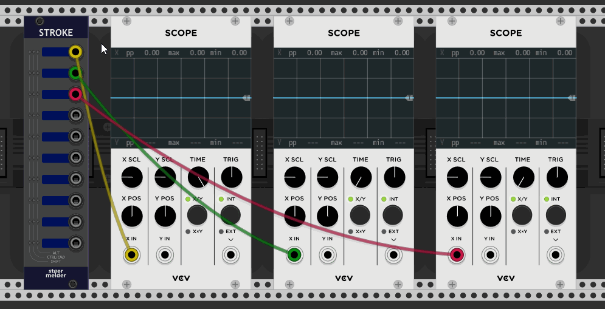

# stoermelder STROKE

STROKE is an utility module which converts any hotkey command (assuming it is not used anywhere else in Rack) into triggers or gates. Additionally, the module provides some special commands which aren't available anywhere else in Rack.

The module provides ten independent mapping slots which are unmapped by default. A slot needs to be "learned" for a hotkey using the context menu option "Learn". The currently assigned key is visible on the display and its modifiers (ALT, CTRL/CMD and SHIFT) on the LEDs.

The module also supports mouse-button events: If your mouse has more than three buttons these  can be mapped the same way as hotkeys, modifies apply also. Since v1.9.0 mouse-buttons left, right and middle can be mapped in STROKE if used in combination with modifiers.

## Output mode

- **Off**  
  The hotkey is cought by the module but no action is executed.
- **Trigger**  
  The hotkey generates a 10V trigger signal on the output port.
- **Gate**  
  The hotkey generates a 10V gate signal on the output port as long the key is pressed.
- **Toggle**  
  The hotkey toggles on and off a 10V signal on the output port.

## View commands 

- **Zoom to module**  
  Fits the module on the screen which is currently hovered by the mouse pointer.
- **Zoom to module (smooth)** (added in v1.9.0)  
  Same as "Zoom to module" but changes the view smoothly.
- **Zoom to module 1/3**  
  Centers the module on the screen which is currently hovered by the mouse pointer. The zoom level is adjusted in such way the module takes up one third of the screen height.
- **Zoom to module 1/3 (smooth)** (added in v1.9.0)  
  Same as "Zoom to module 1/3" but changes the view smoothly.
- **Zoom level to module**  
  Centers the module on the screen which is currently hovered by the mouse pointer. The zoom level can be user-defined in the context menu.
- **Zoom level to module (smooth)** (added in v1.9.0)  
  Same as "Zoom level to module" but changes the view smoothly.
- **Zoom out**  
  Zooms out the current view so that everything fits on the screen.
- **Zoom out (smooth)** (added in v1.9.0)  
  Same as "Zoom out" but changes the view smoothly.
- **Zoom toggle**  
  If the current zoom level is below 100% the view is zoomed out to fit everything, if the current zoom level is above 100% the module currently hovered is fit onto the screen.
- **Zoom toggle (smooth)** (added in v1.9.0)  
  Same as "Zoom toggle" but changes the view smoothly.

- **Scroll left, Scroll right, Scroll up, Scroll down** (added in v1.9.0)  
  Scrolls the current view in the specified direction, same as cursor keys.

## Parameter commands

- **Randomize**  
  Randomizes the value of a parameter. You need to hover the mouse pointer above a parameter before this command can be used.
- **Value copy**  
  Copies the value of a parameter. You need to hover the mouse pointer above a parameter (knob, fader, switch etc.) before this command can be used.
- **Value paste**  
  Pastes the value of a parameter which has been copied before. You need to hover the mouse pointer above a parameter before this command can be used.

## Module commands

- **Add module** (added in v1.9.0)  
  Adds a module with preset to the patch. Before this command can be used a module has to be "learned" by the option in the context sub-menu and pointing to a module. While learning a module is active the slot display turns red temporarily.

- **Send hotkey to module** (added in v1.9.0)  
  Works as a shortcut for sending any hotkey to a module in the current patch. For example you can send "Ctrl+R" (Randomize) to a module in the patch, even without hovering the mouse pointer over the module. Before this command can be used a module and a hotkey has to be "learned" by the options in the context sub-menu. While learning a module is active the slot display turns red temporarily.  
  Please note this is an experimental command and might not work with every module and any hotkey.

## Cable commands

- **Toggle opacity**  
  Toggles the opacity of all cables between 0% and the current opacity level. The slider in the "View" menu can be manally adjusted the undo this command.
- **Toggle visibilty**  
  Toggles the visibility of all cables. This command hides all cables internally and can only be undone using this module.
- **Next color**  
  Sets the color of an existing cable to the next color in Rack's cable color settings. You need to move the mouse cursor above a cable plug before this command can be used.
- **Color**  
  Sets the color of an existing cable to an user-defined color-code in hexadecimal format set in the context menu. You need to move the mouse cursor above a cable plug before this command can be used.
- **Rotate ordering**  
  Moves the next cable to the top of a stacked cable for a module's output plug. Stacked cables have an ordering which correspond to order the cables are plugged in. You need to move the mouse cursor above a cable plug before this command can be used.

## Special commands

- **Toggle framerate widget**  
  Rack has a built-in widget for displaying the current rendering frame in the top-right window corner. Using this command toggles the visibility.
- **Toggle busboard** (added in v1.8.0)  
  Hides the busboard graphics on the background.
- **Toggle engine pause** (added in v1.8.0)  
  Triggers the option in the menu Engine -> Sample rate -> Pause.
- **Toggle lock modules** (added in v1.8.0)  
  Triggers the option in the menu View -> Lock modules.

## Tips

- While you can assign duplicate hotkeys only one of them will work.

STROKE was added in v1.7 of PackOne.