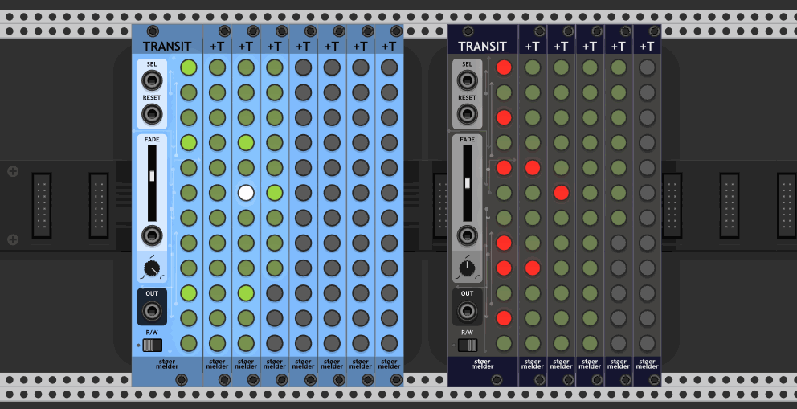
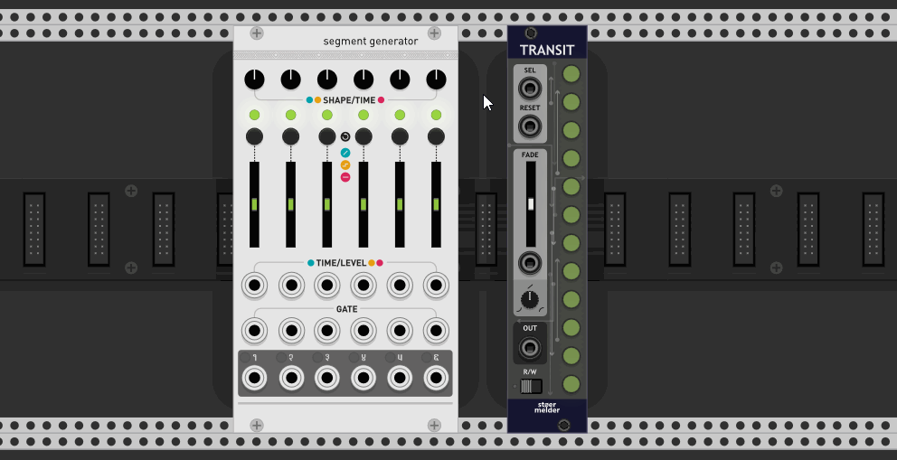
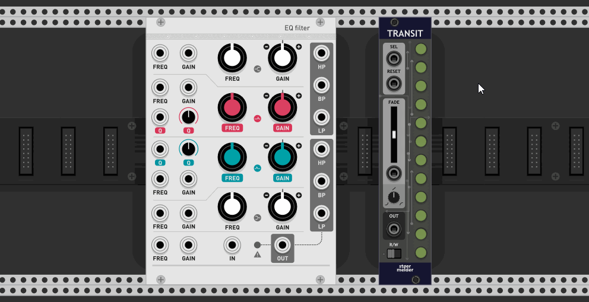
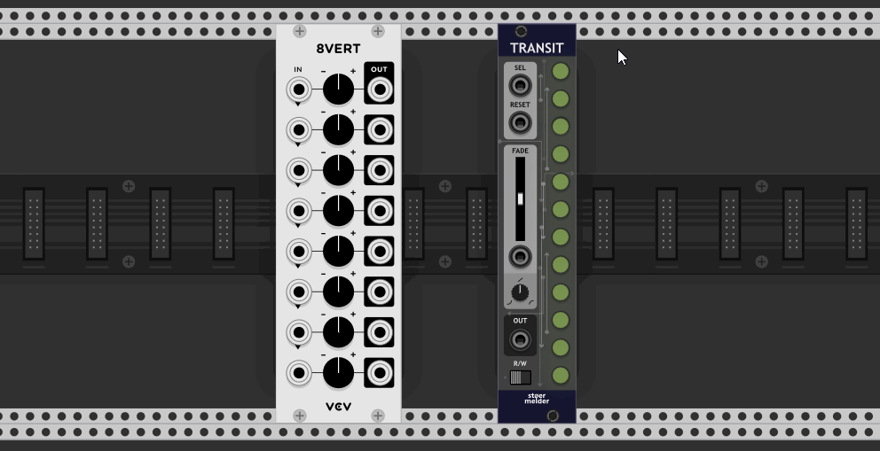
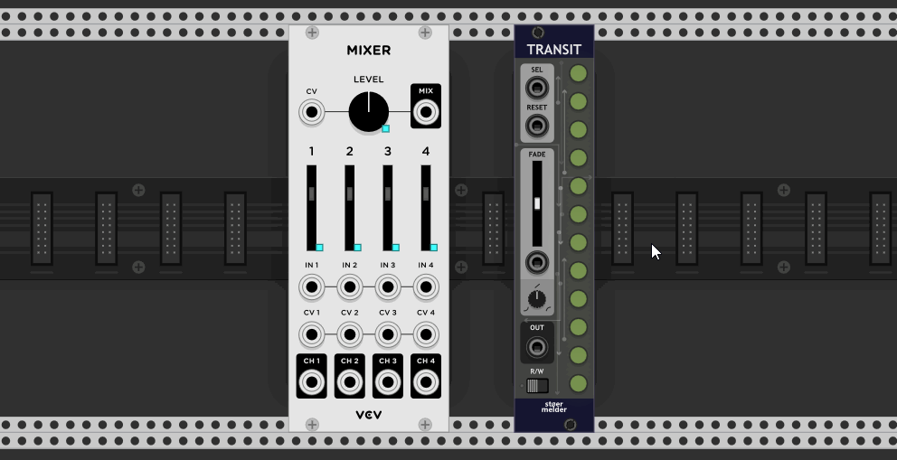
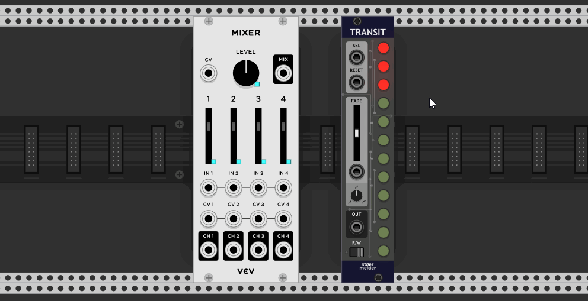
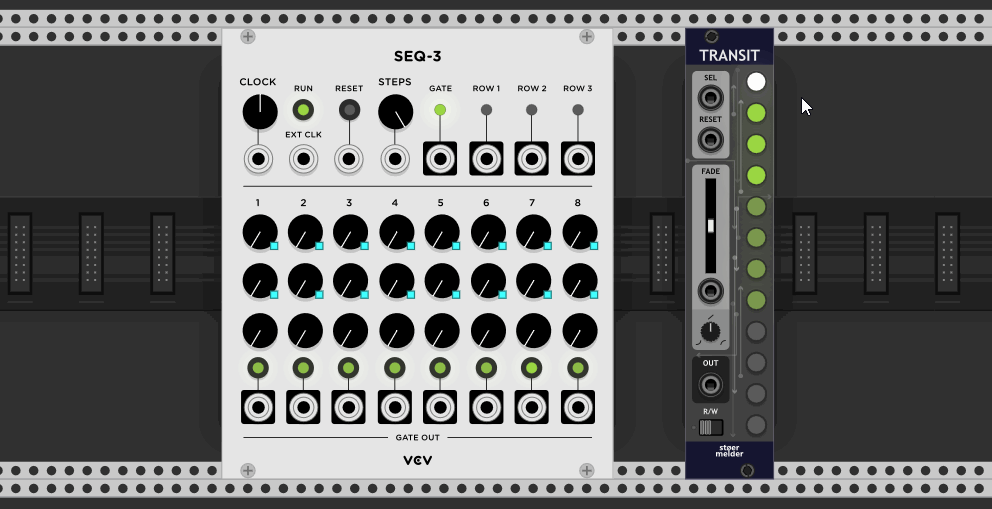
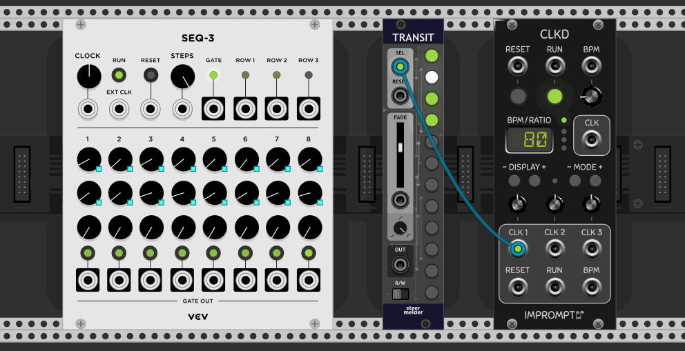
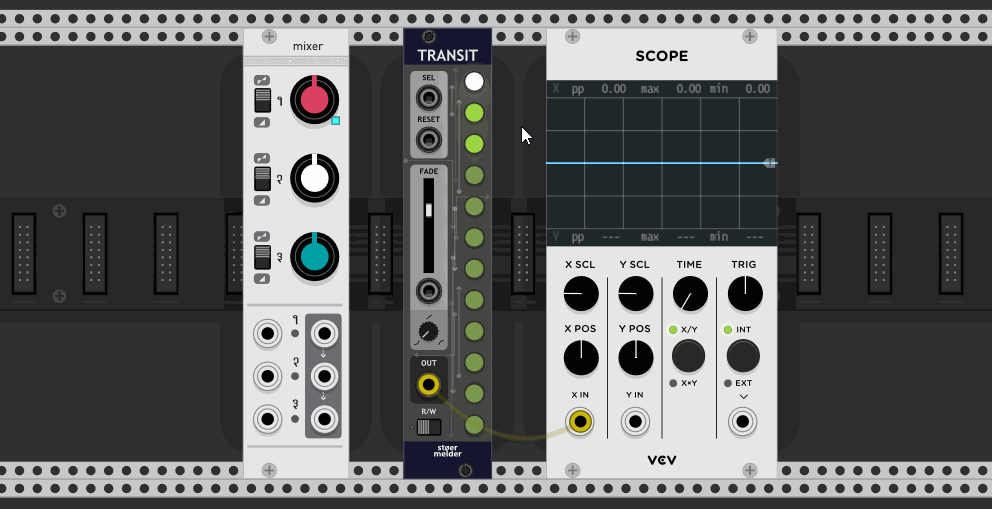
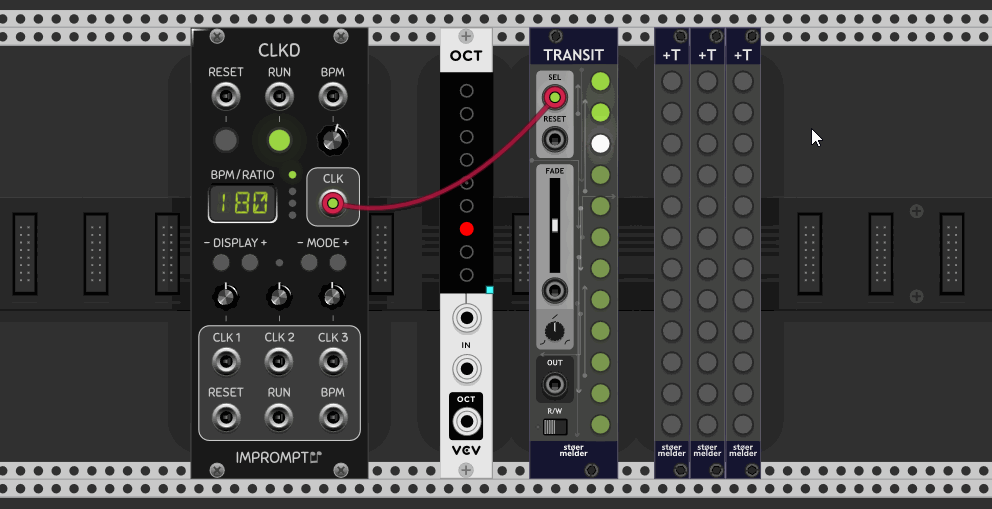

# stoermelder TRANSIT

TRANSIT is an utility module for morphing other module's parameters between one "snapshot" to another utilizing Rack's parameter-mapping functionality. The module provides 12 snapshot-slots and can be extended with up to seven extender-modules called +T.

There is a nice [video overview](https://www.youtube.com/watch?v=qnjBrlkcYOw) from [Artem Leonov](https://artemleonov.bandcamp.com/) of _VCV Rack Ideas_ showcasing a preview-build of TRANSIT.

## Binding parameters

At least one parameter (knob, fader, switch...) must be bound to TRANSIT before the module can be used. It provides multiple ways for binding one or more parameters which need to be enabled on the contextual menu:

- **Bind module (left)**  
  Place any module in Rack to the left of TRANSIT. By selecting _Bind module (left)_ all parameters of the module get bound by TRANSIT.

- **Bind module (select)**  
  Selecting _Bind module (select)_ turns the mouse pointer into a crosshair. After you click on the panel of a module all parameters of this module get bound by TRANSIT.

- **Bind single parameter**  
  Selecting _Bind single parameter_ turns the mouse pointer into a crosshair. After you click on a parameter of any module this parameter gets bound by TRANSIT.
- **Bind multiple parameters**  
  This mode works the same way as _Bind single parameter_ except the binding mode is not disabled automatically and multiple parameters can be bound in a row.

TRANSIT is designed to bind parameters from different modules the same time and technically there is no limitation on the number of parameters which can be bound. Please note that the CPU usage for morphing between snapshots increases linearly by the number of bound parameters.  
Parameters can be unbound at any point by unmapping the mapping indicator. Please note that values stored in snapshots won't be deleted for unbound parameters.

## Write-mode: saving snapshots

Write-mode is used to save snapshots in TRANSIT after some parameters have been bound: A snapshot consists of the values all bound parameters are currently set to. You enter write-mode by flipping the switch on the bottom to the _W_-position. To store a snapshot simply short press one of the 12 snapshot-buttons and the LED on a snapshot-button is lit in red when a slot is in use. To clear a snapshot long-press the button. 

There are also some options on the context menu of the snapshot-buttons:

- **Load** (also Shift+click)  
  Applies the snapshot to the parameters if the slot is used.
- **Clear**  
  Clears the snapshot.
- **Randomize and save**  
  Randomizes all bound parameters and saves a snapshot.
- **Copy**  
  Copies the snapshot to the clipboard.
- **Paste**  
  Pastes the snapshot which has been copied before.
- **Shift front** (added in v1.10.0)  
  Moves all snapshot one slot forward, beginning from the initiating slot. If the first slot is used it gets deleted.
- **Shift back** (added in v1.10.0)  
  Moves all snapshot one slot backward, beginning from the initiating slot. If the last slot is used it gets deleted, also the number of currently active slots is unaffacted.

A blinking white LED signals the snapshot applied at last on the parameters. Please keep in mind that you can change bound parameters manually which will not be recognized by TRANSIT.  
In write-mode any input on the SEL-port is ignored and sequencing is disabled.

## Read-mode: morphing between snapshots

Read-mode is the default operational mode of TRANSIT and is used to "load" or "apply" previously saved snapshots on the bound parameters. The interesting part of TRANSIT is its ability to "morph" the parameter values into the target snapshot: _FADE_ sets the amount of time it takes to reach the parameters' positions stored in the snapshot, this duration can also be controlled by CV (0-10V). There is also a trimpot for setting the shape of the transition, in the middle position the parameters are morphed linearly.

TRANSIT provides three precision-settings on the contextual menu which influence the CPU usage when morphing snapshots: Audio rate, lower CPU (1/8 audio rate, default) and lowest CPU (1/64 audio rate).

## Auto-mode

Auto-mode (added in v1.10.0) stores snapshots automatically to the current slot right before moving on to the next slot. A typical workflow would look like this: Store a few snapshots using Write-mode as usual. Afterwards flip the switch to the middle "A"-position and start slow sequencing using the _SLOT_-port. Imagine slot 1 is active and TRANSIT will begin  morphing into slot 2 next. Right before the transition starts the current state of the parameters is stored into slot 1 preserving all adjustments made in the meantime. In contrast, Read-mode would simply load slot 2 and the snapshot stored in slot 1 will stay unchanged, discarding all changes made to the parameters. Note: Empty slots will stay empty, even in Auto-mode.

## Sequencing and selecting snapshots

The fun begins when you use the port labelled _SEL_ for selecting snapshots by CV. Although there are 12 snapshot slots available it is possible to use less slots for sequencing: You can adjust the number of active slots (i.e. sequence length) by long-pressing a snapshot-button while in read-mode. The LEDs turn off completely for slots that are currently disabled.

Modes for _SEL_ on the contextual menu:

- **Trigger forward**  
  A trigger advances TRANSIT to the next snapshot. Empty slots are part of the sequence but won't have any effect on the bound parameters. A trigger on _RESET_ restarts the sequence on snapshot 1.
- **Trigger reverse**  
  Same as "Trigger forward" but reverse direction.
- **Trigger pingpong**  
  Same as "Trigger forward" but loops first forward then reverse.
- **Trigger alternating** (added in v1.8.0)  
  Same as "Trigger forward" but progresses in the following manner (for 6 active snapshots): 1, 2, 1, 3, 1, 4, 1, 5, 1, 6, 1, 5, 1, 4, 1, 3, 1, 2, ...
- **Trigger random**  
  Same as "Trigger forward" but chooses the next snapshot randomly.
- **Trigger pseudo-random** (added in v1.8.0)  
  Same as "Trigger random" but never chooses a snapshot multiple times in a row (which happens on "random").
- **Trigger random walk** (added in v1.8.0)  
  Same as "Trigger forward" but chooses the next snapshot randomly right next to the currently active snapshot.
- **Trigger shuffle** (added in v1.8.0)  
  Same as "Trigger forward" but works on a random permutation of the active snapshots: Every snapshot will be enabled once before the next permutation is randomly generated.
- **0..10V**  
  You can select a specific snapshot by voltage. A voltage 0-0.833V selects slot 1, 0.833-0.166V selects slot 2, and so on, if all 12 snapshot-slots are active. Keep in mind that adjusting the length of the sequence also adjusts the voltage range for selecting individual slots: A sequence with length 2 will select slot 1 on voltage 0-5V etc.
- **C4**  
  This mode follows the V/Oct-standard. C4 selects snapshot 1, C#4 selects snapshot 2 and so on. Channel 2 on the CV-input acts on triggers to re-trigger the currently selected snapshot.
- **Arm**  
  This mode is a kind of "buffered trigger": First apply a clock signal on _SEL_. Then you "arm" any snapshot manually or by MIDI-mapping by its button (resulting in a yellow LED) which will be activated on the next clock trigger (white LED). This mode allows you manual snapshot activation synchronized to a clock.

 - **Phase** (added in v1.9.0)  
   This mode behaves differently than the other modes: An input voltage of 0-10V scans continously through the stored snapshots. A voltage of 0V sets the parameters to the first snapshot, a voltage of 10V sets the parameters to the last active snapshot, in between the parameters are interpolated according to the used snapshots. Slew-limiting can be applied additionally using the _Fade_-slider.

## _OUT_-port

TRANSIT brings an _OUT_-port for different purposes:

- **Envelope**  
  Outputs an envelope-like shape of the fading-curve starting at 0V and ending at 10V.
- **Gate**  
  Outputs a 10V gate while a fade is in progress.
- **Trigger snapshot change**  
  Outputs a 10V trigger signal everytime a new snapshot-slot is selected.
- **Trigger fade start**  
  Outputs a 10V trigger on the start of every fade.
- **Trigger fade stop**  
  Outputs a 10V trigger on the end of every fade.
- **Poly**  
  Outputs a polyphonic signal combining all of the previous singals on the channels of the cable.

Note: These modes are unavailable if _SEL_-port operates in Phase-mode.

## +T expander

TRANSIT provides 12 snapshot-slots and supports extending this number with +T expanders: The expander must be placed on the right side of TRANSIT. Up to seven instances of +T can be added to one instance of TRANSIT, providing 12 * 8 = 96 snapshot-slots in total.  
Once placed next to TRANSIT the expander works and behaves the same way TRANSIT does and the setup is done analogously. +T itself provides no further options.

## Tips

- TRANSIT is designed to morph parameter-snapshots, while stoermelder [8FACE](./EightFace.md) and [8FACE mk2](./EightFaceMk2.md) are designed to apply different presets onto modues. Morphing between presets of modules is not possible because of technical reasons.

- If you set the _OUT_-port to _Trigger fade stop_ and patch _OUT_ into _SEL_ TRANSIT will endlessly fade snapshots.
  
- Each snapshot can be named with a custom text label. This label is shown while hovering above the snapshot button if parameter tooltips are enabled (added in v1.9.0).

## Changelog

- v1.7.0
    - Initial release of TRANSIT and +T
- v1.7.1
    - Fixed wrong snapshot-count when using +T expander after loading a patch
- v1.8.0
    - Fixed hanging pingpong-mode when changing slots manually
    - Added trigger-options "pseudo-random", "random walk", "alternating", "shuffle"
    - Fixed broken snapshots on save after mapped modules have been deleted (#205)
- v1.9.0
    - Added "Phase"-mode for CV-input which scans continously through snapshots (#182)
    - Added context menu option "Locate and indicate" for bound parameters
    - Added context menu option for custom text labels
    - Improved performance of +T expanders
- v1.10.0
    - Added context menu option for unbinding all bound parameters of a module (#268)
    - Added "Auto"-mode besides "Read" and "Write" (#269)
    - Added "Shift front" and "Shift back" context menu options (#274)