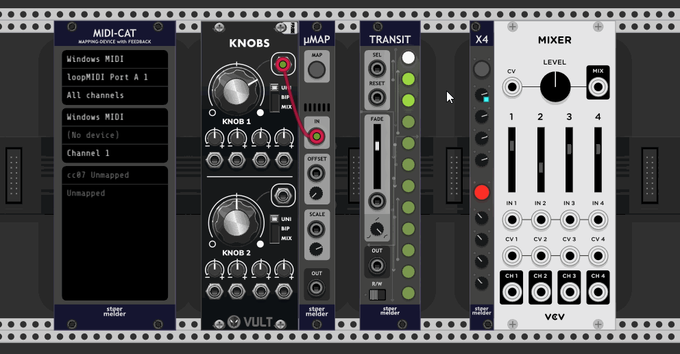

# stoermelder X4

X4 is an utility module for Rack's parameter mapping: It maps a parameter of any module and provides four "copies" as mappable knobs. A typical use-case would be automating a parameter using stoermelder [TRANSIT](./Transit.md) and still being able to control the same parameter using MIDI-mapping with VCV MIDI-MAP or stoermelder [MIDI-CAT](./MidiCat.md).

All mapping-knobs provide a _Read_-option on the context menu: If disabled the knob will ignore "incoming" parameter changes and just "send" any parameter changes, the knob behaves like [CV-PAM](./CVMap.md) in this case. This can be useful if you want to send MIDI-feedback using MIDI-CAT without receiving MIDI messages.

Mapping many parameters can result in quite high CPU usage. If automation at audio rate is needed you can enable "Audio rate processing" on the context menu: By default only on every 32th audio sample of every mapped parameter is updated and the CPU usage is reduced to about a 32th.

X4 was added in v1.7.0 of PackOne.