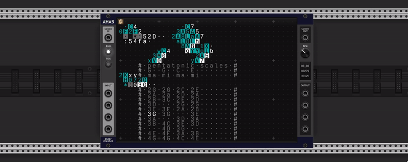
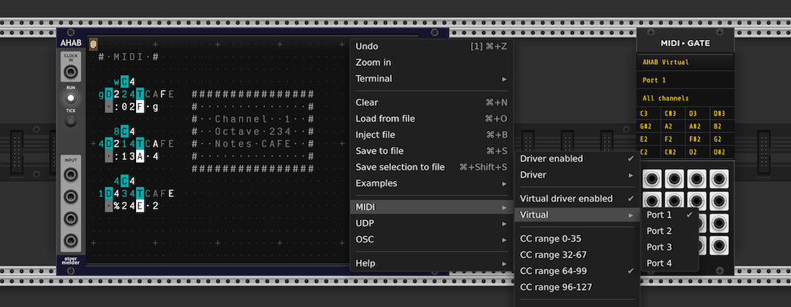
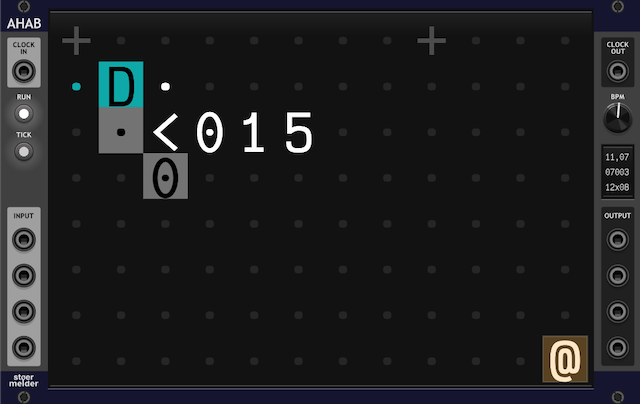
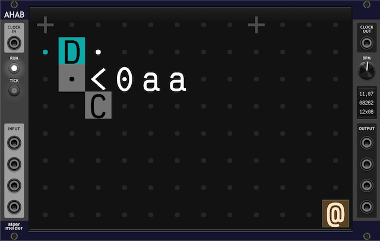
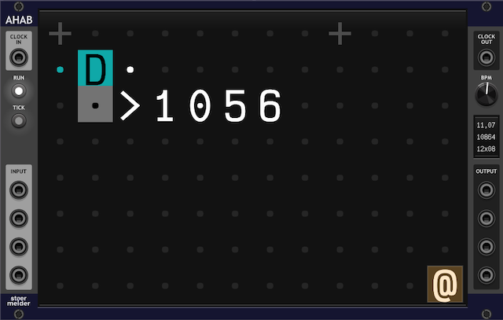
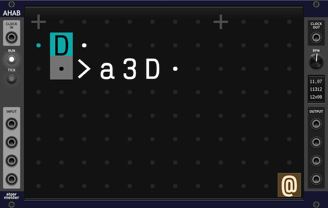

# stoermelder AHAB

AHAB is a port of the [ORCA-C](https://github.com/hundredrabbits/Orca-c) project into a VCV Rack module.

AHAB is a livecoding sequencer based on [ORCA](https://github.com/hundredrabbits/Orca). Create patterns and melodies by typing characters into a grid. Every letter is an operator with its own function — build sequences by chaining them together.

**Getting started**  

- Type characters in the field and build rhythmic or melodic patterns. Examples from the ORCA tutorial are embedded in the module and are available on the context menu - they are a great place to start. 
- The primary way to get musical data out of AHAB is via MIDI: AHAB can send MIDI to both one driver output and one of four virtual ports. The virtual ports must be enabled on the context menu before they can be used in other MIDI-capable modules. Use the operators `:` (MIDI note), `!` (MIDI CC) or `?` (MIDI pitchbend) to control synths and other modules.
- Use the Run button or the spacebar to start and stop the engine. 
- Please make sure to enable the option *Show tooltips* in VCV Rack's View menu - this will show a brief description of each operator when you hover over it.

**Resources**  

- https://metasyn.srht.site/learn-orca
- https://100r.co/media/content/projects/zine_orca.png
- https://100r.co/site/orca.html
- https://github.com/hundredrabbits/Orca

### CV operators `<` and `>`

AHAB provides two custom operators for reading/writing CV values. Both operators need a *bang* to update their output.

- **CV Read-operator `<`** — Use `<` to read values from the module's 4 input jacks.
  - `<1`, `<2`, `<3`, `<4` — Read numeric CV (0-10V mapped to 0-35)
  - `<a`, `<b`, `<c`, `<d` — Read pitch CV (V/Oct, outputs semitone mod 12)

This reads from input 1 and scales the value to a range of 0–5, which is mapped to the voltage range 0-10V. If input is 2V, the operator output will be 1.

This reads from input 1 (addressed as `a`) and outputs the note name for the corresponding V/Oct voltage. Octave and cents are ignored.

- **CV Write-operator `>`** — Use `>` to send values from the pattern to the module's 4 output jacks.
  - `>1`, `>2`, `>3`, `>4` — Write numeric CV (value in range 0-35 maps to 0-10V)
  - `>a`, `>b`, `>c`, `>d` — Write pitch CV (value is semitone, e.g., `>a3` outputs D3 in V/Oct)

This writes to output 1 and scales the value 5 to a range of 0-6, which is mapped to the voltage range 0-10V. In this case, output 1 will be 8.33V.

This writes to output 1 (addressed as `a`) a V/Oct pitch voltage of D3 (third octave D).

### "pending bang" operator `+`

AHAB has a third custom operator `+`, which can be placed to create a manual *bang*. For technical reasons ORCA-C has no support for the *bang* operator `*`, and so does AHAB.

### Feature Comparison

AHAB has some features not found in the original ORCA/ORCA-C:

- The simulation can be triggered by an external clock signal, using the _Clock In_ port. This allows you to drive the simulation even by non-evenly spaced clock sources.

- The copy/paste clipboard is shared across all AHAB instances in your Rack. You can copy/cut from one AHAB module and paste into another. You can save the content of the clipboard to a text file and save it as an ORCA file.

- Operators `<` and `>` let you read from and write to the module's CV ports.

- The usable MIDI CC range can be configured in the context menu, allowing you to use a range different from 64-99, as in ORCA-C.

- If tooltips are enabled in Rack's settings, hovering over operators will show a brief description and their input/output configuration.

Features missing in AHAB compared to ORCA:

- The operator `$` (commander) is not available, as it is not in ORCA-C.

- Hotkey Ctrl/Cmd+`P` to trigger the operator at the cursor is not available, as ORCA-C does not support this feature. AHAB has a special "pending bang" operator `+`, which will give you a similar result, when placing next to an operator.

### Keyboard Shortcuts

| Shortcut | Action |
|---|---|
| Space | Toggle run/stop |
| Backspace | Clear selected cells |
| Ctrl/Cmd + `Z` | Undo |
| Ctrl/Cmd + Shift + `Z` | Redo |
| Ctrl/Cmd + `N` | Clear entire field |
| Ctrl/Cmd + `O` | Load file |
| Ctrl/Cmd + `B` | Inject file at cursor |
| Ctrl/Cmd + `I` | Toggle insert mode (cursor moves right after typing) |
| Ctrl/Cmd + `A` | Select all |
| Ctrl/Cmd + `C` | Copy selected cells to clipboard |
| Ctrl/Cmd + `X` | Cut selected cells to clipboard |
| Ctrl/Cmd + `V` | Paste clipboard at cursor |
| Ctrl/Cmd + `F` | Run simulation for one frame |
| Ctrl/Cmd + Shift + `7` | Toggle comment block around selection |
| Ctrl/Cmd + Shift + `R` | Reset frame counter to zero |
| Arrow keys | Move cursor and selection |
| Shift + Arrow keys | Expand selection |
| Alt + Arrow keys | Move selected cells |
| Ctrl/Cmd + Arrow keys | Move by grid step (rows/cols) |
| Escape | Collapse selection to cursor |
| `{`, `}` | Decrease/increase grid step rows |
| `[`, `]` | Decrease/increase grid step columns |

## Changelog

- v2.3.0
    - Initial release of AHAB
- v2.4.0
    - Added gate length as a parameter for operator `>` in note mode (#420)
    - Added reset input for tick counter (#429)
    - Added "pending bang" operator `+` (#427)
    - Fixed crash on operator `<` when using whithout maximum value set (#425)