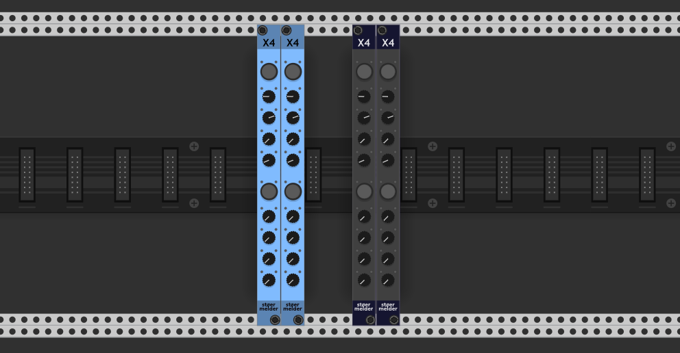
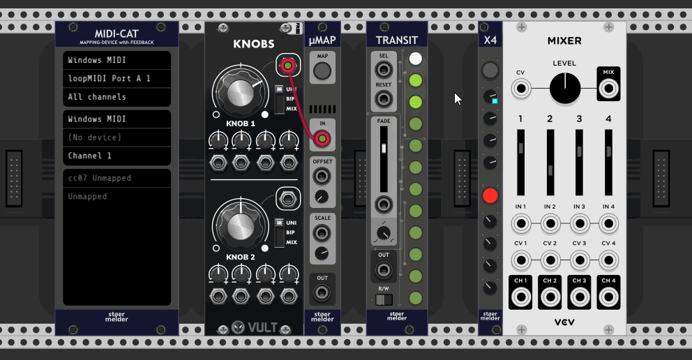

# stoermelder X4

X4 is a utility module designed for Rack's parameter mapping. It allows you to map a single parameter from any module and provides **four separate, mappable knobs** for controlling it. This is particularly useful for automating parameters using stoermelder [TRANSIT](../transit/Transit.md) while also enabling manual control via MIDI mapping with VCV MIDI-MAP or stoermelder [MIDI-CAT](../midicat/MidiCat.md).

Each of the four knobs is mapped to the same parameter.

The _Read_-option in the context menu allows you to control whether the knob **receives** parameter changes or **only sends** them. If disabled, the knob will ignore incoming parameter changes and act purely as a controller (similar to [CV‑PAM](./CVPam.md)). This is particularly useful if you want to send **MIDI feedback** using MIDI-CAT without receiving MIDI messages.

Mapping multiple parameters can increase CPU usage. Enable _Audio rate processing_ in the context menu if you require audio-rate automation. By default, parameter updates are processed only every 32nd audio sample, reducing CPU usage to approximately 1/32 of the original load.

By default, parameter changes are not reported back to the plugin host when using X4 in a plugin version of VCV Rack. In v2.2.0, an option was added to the context menu to enable this behavior. However, enabling it may increase plugin CPU usage.

## Changelog

- v1.7.0
    - Initial release
- v1.7.x
    - Fixed advancing to the lower button after the upper button has been mapped
    - Fixed wrong tooltip of lower mapping button
- v2.2.0
    - Added context menu option to report parameter updates to plugin-host (plugin-version option)