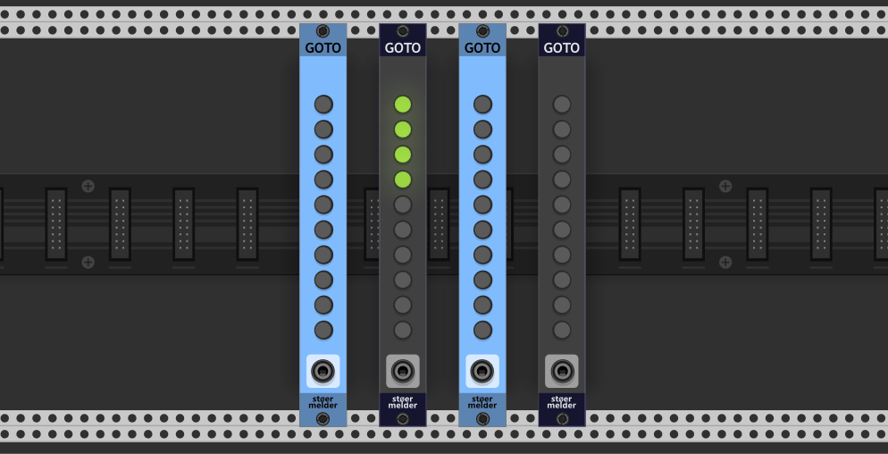
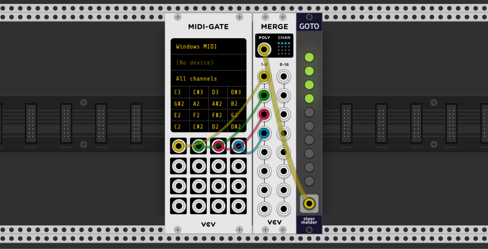
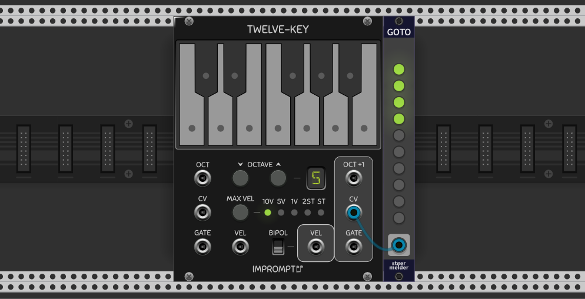

# stoermelder GOTO

GOTO is a utility module that moves the current viewport of VCV Rack to interesting locations in your patch. Up to 10 jump points can be recalled using key combinations Shift+1, Shift+2, … Shift+0, or via CV.

Each jump point of GOTO is bound to a specific module or a selection of modules in your patch. Already used jump points are lit in yellow and can be cleared by long-pressing the button again. The current zoom level is also saved and recalled when a jump point is activated.

### Jump Points

- **LED off** - The button is unassigned/empty
- **Red LED** - The button is learning mode
- **Yellow LED** - The button has an active jump point assigned
- **Long-press** - Hold a button to enter binding mode (for a single module) or to clear an assigned jump point

There are two ways to bind a jump point to module(s):

- **Method 1: Long Button Press + Click** - Long-press one of the inactive buttons to enter binding mode. Only one module can be bound by this method.

- **Method 2: Context Menu Selection** - Select one or more modules in your patch (they will be highlighted in red). Right-click on a jump point button and select "Learn current selection" to bind all selected modules to that jump point.

The option _Jump position_ in the context menu determines where the viewport is positioned when a jump point is activated:

- **Module centering** - The bound module(s) are centered on the screen
- **Module top left** - The bound module(s) are moved to the top-left corner of the viewport

### CV Control

The _INPUT_ port allows triggering jump points via control voltage, which is especially useful with MIDI modules like MIDI-CV, MIDI-GATE, or MIDI-CC. As long as a cable is connected to the port, the hotkeys Shift+1..0 are deactivated.

There are two modes available:

- **Polyphonic trigger** (default) - The first ten channels of a polyphonic cable are used to trigger jump points 1–10. A trigger on channel 1 jumps to point 1, channel 2 jumps to point 2, etc.

- **C5-A5** - The input port is treated as monophonic, and voltages from C5 to A5 (1.00 V–1.83 V in V/Oct notation) trigger jump points 1–10. The module reacts to every change in input voltage.

### Tips

- **Smooth transition** - By default the viewport jumps directly to the bound module(s). Enabling this option moves the viewport smoothly to the new position, which may increase graphical processing load.
- **Ignore zoom level** - By default GOTO recalls the zoom level at binding time. Enabling this option keeps the current zoom level unchanged when jumping.

## Changelog

- v1.6.0
    - Initial release
- v1.7.0
    - Added support for number pad keys (#134)
- v2.0.0
    - Added "top left" as a module reference point for jump destination
    - Removed setting "Center module" as the disabled state did not work correctly
    - Fixed crash on patch-loading inside Rack VST (#342)
    - Fixed broken zoom behavior when jumping by buttons on the panel
- v2.2.0
    - Jump-points can be multiple modules/a selection instead of a single module
