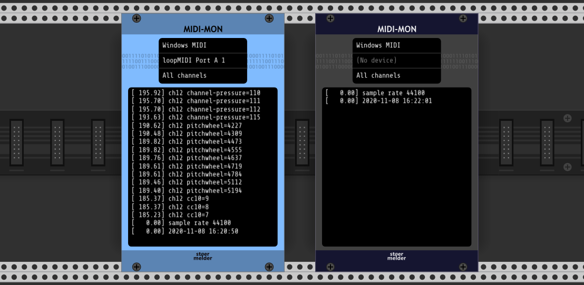

# stoermelder MIDI-MON

MIDI-MON is a utility module for monitoring MIDI messages. Also export as text-file is available.

## Usage

Each log entry is prefixed with a timing indicator in square brackets. By default this shows elapsed time in seconds (e.g. `[  12.3456]`). Enable **Show engine frame** in the context menu to switch to engine frame numbers instead — only the last 6 digits are shown (zero-padded, wrapping every ~20 seconds at 48 kHz) so that fast-changing timing differences between events are immediately visible (e.g. `[034567]`). The full frame number is always written to the exported log file.

## Changelog

- v1.8.0
    - Initial release
- v1.9.0
    - Added support for more message types (program change, song select, song pointer)
    - Added context menu option for clearing the log
- v2.0.0
    - Added support for SysEx messages
    - Added support for CC 14-bit/RPN/NRPN messages
    - Reduced CPU usage
- v2.4.0
    - Added option to display engine frame instead of timestamp