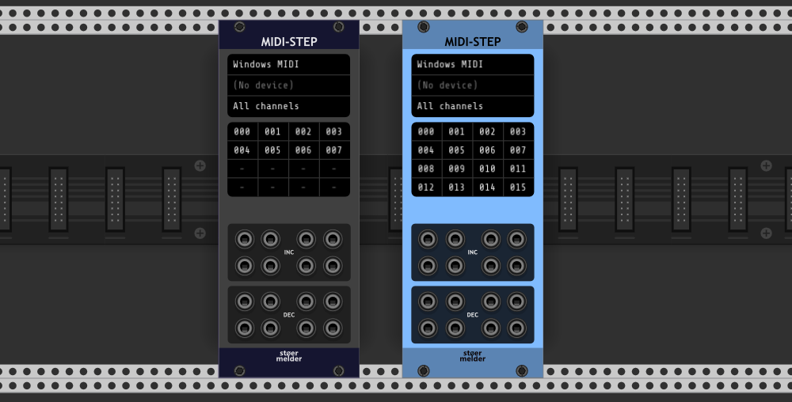
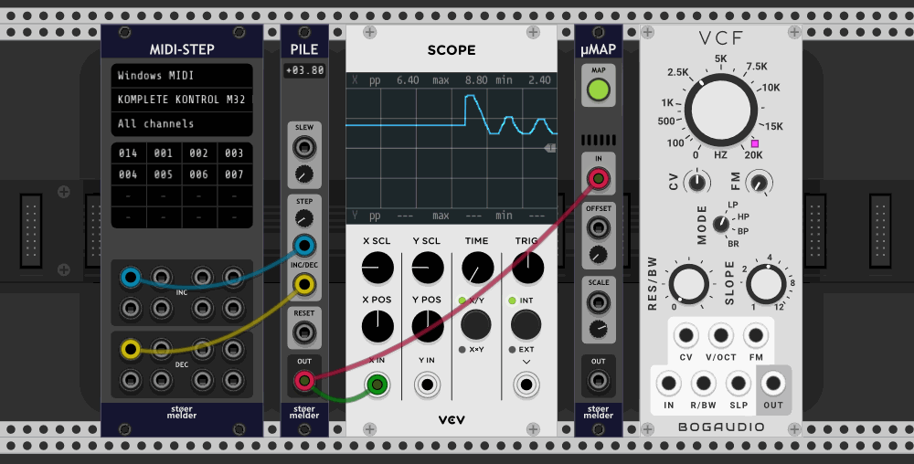
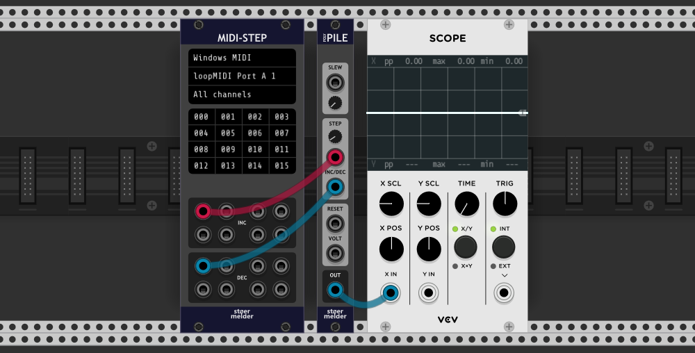
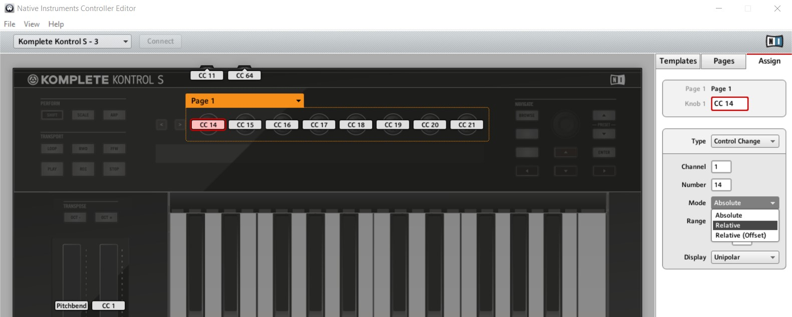
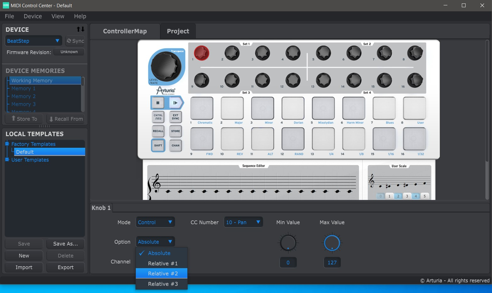
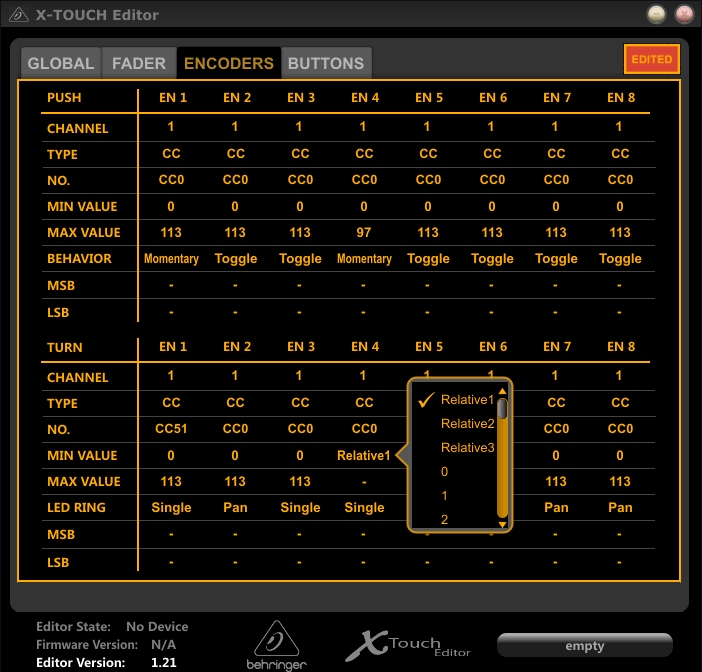
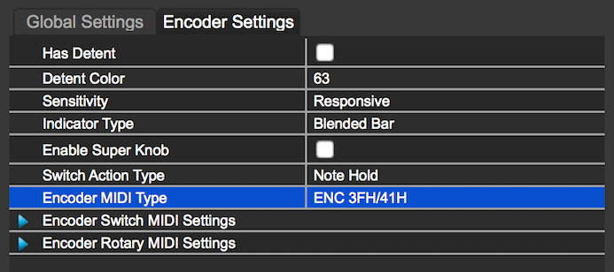
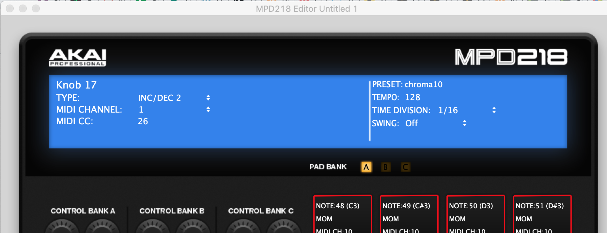

# stoermelder MIDI-STEP

MIDI-STEP is a module intended for relative MIDI protocols of endless rotary knobs found on some hardware MIDI controllers. The module outputs triggers on _INC_ or _DEC_ for every knob-twisting.

The module is similar to the VCV MIDI‑CC module and receives up to eight different MIDI CC numbers in default mode and up to sixteen in polyphonic mode. Every MIDI CC message is interpreted according to the selected hardware protocol, and one or more short triggers are sent on the _INC_‑port (increment, increased value) or DEC‑port (decrement, decreased value).

In polyphonic mode (added in v1.6.0) all triggers are sent on the first ports (top left) of the _INC_‑ and _DEC_‑sections using a polyphonic connection. This mode is especially useful together with [POLY‑PILE](../pile/Pile.md), which converts up to sixteen channels into absolute voltages.

### Tested hardware controllers

I don't own all of following devices so I can provide only limited supported for setup and correct function. They have been tested successfully by users though. Feel free to contact me if you have a MIDI controller with endless rotary knobs which do not work with one of the existing relative protocols.

- **Native Instruments controllers** - You have to change the assigned "Control Change" mode to "Relative" using the "Controller Editor" software.

- **Arturia Beatstep and Beatstep Pro** - These controllers support three different relative protocols that can be configured in the "MIDI Control Center" software. Currently only "Relative #1" and "Relative #2" are supported. "Relative #1" provides more precision when rotating knobs at different speeds.

- **Behringer X‑TOUCH Mini** - The controller supports three different relative protocols that can be configured with the "X‑TOUCH Editor" software. Currently only "Relative1" is supported.

- **DJ Tech Tools Midi Fighter Twister** - Set the "Encoder Type" to "ENC 3FH/41H" in the MidiFighter Utility.

- **Akai MPD218** - Set the knob's "TYPE" to "INC/DEC 2" in the MPD218 Editor.

- **Hercules DJControl Starlight** – This controller supports a single relative protocol that can be enabled in the DJControl software.

## Changelog

MIDI‑STEP was introduced in v1.5 of PackOne.