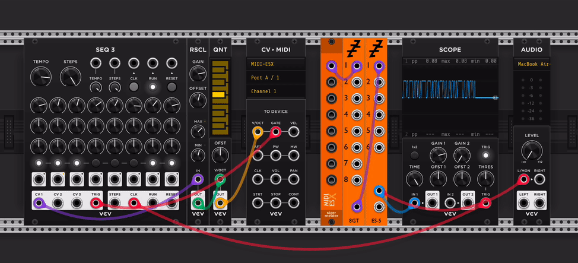

# stoermelder MIDI-ESX

MIDI-ESX converts MIDI messages into a binary audio signal that can be sent to external Expert Sleepers Eurorack hardware modules. It provides essentially the same functionality as Expert Sleepers' VCV Rack module [CV To MIDI](https://library.vcvrack.com/ExpertSleepers-SilentWay/ExpertSleepers-SilentWay-CVToMIDI), but supports all MIDI message types and multiple MIDI channels per port.

A basic setup looks like this:

This software/hardware setup lets an Expert Sleepers ESX-8GT act as a MIDI interface that is sample-accurate and shares the same latency as your audio interface.

### How to use

1. Place **MIDI-ESX** in your patch.
2. Enable the driver from the module's context menu: right-click the module and toggle _Driver active_ if it is not already on.
3. Select the desired _Port group_ (A–D) from the context menu — this determines which virtual ports the module listens to.
4. Add an [Expert Sleepers 8GT](https://library.vcvrack.com/ExpertSleepers-Encoders/ExpertSleepers-Encoders-8GT) module and connect one of its input ports to an output of MIDI-ESX. The 8GT module mirrors the hardware ports of an [ESX-8GT](https://www.expert-sleepers.co.uk/esx8gt.html).
5. Add an [Expert Sleepers ES-5](https://library.vcvrack.com/ExpertSleepers-Expanders/ExpertSleepers-Expanders-ES5) module and patch the 8GT output to one of the ES-5 inputs. To use the eight output ports on ES-5 hardware, use input 1 on the ES-5 software module. Inputs 2–5 on the ES-5 software module correspond to additional ESX-8 expanders; you can connect up to five expanders to one [ES-5 hardware module](https://www.expert-sleepers.co.uk/es5.html).
6. Add a MIDI module of your choice and select the **MIDI-ESX** driver. Choose the same port group you selected in step 3 and the output port number that corresponds to the MIDI-ESX output (top to bottom).
7. Connect the output of ES-5 to an Audio module with an audio interface that is connected to your Expert Sleepers hardware.
8. Connect your hardware module to your synthesizer or other MIDI-capable gear. Please note that special MIDI cables are required to connect Expert Sleepers modules to standard MIDI gear — these are neither Type A nor Type B; see Expert Sleepers [webpage](https://www.flickr.com/photos/expertsleepers/albums/72157627543887181/)! Alternatively, the [ESX-8MD expander](https://www.expert-sleepers.co.uk/esx8md.html) module is another option (untested).

Please refer to the Expert Sleepers [documentation](https://www.expert-sleepers.co.uk/esx8gt.html) for more information on setting up and using their hardware modules or other possible module combinations (ES-4, ES-8, ES-9 etc.).

### Tips & Troubleshooting

- Currently only a sample rate of 48 kHz is supported. MIDI-ESX will not produce any output on other sample rates.

- If there is no activity: ensure _Driver active_ is enabled and that your MIDI device is connected and sending data.

- If no MIDI reaches your hardware: confirm you selected the correct _Port group (A–D)_.

- Use the encoded MIDI outputs only with devices or modules that explicitly support encoded MIDI, like Expert Sleepers modules; connecting them to arbitrary audio/CV inputs will not produce useful results.

## Changelog

- v2.4.0
    — Initial release
- v2.6.0
    - Ignore incoming MIDI messages while module is bypassed