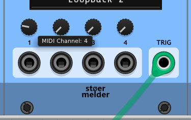

# stoermelder MIDI-KIT

MIDI-KIT is a scripting module for altering, filtering, delaying, or generating MIDI messages. It bundles two scripting engines — a full JavaScript engine (QuickJS) and a small subset of Lua — so you can pick whichever language you are more comfortable with.

## How it works

MIDI-KIT provides two interchangeable scripting engines. Both expose the same `midi` / `midiOut` / `input` / `trig` / `param` / `number` / `rack` API described further down, so the only thing that differs between them is the language syntax and a few language-specific details.

| Engine | Language | Underlying interpreter |
| ------ | -------- | ---------------------- |
| **JavaScript** | Full JavaScript (ES2020) | [QuickJS](https://bellard.org/quickjs/) |
| **Lua**        | A small subset of Lua 5.x    | [MiniLua](https://github.com/edubart/minilua) (bundled) |

Neither engine is optimized for raw performance, but MIDI events are typically sparse compared to audio/DSP processing and the engines are adequate for most MIDI scripting tasks.

The active engine is chosen by a header tag at the top of the script.

JavaScript:
```
/**
 * @engine QuickJs
 */
```
(`@engine QuickJs` is also the default — JavaScript is assumed when no `@engine` tag is present.)

Lua:
```
--[[
@engine Lua
--]]
```

The header is parsed line-by-line and may also be used to set `@author` and `@description` metadata, which is shown in the module's log on load.

MIDI-KIT is event-driven: it runs only when a MIDI message arrives on the selected MIDI input, or a trigger arrives on the CV trigger input (`rack.onTrigger`). The scripting API lets you create new MIDI messages; a single incoming event may result in up to 32 outgoing messages. Incoming MIDI messages are not passed through automatically — scripts must explicitly call `midiOut.send()` to forward messages.

The module also exposes four CV inputs and four panel parameters that can be read from scripts to add modulation or dynamic configuration.

You can use MIDI-KIT as an insert effect via VCV Rack's built-in MIDI Loopback driver. This lets you process incoming messages before they reach other MIDI modules (for example, MIDI‑CC, MIDI‑CV, MIDI‑MAP, or MIDI‑CAT), and likewise process outgoing messages.

## Examples

**Note:** Channels are 1..16, parameter and input indices are 1..4. The main entry point is `rack.onMidiMessage(midiPort, msg)`; in this version `midiPort` is always *1*.

### Basic pass-through
The script passes all incoming MIDI messages to the default MIDI output port.

JavaScript:
```js
rack.onMidiMessage = function(midiPort, msg) {
   midiOut.send(msg);
};
```

Lua:
```lua
rack.onMidiMessage = function(midiPort, msg)
   midiOut.send(msg)
end
```

### Simple MIDI filter
The script drops all incoming MIDI messages except for MIDI channel 2. Messages without a channel field (like MIDI clock) will also be dropped.

JavaScript:
```js
rack.onMidiMessage = function(midiPort, msg) {
   if (midi.getChannel(msg) === 2) {
      midiOut.send(msg);
   }
};
```

Lua:
```lua
rack.onMidiMessage = function(midiPort, msg)
   if midi.getChannel(msg) == 2 then
      midiOut.send(msg)
   end
end
```

### MIDI channel routing for CC messages
The script routes incoming CC messages on MIDI channel 2 to MIDI channel 3. All other messages are passed-through unchanged.

JavaScript:
```js
rack.onMidiMessage = function(midiPort, msg) {
   if (midi.isCc(msg) && midi.getChannel(msg) === 2) {
      midi.setChannel(msg, 3);
   }
   midiOut.send(msg);
};
```

Lua:
```lua
rack.onMidiMessage = function(midiPort, msg)
   if midi.isCc(msg) and midi.getChannel(msg) == 2 then
      midi.setChannel(msg, 3)
   end
   midiOut.send(msg)
end
```

### Dynamic MIDI channel routing for CC messages by knob (1)
The script routes incoming CC messages on MIDI channel 2 to a MIDI channel set by parameter 1 on the panel. All other messages are passed-through unchanged.

JavaScript:
```js
param.enable(1);

rack.onMidiMessage = function(midiPort, msg) {
   if (midi.isCc(msg) && midi.getChannel(msg) === 2) {
      let ch = Math.ceil(param.getValue(1) * 16);
      midi.setChannel(msg, ch);
   }
   midiOut.send(msg);
};
```

Lua:
```lua
param.enable(1)

rack.onMidiMessage = function(midiPort, msg)
   if midi.isCc(msg) and midi.getChannel(msg) == 2 then
      local ch = math.ceil(param.getValue(1) * 16)
      midi.setChannel(msg, ch)
   end
   midiOut.send(msg)
end
```

### Dynamic MIDI channel routing for CC messages by knob (2)
The script handles MIDI messages like the previous example, but MIDI-KIT provides additional programming interface for user interface configuration: `param.getName` configures the text "MIDI Channel" for the tooltip of the first panel parameter, the display value is scaled to the integer range 1..16 by `param.getValueFormat`.

JavaScript:
```js
param.enable(1);

param.getName = function(port) {
    if (port === 1) return "MIDI Channel";
    return "";
};

param.getValueFormat = function(port) {
    if (port === 1) return number.toString(Math.ceil(param.getValue(1) * 16));
    return number.toString(param.getValue(port));
};

rack.onMidiMessage = function(midiPort, msg) {
   if (midi.isCc(msg) && midi.getChannel(msg) === 2) {
      let ch = Math.ceil(param.getValue(1) * 16);
      midi.setChannel(msg, ch);
   }
   midiOut.send(msg);
};
```


Lua:
```lua
param.enable(1)

param.getName = function(port)
    if port == 1 then return "MIDI Channel" end
    return ""
end

param.getValueFormat = function(port)
    if port == 1 then return number.toString(math.ceil(param.getValue(1) * 16)) end
    return number.toString(param.getValue(port))
end

rack.onMidiMessage = function(midiPort, msg)
   if midi.isCc(msg) and midi.getChannel(msg) == 2 then
      local ch = math.ceil(param.getValue(1) * 16)
      midi.setChannel(msg, ch)
   end
   midiOut.send(msg)
end
```

### Send NRPN message

JavaScript:
```js
rack.onMidiMessage = function(midiPort, msg) {
   if (midi.isNoteOn(msg)) {
      let nrpn1 = midi.createNRPN();
      midi.setNRPN(nrpn1, 1, 12345, 13456);
      midiOut.send(nrpn1);
   }
};
```

Lua:
```lua
rack.onMidiMessage = function(midiPort, msg)
   if midi.isNoteOn(msg) then
      local nrpn1 = midi.createNRPN()
      midi.setNRPN(nrpn1, 1, 12345, 13456)
      midiOut.send(nrpn1)
   end
end
```

### Send SysEx message

JavaScript:
```js
rack.onMidiMessage = function(midiPort, msg) {
   if (midi.isNoteOn(msg)) {
      let sysex = midi.create();
      midi.setSysEx(sysex, "ab33010001");
      midiOut.send(sysex);
   }
};
```

Lua:
```lua
rack.onMidiMessage = function(midiPort, msg)
   if midi.isNoteOn(msg) then
      local sysex = midi.create()
      midi.setSysEx(sysex, "ab33010001")
      midiOut.send(sysex)
   end
end
```

### Send a raw MIDI message

Use `midi.setRaw()` for message types with no dedicated setter, such as an MTC quarter-frame message (status `0xf1`).

JavaScript:
```js
rack.onMidiMessage = function(midiPort, msg) {
   if (midi.isNoteOn(msg)) {
      let mtc = midi.create();
      midi.setRaw(mtc, "f11a");
      midiOut.send(mtc);
   }
};
```

Lua:
```lua
rack.onMidiMessage = function(midiPort, msg)
   if midi.isNoteOn(msg) then
      local mtc = midi.create()
      midi.setRaw(mtc, "f11a")
      midiOut.send(mtc)
   end
end
```

### Send an all-notes-off when the script unloads

`rack.onUnload()` runs once, right before the script's state is torn down — the script is being replaced, the module is reset, or the module is removed from the patch. It's the only reliable place to clean up notes a script left sounding, since nothing runs afterward to release them. Note the JavaScript version assigns it to the `rack` object — `rack.onUnload = function() {...}` — see [JavaScript (QuickJS)](#javascript-quickjs).

JavaScript:
```js
rack.onMidiMessage = function(midiPort, msg) {
   if (midi.isNoteOn(msg)) {
      midiOut.send(msg);
   }
};

rack.onUnload = function() {
   for (let note = 0; note < 128; note++) {
      let off = midi.create();
      midi.setNoteOff(off, 1, note);
      midiOut.send(off);
   }
};
```

Lua:
```lua
rack.onMidiMessage = function(midiPort, msg)
   if midi.isNoteOn(msg) then
      midiOut.send(msg)
   end
end

rack.onUnload = function()
   for note = 0, 127 do
      local off = midi.create()
      midi.setNoteOff(off, 1, note)
      midiOut.send(off)
   end
end
```

### Send a MIDI clock message on each trigger

`rack.onTrigger(trigPort)` is the entry point for logic driven by the CV trigger input rather than by incoming MIDI — for example, forwarding an external clock as MIDI clock messages.

JavaScript:
```js
rack.onTrigger = function(trigPort) {
   let clock = midi.create();
   midi.setRaw(clock, "f8");
   midiOut.send(clock);
};
```

Lua:
```lua
rack.onTrigger = function(trigPort)
   local clock = midi.create()
   midi.setRaw(clock, "f8")
   midiOut.send(clock)
end
```

### Add items to the module's context menu

`rack.registerContextMenu()` adds items to the module's right-click context menu — a boolean toggle (a menu line with a checkmark) or an options submenu (one entry per option, checkmark on the current selection). Items appear in registration order and can be used to change `config` values live instead of editing the script.

JavaScript:
```js
config.channel = 1;

rack.registerContextMenu({
    type: "options",
    label: "MIDI channel",
    options: ["1", "2", "3"],
    selected: config.channel - 1,
    onChange: function(idx) {
        config.channel = idx + 1;
    }
});

rack.registerContextMenu({
    type: "boolean",
    label: "Pass through",
    checked: config.passThrough,
    onChange: function(checked) {
        config.passThrough = checked;
    }
});
```

Lua:
```lua
config.channel = 1

rack.registerContextMenu({
    type = "options",
    label = "MIDI channel",
    options = { "1", "2", "3" },
    selected = config.channel - 1,
    onChange = function(idx)
        config.channel = idx + 1
    end
})

rack.registerContextMenu({
    type = "boolean",
    label = "Pass through",
    checked = config.passThrough,
    onChange = function(checked)
        config.passThrough = checked
    end
})
```

## Language reference

MIDI-KIT supports two scripting languages. The JavaScript engine is [QuickJS](https://bellard.org/quickjs/) (a full ES2020 engine); the Lua engine is a bundled [MiniLua](https://github.com/edubart/minilua). QuickJS ships with the full standard JavaScript library; MiniLua is trimmed to a safe subset. The `midi` / `midiOut` / `input` / `trig` / `param` / `number` / `rack` API is identical across the two engines, so picking an engine is mostly a matter of personal taste.

### Quick comparison

| | JavaScript (QuickJS) | Lua (MiniLua) |
| - | ---------------- | ------------- |
| Statement terminator | `;` optional (ASI) | newline / `;` (no `;` required) |
| Variable declaration | `let x = 1;` (also `var`, `const`) | `local x = 1` (globals are unprefixed) |
| Strict equality | `===`, `!==` (also `==`, `!=`) | `==`, `~=` (no implicit conversion in either) |
| Logical operators | `&&`, `||`, `!` | `and`, `or`, `not` |
| Block keyword | `{ }` | `do ... end` / `function ... end` |
| Function definition | `function f(x) { ... }` or `let f = function(x) { ... };` | `local f = function(x) ... end` |
| String length | counts UTF-8 **bytes** | counts **bytes** as well |
| Implicit number→string | **yes** in `+` concatenation | **yes** for `..` concatenation; use `tostring(n)` elsewhere |
| Comments | `//` and `/* */` | `--` and `--[[ ]]` |
| Header convention | `/** ... @engine QuickJs ... */` | `--[[ ... @engine Lua ... --]]` |

### JavaScript (QuickJS)

QuickJS is a full JavaScript engine (ES2020), so all standard JavaScript syntax and the standard library are available: `function` declarations, `while`/`do`/`for` loops, `switch`, `try`/`catch`/`throw`, `class`, `new`, `this`, `var`/`let`/`const`, arrow functions, destructuring, template literals, and `Math`/`JSON`/`String`/`Array`/`Date`/`RegExp`/`Number`. There are no scriptlet subset restrictions to work around.

The only constraints come from the module, not the language:

- A **1 MiB memory limit** on the QuickJS heap.
- The script runs in a **sandboxed API**: only the globals documented here (`rack`, `number`, `input`, `trig`, `param`, `midi`, `midiOut`) are available. There is no `require`/`import`, no `console`, and no file or network access.

Strings are binary data chunks; their length counts bytes rather than Unicode code points: `'Київ'.length === 8`. Numbers are ordinary JavaScript numbers; `+` concatenation auto-coerces numbers to strings, and `number.toString(n)` is also available for explicit conversion.

### Lua (MiniLua)

#### Supported features

- Numeric and string literals: `12`, `12.3`, `"hello"`, `'hello'`, `true`, `false`, `nil`
- Arithmetic: `+`, `-`, `*`, `/`, `%`, unary `-`
- Comparisons: `==`, `~=`, `<`, `<=`, `>`, `>=` (no implicit conversion)
- Logical operators: `and`, `or`, `not` (short-circuit)
- String concatenation: `..` — e.g. `'Port ' .. i`
- Local variables: `local x = 1`
- Tables (associative + array) with index access: `t.k`, `t["k"]`, `t[1]`
- Functions: `local f = function(x) return x * 2 end` and `function f(x) ... end`
- Numeric and generic `for` loops:
  ```
  for i = 1, 10 do ... end             -- numeric
  for k, v in pairs(t) do ... end       -- generic
  ```
- `if ... then ... else ... end` (also `elseif`)
- `repeat ... until cond`
- Multi-return values; `tostring(n)`, `tonumber(s)`, `math.*` (a subset of the standard `math` library is available)
- `pcall` for protected calls
- Strings are binary data chunks: their length counts bytes, not Unicode code points — `'Київ':len() == 8`.

#### Not supported features

- No `goto` and no labels
- No pattern matching with captures (only plain `string.find` is exposed)
- No `os`, `io`, `package`, `require` or `debug` libraries — the engine only opens the safe subset (`_G`, `math`, `string`, `table`) needed to host user scripts
- No coroutines (`coroutine.*`)
- No metamethods / metatables beyond what `string` and `table` need internally

There is no implicit number-to-string coercion outside `..` concatenation — numbers are auto-converted to strings in `..` (e.g. `'Port ' .. i`); everywhere else use `tostring(n)` or the MIDI-KIT helper `number.toString(n)`. For everything else, the standard Lua 5.x semantics apply; please refer to the [Lua reference manual](https://www.lua.org/manual/5.4/) for details.

## Programming reference

The API below is identical for both scripting engines — the function names, argument semantics, and return values do not depend on whether the active engine is JavaScript or Lua. Where the syntax of the call differs between languages, the examples in the corresponding section above (JavaScript (QuickJS) / Lua (MiniLua)) apply.

### Callbacks on the `rack` object

The callbacks below are defined as methods on the `rack` object — `rack.onMidiMessage`, `rack.onTrigger`, `rack.onLoad`, `rack.onUnload`.

- `rack.onMidiMessage(midiPort, msg)`: Main entry point of the script. This function is called by the module on each incoming MIDI message `msg`, received from MIDI input port `midiPort` (always *1* for this version).
- `rack.onTrigger(trigPort)`: Optional. Called whenever a trigger arrives on CV trigger input port `trigPort` (only *1* is supported in this version). This is the only entry point for script logic that isn't driven by an incoming MIDI message — e.g. sending a MIDI message in response to an external clock/gate. A script that doesn't define it simply never has it called. **In JavaScript (QuickJS), assign it to the `rack` object** — `rack.onTrigger = function(trigPort) { ... };` — see [JavaScript (QuickJS)](#javascript-quickjs) below.
- `rack.onLoad()`: Optional. Called once, right after the script's top-level code runs, when the script has loaded successfully. Use it in place of a manually-called `init()` function at the bottom of the file. **In JavaScript (QuickJS), assign it to the `rack` object** — `rack.onLoad = function() { ... };` — see [JavaScript (QuickJS)](#javascript-quickjs) below.
- `rack.onUnload()`: Optional. Called once, right before the script's state is torn down — the script is being replaced by another, the module is reset, or the module is removed from the patch. This is the only reliable place to send cleanup messages, such as a note off for anything the script left sounding; nothing else gets a chance to release those notes afterward. **In JavaScript (QuickJS), assign it to the `rack` object** — `rack.onUnload = function() { ... };` — see [JavaScript (QuickJS)](#javascript-quickjs) below.

### rack

- `rack.log(value [, value ...])`: Prints a line on the display of the module. Any number of arguments are concatenated (no separator) into one line; each accepts any value — numbers (formatted like `number.toString()`), booleans (`true`/`false`), strings (verbatim), and `null`/`nil`/`undefined` (Lua's `nil` prints as `null`). Other values (objects, arrays, tables) use engine-specific formatting.
- `rack.overlay(str1, [str2], [str3])`: Displays string `str1` in a Rack overlay widget.
- `rack.getFrame()`: Returns the current engine frame number of the Rack engine.
- `rack.random()`: Returns a random number of interval [0, 1), drawn from Rack's own RNG (`rack::random::uniform()`).
- `rack.registerContextMenu(options)`: Adds one item to the module's right-click context menu, in registration order — multiple items are allowed. Returns `true` on success; throws (and the script fails to load) if `options` is malformed. Two variants:

  *Boolean toggle* — a single menu line with a checkmark:
  ```js
  rack.registerContextMenu({
      type: "boolean",
      label: "Velocity to CC",
      checked: false,
      onChange: function(checked) {
          // checked: true/false (boolean)
      }
  });
  ```
  *Options submenu* — a submenu with one entry per option, checkmark on the current selection:
  ```js
  rack.registerContextMenu({
      type: "options",
      label: "Out mode",
      options: ["Internal", "External", "Both"],
      selected: 1,
      onChange: function(selectedIndex, selectedLabel) {
          // selectedIndex: number, selectedLabel: string
      }
  });
  ```
  Notes:
  - `label` must be a non-empty string; `options` must be a non-empty array of strings; `onChange` must be a function.
  - `checked` (boolean variant) defaults to `false`; `selected` (options variant) is clamped into range and defaults to `0`.
  - `onChange` runs when the menu item is clicked and may call any other `rack.*` function; exceptions inside it are logged as `Context menu callback error: ...` without crashing.
  - The checkmark/selection updates as soon as the item is clicked, so the menu reflects the change immediately.
  - All registered items are cleared when the script is reloaded or cleared.

### input

- `input.enable(port)`: Enables input with index `port` (1..4).
- `input.getName(port)`: Callback function used by the module to display a tooltip text for the input. The default implementation can be replaced to display some additional information for the input.
- `input.getVoltage(port, [channel])`: Reads the current voltage on the input port `port` (1..4) of polyphonic `channel` (1..16).
- `input.isHigh(port, [channel])`: Returns true if the voltage on input port `port` (1..4) of polyphonic `channel` (1..16) is above 0.7V.
- `input.isLow(port, [channel])`: Returns true if the voltage on input port `port` (1..4) of polyphonic `channel` (1..16) is below 0.7V.

### trig

- `trig.getTicks(trigPort)`: Returns the number of triggers on trigger input port `trigPort` (only *1* is supported in this version, on polyphonic channel 1) since loading the script. 
- `trig.isHigh(trigPort, [channel = 1])`: Returns true if the voltage on trigger input port `trigPort` (only *1* is supported in this version) of polyphonic `channel` (1..16) is above 0.7V.
- `trig.isLow(trigPort, [channel = 1])`: Returns true if the voltage on trigger input port `trigPort` (only *1* is supported in this version) of polyphonic `channel` (1..16) is below 0.7V.
- `trig.setGate(trigPort, [channel = 1], duration)`: Sends a gate on trigger output port `trigPort` (only *1* is supported in this version) with length of `duration` ms on polyphonic `channel` (1..16).
- `trig.setHigh(trigPort, [channel = 1])`: Sets the trigger output port `trigPort` (only *1* is supported in this version) to 10V on polyphonic `channel` (1..16).
- `trig.setLow(trigPort, [channel = 1])`: Sets the trigger output port `trigPort` (only *1* is supported in this version) to 0V on polyphonic `channel` (1..16).
- `trig.setTrigger(trigPort, [channel = 1])`: Sends a trigger on trigger output port `trigPort` (only *1* is supported in this version) on polyphonic `channel` (1..16).

### param

- `param.enable(arg)`: Enables parameter with index `arg` (1..4).
- `param.getName(arg)`: Callback function used by the module to display a tooltip text for the parameter. The default implementation can be replaced to display some additional information for the parameter.
- `param.getValueFormat(arg)`: This function is used by the module to display a formatted value on the tooltip for the parameter. The default implementation can be replaced.
- `param.getValue(arg)`: Reads the value of the parameter with index `arg` (1..4). The return value is interval [0, 1].

### number

- `number.crossfade(a, b, p)`: Linearly interpolates between `a` and `b`, from `p = 0` to `p = 1`.
- `number.rescale(x, xMin, xMax, yMin, yMax, [a])`: Rescales `x` from `[xMin, xMax]` to `[yMin, yMax]`. The optional parameter `a` controls the curvature of the mapping (`a = 0` is linear). See the image for example curves:
  $$ f(x) \frac{\ \exp\left(\left(\ln\left(x\left(e-1\right)+1\right)\right)^{\left(2^{a}\right)}\right)-1}{e-1} $$
  Resulting in curves for `a = -4, -2, 0, 2, 4`: 
  
- `number.toString(arg)`: Converts `arg` to a string representation.

### midi

- `midi.create()`: Creates an empty MIDI message.
- `midi.clone(msg)`: Creates an independent copy of `msg` (same MIDI payload, but a fresh, unsent message). Edit the returned handle freely — the source `msg` is unaffected. Handy for sending a modified copy of the incoming message: `let copy = midi.clone(msg); midi.setChannel(copy, 5); midiOut.send(copy);`. Note: NRPN state is not copied — a clone of an NRPN handle is a single plain message.
- `midi.createNRPN()`: Creates an empty NRPN MIDI message (actually 4 MIDI messages).
- `midi.getChannel(msg)`: Returns the MIDI channel (1..16) of `msg`, or `-1` if `msg` is a realtime or SysEx message (clock, start/stop/continue, SysEx framing), since those carry no channel.
- `midi.getChanPressure(msg)`: Returns the pressure value (0..127) of a MIDI channel pressure/aftertouch message `msg`.
- `midi.getLength(msg)`: Returns the length of the MIDI message `msg`. For common short messages this will return *3*; channel pressure messages are 2 bytes; SysEx messages may be longer.
- `midi.getNote(msg)`: Returns the MIDI note number (0..127) of `msg` (byte 2 of the MIDI message).
- `midi.getRaw(msg)`: Returns the raw bytes of `msg` as hexstring, exactly as sent/received — no framing added or removed.
- `midi.getSysEx(msg)`: Returns the payload data of a MIDI SysEx message `msg` as hexstring (the `f0`/`f7` framing is excluded).
- `midi.getSysExLength(msg)`: Returns the payload length in bytes of a MIDI SysEx message `msg` (the `f0`/`f7` framing is excluded) — check this before reading the payload with `getSysEx`.
- `midi.getPitchWheel(msg)`: Returns the MIDI pitch wheel (0..16383) value of `msg`.
- `midi.getProgramChange(msg)`: Returns the MIDI program number (0..127) of `msg` (byte 2 of the MIDI message).
- `midi.getValue(msg)`: Returns the MIDI value field (0..127) of `msg` (byte 3 of the MIDI message).
- `midi.isCc(msg)`: Returns true if `msg` is a MIDI CC message.
- `midi.isChanPressure(msg)`: Returns true if `msg` is a MIDI channel pressure message.
- `midi.isClock(msg)`: Returns true if `msg` is a MIDI clock message.
- `midi.isContinue(msg)`: Returns true if `msg` is a MIDI continue message.
- `midi.isKeyPressure(msg)`: Returns true if `msg` is a MIDI key pressure message.
- `midi.isNoteOff(msg)`: Returns true if `msg` is a MIDI note off message.
- `midi.isNoteOn(msg)`: Returns true if `msg` is a MIDI note on message.
- `midi.isPitchWheel(msg)`: Returns true if `msg` is a MIDI pitch wheel message.
- `midi.isProgramChange(msg)`: Returns true if `msg` is a MIDI program change message.
- `midi.isStart(msg)`: Returns true if `msg` is a MIDI start message.
- `midi.isStop(msg)`: Returns true if `msg` is a MIDI stop message.
- `midi.isSysEx(msg)`: Returns true if `msg` is a MIDI SysEx message.
- Every `channel` argument below is silently clamped to 1..16, e.g. `midi.setNoteOn(msg, -5, ...)` is treated as channel 1.
- `midi.setCc(msg, channel, cc, value)`: Sets `msg` as a MIDI CC message with the specified MIDI channel `channel` (1..16), CC number `cc` (0..127) and `value` (0..127, clamped if out of range).
- `midi.setCc14bit(msg1, msg2, channel, cc, value)`: Sets `msg1` and `msg2` as a 14-bit MIDI CC message pair, with the MIDI channel `channel` (1..16), CC number `cc` (0..127) and `value` (0..16383).
- `midi.setChannel(msg, channel)`: Sets the MIDI channel `channel` (1..16) for `msg`.
- `midi.setChanPressure(msg, channel, value)`: Sets `msg` as a MIDI channel pressure message, with MIDI channel `channel` (1..16) and pressure `value` (0..127).
- `midi.setKeyPressure(msg, channel, note, value)`: Sets `msg` as MIDI key pressure/aftertouch message, with the MIDI channel `channel` (1..16), MIDI note number `note` (0..127) and pressure `value` (0..127, clamped if out of range).
- `midi.setNote(msg, note)`: Sets the MIDI note number (0..127) for `msg` (byte 2 of the MIDI message).
- `midi.setNoteOff(msg, channel, note, velocity)`: Sets `msg` as MIDI note off message, with MIDI channel `channel` (1..16), MIDI note number `note` (0..127) and release `velocity` (0..127, clamped if out of range; optional and defaults to *0* — read back with `midi.getValue(msg)`). Please be aware, some MIDI devices need a MIDI note on message with velocity *0* instead of a MIDI note off message.
- `midi.setNoteOn(msg, channel, note, velocity)`: Sets `msg` as MIDI note on message, with MIDI channel `channel` (1..16), MIDI note number `note` (0..127) and `velocity` (0..127, clamped if out of range).
- `midi.setNRPN(nrpn, channel, number, value)`: Sets the NRPN number and NRPN value of `nrpn`.
- `midi.setPitchWheel(msg, channel, value)`: Sets `msg` as a MIDI pitch wheel message, with the specified MIDI channel (1..16) and pitch wheel value (0..16383).
- `midi.setProgramChange(msg, channel, prg)`: Sets `msg` as a MIDI program change message, with the MIDI channel `channel` (1..16) and program number `prg` (0..127).
- `midi.setRaw(msg, str)`: Sets `msg` to the exact bytes given by hexstring `str` (e.g. "f11a"), with no framing added or removed. Use this for message types with no dedicated setter, such as MIDI Time Code, Song Position Pointer, Song Select, tune request or active sensing.
- `midi.setSysEx(msg, str)`: Sets `msg` as a MIDI SysEx message with string `str` representing a hexstring of the payload data (e.g. "ab0fad050fdd"). The `f0`/`f7` framing bytes are added automatically and must not be included in `str`. The payload is limited to 256 bytes and every byte must be 7-bit (00-7f), since any byte ≥ 0x80 inside a SysEx body is illegal.
- `midi.setValue(msg, value)`: Sets the MIDI value field (0..127) for `msg` (byte 3 of the MIDI message).

### midiOut

- `midiOut.selectPort(midiPort)`: Selects the output port `midiPort` (1-based) used by every following `midiOut.*` call, until `midiOut.selectPort()` is called again. The selection stays in effect across `rack.onMidiMessage()` invocations. Currently MIDI-KIT has only one output port (index *1*) — scripts that call it now won't need to change when more output ports become available.

The sending functions below take no port argument — the destination is whatever `midiOut.selectPort()` last selected (port *1* if it was never called):

- `midiOut.send(msg)`: Sends `msg` on the selected MIDI port.
- `midiOut.sendAfterMs(msg, ms)`: Sends `msg` delayed on the selected MIDI port. The delay `ms` is specified in milliseconds.
- `midiOut.sendAfterTrigger(msg, [trigPort], ticks)`: Sends `msg` delayed on the selected MIDI port. The delay is specified in `ticks` of triggers on CV trigger input `trigPort`. If `trigPort` is omitted the default trigger port is selected.

**A message can only be sent once per callback.** `midiOut.send(msg)` and the `sendAfter*` variants mark the handle as sent — the actual enqueue happens once per handle after the callback, so sending the *same* handle again in one `rack.onMidiMessage`/`rack.onLoad`/`rack.onUnload` is not a second message: only one goes out (and if the message body was changed in between, the last change wins). To send the same bytes twice, create a fresh handle with `midi.create()` or `midi.clone(msg)` and send that. Each message sent also consumes one of the 32 message-handle slots, so one handle per message is the right pattern.


## Changelog

- v2.x.x
   - Initial release of MIDI-KIT