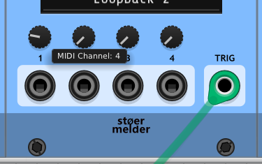

# MIDI-KIT scripting reference

MIDI-KIT scripts run in one of two embedded engines, chosen by a versioned
`@engine` header tag: `QuickJs@v1` (a full JavaScript engine) or `minilua@v1`
(a sandboxed Lua 5.4 via minilua). Both engines expose the *same* API (`midi`, `midiOut`, `input`,
`trig`, `param`, `number`, `rack`) with 1-based indices for ports,
channels, and params. Pick the engine per script; the module identifies it
from the header, not the file extension.

**Contents:**
- [Part 1 — Writing a script](#part-1--writing-a-script): engine choice,
  file header, script structure and lifecycle
- [Part 2 — Examples](#part-2--examples): worked scripts from basic
  pass-through to context menus and assembled NRPN input
- [Part 3 — API reference](#part-3--api-reference): every `rack.*` /
  `input.*` / `trig.*` / `param.*` / `midi.*` / `midiOut.*` / `number.*`
  function, persistence, sample-accurate timing, and the MIDI status/type reference
- [Part 4 — Gotchas](#part-4--gotchas)

## Part 1 — Writing a script

### When to write QuickJs (JavaScript) vs Lua

Both engines handle the common case equally well: reacting to
`midi.onMessage`, building/sending messages. Pick based on these differences:

| | QuickJs (JS) | Lua |
|---|---|---|
| Language completeness | Full JavaScript (ES2020): `while`, `switch`, `try`, `class`, `new`, `this`, `var`/`let`/`const`, function declarations, arrow functions | Full Lua 5.4 syntax; only the *library* is trimmed |
| Data structures | Array literals `[1,2,3]`, object literals `{a:1}` | Only tables (`{}`); no literal array sugar, must use `{ {...}, {...} }` and `#t`/`ipairs` |
| Stdlib | Full JS standard library: `Math`, `JSON`, `String`, `Array`, ... | Real Lua stdlib subset: `math`, `string`, `table` (no `io`, `os`, `package`, `debug` — sandboxed) |
| String formatting | JS auto-coerces numbers in `+` concatenation; `number.toString()` helper available | Lua auto-coerces numbers in `..` concatenation; `string.format` available |
| Familiarity | Preferred if the user/preset is JS-oriented or ports logic from another JS script | Preferred if the script needs `string.format`, `table.sort`, pattern matching, or other real stdlib features |
| Performance/footprint | QuickJS is a full embeddable JS engine with a 1 MiB memory limit | minilua is a stripped full Lua VM; similarly small footprint |

Default guidance: **match whatever sibling/companion scripts in the same
preset pair already use**, so users can read them side by side. Otherwise,
prefer Lua for string formatting or table sorting, and QuickJs for
array/object literal syntax or scripts adapted from existing JS examples.

### Required file header

The engine is selected by parsing `@key value` tags out of the leading
comment block only — nothing after the block is scanned.

QuickJs (JS-style `/** ... */`):
```javascript
/**
 * @target stoermelder MIDI-KIT
 * @engine QuickJs@v1
 * @author yourname
 * @description One-line summary shown in the module log on load
 */
```

Lua (Lua-style `--[[ ... --]]`):
```lua
--[[
@target stoermelder MIDI-KIT
@engine minilua@v1
@author yourname
@description One-line summary shown in the module log on load
--]]
```

`@engine` is mandatory and must exactly match `QuickJs@v1` or `minilua@v1`, or
the script is rejected. The `@v1` suffix pins the script to an engine protocol
revision, so a future breaking change can bump it (`@v2`) without silently
misbehaving old scripts. `@author`/`@description` are optional and get echoed
to the module's log on load. `@target` is conventional but not checked.

`@requires params=N` is optional and declares that the script needs at least `N`
panel params, for example `@requires params=4` for a script that reads params
3 and 4. A module with fewer params (MIDI-µKIT has 2) refuses to load the script
and logs "Script not loaded: it requires 4 params, this module has 2", instead
of failing later when the script touches a param that isn't there. An unknown
key or a malformed value also refuses the script. A script can still adapt
instead of refusing by checking `param.count` or by giving `param.getValue` a
fallback (see [Module variants](#module-variants)). The tag sits in the header
block next to `@engine`. The **Examples** menus grey out such scripts on a variant
that can't run them and show "needs N params" next to the name.

`@requires messages=N` is optional and asks for a message store of at least `N`
handles (see [`midi.*`](#midi-message-constructioninspection)). The default is
32, the maximum 512, and `N` is a minimum: `messages=16` keeps 32, `messages=64`
gives 64. A value above 512, or a malformed one, refuses the script
("Script not loaded: @requires messages=5000 exceeds the maximum of 512"). The
store is sized once, before the script's top-level code runs, and every load
sets it again, so a following script without the tag gets 32. Both keys can be
combined: `@requires params=4 messages=512`.

A larger store lets a callback hold more distinct messages *at once*. It does not
raise how much a callback can *send*: everything goes through the output queue,
which takes 128 entries between two drains (every 8 samples), and what doesn't
fit is dropped and logged. So `messages=512` doesn't fix dropped output; reusing
one handle does as well for most scripts.

Engine selection is a plain substring search for `@engine <name>@vN` in the
header comment block — not the file extension, and not scanned past the
block. Keep the `@engine` tag inside the leading comment, or the script can be
misrouted.

### Script structure

A MIDI-KIT script is a single text file: top-level code that runs once when
the script (re)loads, plus optional callbacks that run in response to events.
There is no per-sample or per-frame callback — logic only runs when something
happens: a MIDI message arrives, a trigger fires, a Tipsy message decodes, or
the script loads/unloads/saves.

**Top-level code** runs once, synchronously, at (re)load. It's where you set
up `config`, define helpers, register context-menu items, and enable things
(`param.enable()`, `trig.enableIn()`, `midi.enableNrpnIn()`, …).

The callbacks a script can define, and when each runs:

| Callback | Runs … | Needs |
| --- | --- | --- |
| `midi.onMessage(midiPort, msg)` | on every incoming MIDI message | — |
| `midi.onNrpn(midiPort, msg)` / `midi.onRpn(midiPort, msg)` / `midi.onCc14bit(midiPort, msg)` | on every completed NRPN / RPN / 14-bit CC parameter change | `midi.enableNrpnIn()` / `enableRpnIn()` / `enableCc14bitIn()` |
| `trig.onTrigger(trigPort, channel)` | on every rising edge of an *enabled* trigger channel | `trig.enableIn()` |
| `trig.onTipsyMessage(data, mimeType)` | on every complete [Tipsy](#tipsy) message decoded from trigger input 1 | `trig.enableTipsyIn()` |
| `rack.onLoad()` / `rack.onUnload()` | script [lifecycle](#persistence) — load, teardown | — |
| `input.getName(i)` / `param.getName(i)` / `param.getValueFormat(i)` | when a panel tooltip is shown; looked up live, so they may be reassigned at runtime | — |

All hooks are assigned as plain fields on their object (`midi.onMessage =
function(midiPort, msg) {...}` in JS, `function(...) end` in Lua) and must be
assigned exactly once, at the top level — see [Hooks and predefined objects
are resolved once, at load
time](#hooks-and-predefined-objects-are-resolved-once-at-load-time) for why.
A script that never defines `midi.onMessage` loads fine but silently ignores
all MIDI (logged once at load); the other hooks warn only for `midi.onMessage`
— omitting the rest is silent.

**The return value of `midi.onMessage` is ignored and reserved.** Today every
message is handled the same way whatever the callback returns: nothing is
dropped, consumed or forwarded because of it. A future version may give a
return value a meaning (for example "consumed"), so don't write a callback that
returns something by accident, such as `return midiOut.send(msg)` or an
implicit return from a helper. End it with a bare `return` (or no `return`).
Messages are passed on only through the `midiOut.send*` calls.

`trig.onTrigger` additionally needs `trig.enableIn(trigPort, [channel])` — the
trigger input is otherwise not processed at all on that port and channel: no ticks
counted, no `sendAfterTrigger` messages drained, no callback dispatched.

## Part 2 — Examples

**Note:** Channels are 1..16, parameter and input indices are 1..4 (1..2 on MIDI-µKIT, see [Module variants](#module-variants)), trigger input and output indices are 1..2. The main entry point is `midi.onMessage(midiPort, msg)`, where `midiPort` is the 1-based MIDI input the message arrived on. Only MIDI input and output 1 are enabled by default; see [Enabling MIDI ports](#enabling-midi-ports).

Examples build up roughly from simplest to most involved: basic pass-through
and filtering first, then message construction (NRPN, 14-bit CC, SysEx, raw),
then lifecycle/trigger/Tipsy examples, and finally UI (context menu) and
assembled-input examples.

### Basic pass-through
The script passes all incoming MIDI messages to the default MIDI output port.

JavaScript:
```js
midi.onMessage = function(midiPort, msg) {
   midiOut.send(msg);
};
```

Lua:
```lua
midi.onMessage = function(midiPort, msg)
   midiOut.send(msg)
end
```

### Simple MIDI filter
The script drops all incoming MIDI messages except for MIDI channel 2. Messages without a channel field (like MIDI clock) will also be dropped.

JavaScript:
```js
midi.onMessage = function(midiPort, msg) {
   if (midi.getChannel(msg) === 2) {
      midiOut.send(msg);
   }
};
```

Lua:
```lua
midi.onMessage = function(midiPort, msg)
   if midi.getChannel(msg) == 2 then
      midiOut.send(msg)
   end
end
```

### MIDI channel routing for CC messages
The script routes incoming CC messages on MIDI channel 2 to MIDI channel 3. All other messages are passed-through unchanged.

JavaScript:
```js
midi.onMessage = function(midiPort, msg) {
   if (midi.isCc(msg) && midi.getChannel(msg) === 2) {
      midi.setChannel(msg, 3);
   }
   midiOut.send(msg);
};
```

Lua:
```lua
midi.onMessage = function(midiPort, msg)
   if midi.isCc(msg) and midi.getChannel(msg) == 2 then
      midi.setChannel(msg, 3)
   end
   midiOut.send(msg)
end
```

### Dynamic MIDI channel routing for CC messages by knob (1)
The script routes incoming CC messages on MIDI channel 2 to a MIDI channel set by parameter 1 on the panel. All other messages are passed-through unchanged.

JavaScript:
```js
param.enable(1);

midi.onMessage = function(midiPort, msg) {
   if (midi.isCc(msg) && midi.getChannel(msg) === 2) {
      let ch = Math.ceil(param.getValue(1) * 16);
      midi.setChannel(msg, ch);
   }
   midiOut.send(msg);
};
```

Lua:
```lua
param.enable(1)

midi.onMessage = function(midiPort, msg)
   if midi.isCc(msg) and midi.getChannel(msg) == 2 then
      local ch = math.ceil(param.getValue(1) * 16)
      midi.setChannel(msg, ch)
   end
   midiOut.send(msg)
end
```

### Dynamic MIDI channel routing for CC messages by knob (2)
The script handles MIDI messages like the previous example, but MIDI-KIT provides additional programming interface for user interface configuration: `param.getName` configures the text "MIDI Channel" for the tooltip of the first panel parameter, the display value is scaled to the integer range 1..16 by `param.getValueFormat`.

JavaScript:
```js
param.enable(1);

param.getName = function(port) {
    if (port === 1) return "MIDI Channel";
    return "";
};

param.getValueFormat = function(port) {
    if (port === 1) return number.toString(Math.ceil(param.getValue(1) * 16));
    return number.toString(param.getValue(port));
};

midi.onMessage = function(midiPort, msg) {
   if (midi.isCc(msg) && midi.getChannel(msg) === 2) {
      let ch = Math.ceil(param.getValue(1) * 16);
      midi.setChannel(msg, ch);
   }
   midiOut.send(msg);
};
```


Lua:
```lua
param.enable(1)

param.getName = function(port)
    if port == 1 then return "MIDI Channel" end
    return ""
end

param.getValueFormat = function(port)
    if port == 1 then return number.toString(math.ceil(param.getValue(1) * 16)) end
    return number.toString(param.getValue(port))
end

midi.onMessage = function(midiPort, msg)
   if midi.isCc(msg) and midi.getChannel(msg) == 2 then
      local ch = math.ceil(param.getValue(1) * 16)
      midi.setChannel(msg, ch)
   end
   midiOut.send(msg)
end
```

### Send NRPN message

JavaScript:
```js
midi.onMessage = function(midiPort, msg) {
   if (midi.isNoteOn(msg)) {
      let nrpn1 = midi.createNRPN();
      midi.setNRPN(nrpn1, 1, 12345, 13456);
      midiOut.send(nrpn1);
   }
};
```

Lua:
```lua
midi.onMessage = function(midiPort, msg)
   if midi.isNoteOn(msg) then
      local nrpn1 = midi.createNRPN()
      midi.setNRPN(nrpn1, 1, 12345, 13456)
      midiOut.send(nrpn1)
   end
end
```

### Send 14-bit CC message

A 14-bit CC value spans two CC messages (CC `cc` = value MSB, CC `cc + 32` =
value LSB). `midi.createCc14bit()` chains the two into one atomic pair, so a
receiver never sees the MSB without its LSB.

JavaScript:
```js
midi.onMessage = function(midiPort, msg) {
   if (midi.isNoteOn(msg)) {
      let cc14 = midi.createCc14bit();
      midi.setCc14bit(cc14, 1, 1, 100.5);  // CC 1 = 100 (MSB), CC 33 = 64 (LSB)
      midiOut.send(cc14);
   }
};
```

Lua:
```lua
midi.onMessage = function(midiPort, msg)
   if midi.isNoteOn(msg) then
      local cc14 = midi.createCc14bit()
      midi.setCc14bit(cc14, 1, 1, 100.5)   -- CC 1 = 100 (MSB), CC 33 = 64 (LSB)
      midiOut.send(cc14)
   end
end
```

### Send SysEx message

JavaScript:
```js
midi.onMessage = function(midiPort, msg) {
   if (midi.isNoteOn(msg)) {
      let sysex = midi.create();
      midi.setSysEx(sysex, "ab33010001");
      midiOut.send(sysex);
   }
};
```

Lua:
```lua
midi.onMessage = function(midiPort, msg)
   if midi.isNoteOn(msg) then
      local sysex = midi.create()
      midi.setSysEx(sysex, "ab33010001")
      midiOut.send(sysex)
   end
end
```

### Send a raw MIDI message

Use `midi.setRaw()` for message types with no dedicated setter, such as an MTC quarter-frame message (status `0xf1`).

JavaScript:
```js
midi.onMessage = function(midiPort, msg) {
   if (midi.isNoteOn(msg)) {
      let mtc = midi.create();
      midi.setRaw(mtc, "f11a");
      midiOut.send(mtc);
   }
};
```

Lua:
```lua
midi.onMessage = function(midiPort, msg)
   if midi.isNoteOn(msg) then
      local mtc = midi.create()
      midi.setRaw(mtc, "f11a")
      midiOut.send(mtc)
   end
end
```

### Send an all-notes-off when the script unloads

`rack.onUnload()` runs right before the script's state is torn down — the script is being replaced, the module is reset, or the module is removed from the patch. It's the only reliable place to clean up notes a script left sounding, since nothing runs afterward to release them. It never runs on a plain patch save — a save is not a lifecycle event at all (see [Persistence](#persistence): a save just writes out whatever `rack.setConfig()` last published). Note the JavaScript version assigns it to the `rack` object — `rack.onUnload = function() {...}` — like the other hooks (see [Hooks and predefined objects are resolved once, at load time](#hooks-and-predefined-objects-are-resolved-once-at-load-time)).

When the script is replaced or the module is reset, `rack.onUnload()` may only send MIDI right away with `midiOut.send()`; that output always goes out. Everything else it does that would outlive the script is ignored: messages scheduled for later (`sendAfterMs`, `sendAtFrame`, `sendAfterTrigger`), trigger output writes and `trig.sendTipsy()`. Whatever the script scheduled earlier and is still waiting is dropped with it, and the trigger outputs go back to 0 V.

The example sends CC 123 (All Notes Off) on all 16 channels with one reused handle, instead of one note-off per note. With `midiOut.enableTiming()` a note-on sent just before may still be waiting in Rack's output queue; the module holds what `rack.onUnload()` sends behind it, so the all-notes-off can't overtake a note-on and leave a note stuck (see [Enabling sample-accurate timing](#enabling-sample-accurate-timing)).

JavaScript:
```js
midi.onMessage = function(midiPort, msg) {
   if (midi.isNoteOn(msg)) {
      midiOut.send(msg);
   }
};

rack.onUnload = function() {
   let off = midi.create();
   for (let ch = 1; ch <= 16; ch++) {
      midi.setCc(off, ch, 123, 0);
      midiOut.send(off);
   }
};
```

Lua:
```lua
midi.onMessage = function(midiPort, msg)
   if midi.isNoteOn(msg) then
      midiOut.send(msg)
   end
end

rack.onUnload = function()
   local off = midi.create()
   for ch = 1, 16 do
      midi.setCc(off, ch, 123, 0)
      midiOut.send(off)
   end
end
```

### Send a MIDI clock message on each trigger

`trig.onTrigger(trigPort, channel)` is the entry point for logic driven by the CV trigger inputs rather than by incoming MIDI — for example, forwarding an external clock as MIDI clock messages. `trigPort` (1 or 2) is the trigger input that fired and `channel` (1-based) is its polyphonic channel. **The callback is not used until `trig.enableIn(trigPort, [channel])` is called** — here `trig.enableIn(1)` clocks it from channel 1 of trigger input 1.

JavaScript:
```js
trig.enableIn(1);

trig.onTrigger = function(trigPort, channel) {
   let clock = midi.create();
   midi.setRaw(clock, "f8");
   midiOut.send(clock);
};
```

Lua:
```lua
trig.enableIn(1)

trig.onTrigger = function(trigPort, channel)
   local clock = midi.create()
   midi.setRaw(clock, "f8")
   midiOut.send(clock)
end
```

### Multiply a clock into MIDI clock, sample-accurately

A Rack clock usually ticks once per beat, MIDI clock needs 24 pulses per beat. Hardware that syncs to MIDI clock exposes any timing jitter at once, so this is a case for [sample-accurate timing](#enabling-sample-accurate-timing): `midiOut.enableTiming()` makes every pulse leave on its own frame. The pulse for the input tick goes out on the tick's frame, the other 23 are spread over the next period with `midiOut.sendAtFrame()`, using the previous period as the prediction (as every clock multiplier has to). `rack.getEventFrame()` is the frame of the tick being handled.

JavaScript:
```js
let lastEdge = -1;
let period = 0;

rack.onLoad = function() {
   midiOut.enableTiming();
   trig.enableIn(1);
};

function pulse() {
   let clock = midi.create();
   midi.setRaw(clock, "f8");
   return clock;
}

trig.onTrigger = function(trigPort, channel) {
   let edge = rack.getEventFrame();
   if (lastEdge >= 0) period = edge - lastEdge;
   lastEdge = edge;

   midiOut.send(pulse());   // on the frame of the tick
   if (period > 0) {
      for (let k = 1; k < 24; k++) {
         midiOut.sendAtFrame(pulse(), edge + Math.round(k * period / 24));
      }
   }
};
```

Lua:
```lua
local lastEdge = -1
local period = 0

rack.onLoad = function()
   midiOut.enableTiming()
   trig.enableIn(1)
end

local function pulse()
   local clock = midi.create()
   midi.setRaw(clock, "f8")
   return clock
end

trig.onTrigger = function(trigPort, channel)
   local edge = rack.getEventFrame()
   if lastEdge >= 0 then period = edge - lastEdge end
   lastEdge = edge

   midiOut.send(pulse())   -- on the frame of the tick
   if period > 0 then
      for k = 1, 23 do
         midiOut.sendAtFrame(pulse(), edge + math.floor(k * period / 24 + 0.5))
      end
   end
end
```

The shipped `Clock multiplier` preset adds a multiplier menu (for clocks that tick on 8th or 16th notes) and treats a long gap, when the clock was stopped, as a restart instead of stretching the pulses over the gap.

### Tipsy protocol — send and receive over CV

Tipsy is a protocol for exchanging arbitrary data between modules as a stream
of CV voltages on the trigger input/output. Sending encodes a payload as
voltages on trigger output 1 (`trig.sendTipsy`); receiving routes
trigger input 1 into MIDI-KIT's Tipsy decoder (`trig.enableTipsyIn`) and
delivers each complete message to `trig.onTipsyMessage`. The reference for
all three functions is [Tipsy under `trig.*`](#tipsy).

**Sending — `trig.sendTipsy`**

`trig.sendTipsy(data, [mimeType = "text/plain"])` encodes binary `data` using the Tipsy protocol and outputs it as CV voltages on trigger output 1. This is useful for communicating with modules that understand the Tipsy protocol, such as Transit for preset snapshots.

JavaScript:
```js
midi.onMessage = function(midiPort, msg) {
   // Send a text message via Tipsy protocol (mime defaults to text/plain)
   trig.sendTipsy("Preset changed!");
   
   // Or send JSON data with an explicit mime type
   let config = JSON.stringify({ channel: 1, mode: "auto" });
   trig.sendTipsy(config, "application/json");
};
```

Lua:
```lua
midi.onMessage = function(midiPort, msg)
   -- Send a text message via Tipsy protocol (mime defaults to text/plain)
   trig.sendTipsy("Preset changed!")
   
   -- Or send JSON-like data with an explicit mime type
   local config = '{"channel":1,"mode":"auto"}'
   trig.sendTipsy(config, "application/json")
end
```

**Note:** The Tipsy-encoded data is output sequentially as CV voltages on trigger output 1, one voltage per sample. The receiving module must understand the Tipsy protocol to decode the data correctly. When no Tipsy message is being sent, the trigger output is driven by the script's `trig.*` functions; a `trig.sendTipsy` call temporarily takes over trigger output 1 while its encoded stream is transmitted.

**Receiving — `trig.enableTipsyIn` / `trig.onTipsyMessage`**

`trig.enableTipsyIn()` routes **trigger input 1** into MIDI-KIT's Tipsy decoder. Every complete message that arrives is delivered to `trig.onTipsyMessage(data, mimeType)`. Pass `false` to release the trigger input again. Tipsy is only supported on the first trigger input and output, so — like `trig.sendTipsy()` — there is no port argument.

Note that while trigger input 1 is claimed for Tipsy, its channel 1 no longer behaves as a trigger — `trig.onTrigger` doesn't fire and `trig.getTicks()` doesn't advance there, since the encoded voltages swing across the trigger threshold constantly and would otherwise fire on nearly every sample. Other channels and trigger input 2 are unaffected.

JavaScript:
```js
rack.onLoad = function() {
   trig.enableTipsyIn();        // decode a Tipsy stream from the trigger input
};

trig.onTipsyMessage = function(data, mimeType) {
   rack.log("received " + mimeType + ": " + data);

   if (mimeType === "application/json") {
      let config = JSON.parse(data);
      // ... use config
   }
};
```

Lua:
```lua
rack.onLoad = function()
   trig.enableTipsyIn()         -- decode a Tipsy stream from the trigger input
end

trig.onTipsyMessage = function(data, mimeType)
   rack.log("received " .. mimeType .. ": " .. data)
end
```

**Note:** While trigger input 1 is claimed for Tipsy, its channel 1 no longer behaves as a trigger — `trig.onTrigger` doesn't fire and `trig.getTicks()` doesn't advance there, and `trig.isHigh()`/`trig.isLow()` on channel 1 read `0` (other channels and trigger input 2 are unaffected). Releasing it with `trig.enableTipsyIn(false)` restores normal trigger behavior. Payloads are capped at 256 bytes, and `data` may contain arbitrary bytes including NULs. A malformed or interrupted stream is reported once in the module log and the decoder resynchronizes automatically on the next message.

### Add items to the module's context menu

`rack.registerContextMenu()` adds items to the module's right-click context menu — a boolean toggle (a menu line with a checkmark) or an options submenu (one entry per option, checkmark on the current selection). Items appear in registration order and can be used to change `config` values live instead of editing the script. To persist a change (so it survives a patch save/reload), call `rack.setConfig()` in the item's `onChange` — see [Persistence](#persistence).

The checkmark/selection state is read **lazily** — each time the menu is opened, the engine calls the item's `onGetValue` callback (if provided) to determine the current value. This means the menu always reflects the live state of the script, even if it was changed programmatically. If `onGetValue` is omitted, the item defaults to `false` (boolean) or `0` (options, i.e. the first option).

JavaScript:
```js
config.channel = 1;

rack.registerContextMenu({
    type: "options",
    label: "MIDI channel",
    options: ["1", "2", "3"],
    onGetValue: function() {
        return config.channel - 1;
    },
    onChange: function(idx) {
        config.channel = idx + 1;
    }
});

rack.registerContextMenu({
    type: "boolean",
    label: "Pass through",
    onGetValue: function() {
        return config.passThrough;
    },
    onChange: function(checked) {
        config.passThrough = checked;
    }
});
```

Lua:
```lua
config.channel = 1

rack.registerContextMenu({
    type = "options",
    label = "MIDI channel",
    options = { "1", "2", "3" },
    onGetValue = function()
        return config.channel - 1
    end,
    onChange = function(idx)
        config.channel = idx + 1
    end
})

rack.registerContextMenu({
    type = "boolean",
    label = "Pass through",
    onGetValue = function()
        return config.passThrough
    end,
    onChange = function(checked)
        config.passThrough = checked
    end
})
```

### Assemble NRPN input

This is the assembled-input alternative to the manual "Send NRPN message"-style examples: instead of constructing an NRPN from parts, the module reassembles a spec-compliant NRPN write (CC 99/98 = parameter select, then CC 6/38 = data entry) into a single parameter change and delivers it to `midi.onNrpn`. Enable it with `midi.enableNrpnIn(midiPort [, channel])`. While NRPN input is enabled, the component CCs it is assembled from no longer reach `midi.onMessage` — they are consumed by the assembler. The example reads the NRPN number with `midi.getControl(msg)` and the combined 14-bit value with `midi.getValue(msg)`, looks the number up in a small `config.map`, and forwards the change as an atomic 14-bit CC pair with `midi.createCc14bit()` + `midi.setCc14bit()` + `midiOut.send()`.

JavaScript:
```js
let config = {
    map: [
        { nrpnNumber: 0, ccNumber: 0 },
        { nrpnNumber: 1, ccNumber: 1 },
        { nrpnNumber: 2, ccNumber: 2 }
    ],
    ccChannel: 1
};

function findCcNumber(nrpnNumber) {
    let ccNumber = -1;
    for (let i = 0; i < config.map.length; i++) {
        if (config.map[i].nrpnNumber === nrpnNumber) {
            ccNumber = config.map[i].ccNumber;
            break;
        }
    }
    return ccNumber;
}

midi.enableNrpnIn(1);

midi.onNrpn = function(midiPort, msg) {
    let nrpnNumber = midi.getControl(msg);
    let nrpnValue = midi.getValue(msg);

    let ccNumber = findCcNumber(nrpnNumber);
    if (ccNumber < 0) return;   // not in config.map — ignore

    let cc14 = midi.createCc14bit();
    midi.setCc14bit(cc14, config.ccChannel, ccNumber, nrpnValue / 128);
    midiOut.send(cc14);
};
```

Lua:
```lua
local config = {
    map = {
        { nrpnNumber = 0, ccNumber = 0 },
        { nrpnNumber = 1, ccNumber = 1 },
        { nrpnNumber = 2, ccNumber = 2 }
    },
    ccChannel = 1
}

local function findCcNumber(nrpnNumber)
    local ccNumber = -1
    for i = 1, #config.map do
        if config.map[i].nrpnNumber == nrpnNumber then
            ccNumber = config.map[i].ccNumber
            break
        end
    end
    return ccNumber
end

midi.enableNrpnIn(1)

midi.onNrpn = function(midiPort, msg)
    local nrpnNumber = midi.getControl(msg)
    local nrpnValue = midi.getValue(msg)

    local ccNumber = findCcNumber(nrpnNumber)
    if ccNumber < 0 then return end   -- not in config.map, ignore

    local cc14 = midi.createCc14bit()
    midi.setCc14bit(cc14, config.ccChannel, ccNumber, nrpnValue / 128)
    midiOut.send(cc14)
end
```

**Note:** The shipped preset `NRPN to CC (assembled)` is this script with a context-menu channel selector added — see [Assembled extended input](#assembled-extended-input-nrpn--rpn--14-bit-cc) for the full rules.


## Part 3 — API reference

### Module variants

MIDI-µKIT is the compact variant of the module with **2** CV inputs and **2** knobs instead of 4; the trigger ports and the four MIDI inputs and outputs are the same. Scripts run unchanged on both, but a script that uses param or input indices 3 and 4 has to adapt. Read the read-only counts `param.count`, `input.count`, `trig.inCount`, `trig.outCount`, `midi.portCount` and `midiOut.portCount`; they are set when the script loads:

```js
for (let i = 1; i <= param.count && i <= 4; i++) param.enable(i);
let length = param.getValue(3, 0.5);   // 0.5 on µKIT, where param 3 doesn't exist
```

```lua
for i = 1, math.min(param.count, 4) do param.enable(i) end
local length = param.getValue(3, 0.5)   -- 0.5 on µKIT, where param 3 doesn't exist
```

### Hooks and predefined objects are resolved once, at load time

`midi.onMessage`, `midi.onNrpn`, `midi.onRpn` and `midi.onCc14bit` are read
from the `midi` object **exactly once**;
`rack.onLoad` and `rack.onUnload` from the `rack` object; and
`trig.onTrigger`/`trig.onTipsyMessage` from the `trig` object — all right
after the script's top-level code finishes running. **Reassigning any of them
afterward, from inside a callback or anywhere else, has no effect.** The
function present at load time keeps running for the script's lifetime; a
later assignment is simply never looked at again. The same applies to
defining a hook **late**: a script that never defines `midi.onMessage` at
load time but assigns it later (e.g. from inside `trig.onTrigger`) never has
that later definition called — the "no `midi.onMessage` defined" warning
logged at load time is the last word on it. (`trig.enableIn()` is not a hook —
it's a live API call like `param.enable()`, so calling it at any time takes
effect for subsequent trigger dispatch. `rack.getConfig()`/`rack.setConfig()`
are likewise live calls, not hooks — see [Persistence](#persistence) — so
unlike the hooks above, calling them from inside a callback, or any number of
times, works exactly as it looks like it should.)

The tooltip functions `input.getName`, `param.getName` and `param.getValueFormat`
are the exception: they are looked up by name each time a tooltip is shown, so
assigning them later does work. A script can therefore reassign them at runtime,
for example from `midi.onMessage`, to change a tooltip as its state changes. This
is supported, unlike reassigning any other hook. The cost is a name lookup per
tooltip, which is negligible because a tooltip is shown only while the pointer
hovers over a parameter or port.

This is a deliberate, permanent design choice: resolving hooks once, rather
than looking them up by name on every incoming MIDI message or trigger tick,
is what keeps message dispatch fast. Write scripts so every hook is assigned
exactly once, at the top level, during initial load — this is what every
shipped preset does and the only supported pattern.

Reassigning (or otherwise clobbering — e.g. `rack = 42`) one of the
predefined globals (`rack`, `midi`, `midiOut`, `trig`, `input`, `param`,
`number`) at runtime is likewise unsupported. Both engines degrade gracefully
rather than crash if a script does this anyway — expect either the
reassignment to be silently ignored (for a hook function, per above) or a
caught, logged script error on the next statement that uses the clobbered
value — but the resulting behavior is undefined and may differ in wording
between QuickJs and Lua. Treat this as a bug in the script, not a supported
technique.

### `rack.*`

| Function | Effect |
| --- | --- |
| `rack.log(value [, value ...])` | write a line to the module's log/console. Any number of arguments are concatenated (no separator) into one line, each coerced the same way as a single value: strings logged verbatim (no added quotes), numbers formatted like `number.toString()` (so `rack.log(1 / 3)` prints `0.333333`, and whole numbers print exactly however large: `rack.log(rack.getEventFrame())` shows every digit), booleans as `true`/`false`, `null`/`undefined` (QuickJs) / `nil` (Lua) as `null`/`undefined`. Other values (objects, arrays, tables, functions) use each engine's own stringification — scalars are guaranteed to format identically in both engines |
| `rack.overlay(s1 [, s2 [, s3]])` | show up to 3 lines in the on-panel overlay |
| `rack.getEventFrame()` | the engine frame (sample counter) of the event being handled: the arrival frame in `midi.onMessage` (of the last message for assembled NRPN/RPN/14-bit events), the frame of the edge in `trig.onTrigger`, the frame the message completed on in `trig.onTipsyMessage`. `-1` outside an event (top level, `rack.onLoad`, `rack.onUnload`, context-menu callbacks). Use with `midiOut.sendAtFrame()` — see [Enabling sample-accurate timing](#enabling-sample-accurate-timing) |
| `rack.msToFrames(ms)` | the number of frames in `ms` milliseconds at the current sample rate, rounded to a whole frame (`rack.msToFrames(10)` is 441 at 44.1 kHz). Use it to place messages relative to `rack.getEventFrame()` |
| `rack.framesToMs(frames)` | the inverse: milliseconds in `frames` frames, not rounded. For example, a measured clock period in frames becomes a time (and a BPM) |
| `rack.random()` | a random number in [0, 1), drawn from Rack's own RNG (`rack::random::uniform()`), so it shares the patch's seed/determinism |
| `rack.getConfig(key [, default])` | read a persisted value, or `default` (`undefined`/`nil` if omitted) when `key` is unset. Rejects a malformed key the same way as `setConfig()` — see [Persistence](#persistence) |
| `rack.setConfig(key, value)` | persist `value` under `key`, or remove the key if `value` is `undefined`/`nil`. Rejects a malformed key, a non-JSON-serializable value, one nested too deeply, or one that would push the whole config past its size cap — see [Persistence](#persistence) |

`rack.onLoad`/`rack.onUnload` (script lifecycle) and
`rack.registerContextMenu`/`rack.unregisterContextMenu` (below) are documented in their own subsections.

#### Context menu — `rack.registerContextMenu`

`rack.registerContextMenu(options)` adds one item to the module's right-click
context menu, in registration order (multiple items are allowed). Returns
`true` on success; throws (load fails) if `options` is malformed. Two
variants:

*Boolean toggle* — a single menu line with a checkmark:
```js
rack.registerContextMenu({
    type: "boolean",
    label: "Velocity to CC",
    onGetValue: function() {
        // Return true/false: the checkmark is read lazily, when the
        // menu is opened, so it always reflects the current state
        // (e.g. a config restored by onLoad()).
        return config.emitTrigger;
    },
    onChange: function(checked) {
        // checked: true/false (boolean)
    }
});
```
*Options submenu* — a submenu with one entry per option, checkmark on the
current selection:
```js
rack.registerContextMenu({
    type: "options",
    label: "Out mode",
    options: ["Internal", "External", "Both"],
    onGetValue: function() {
        // Return the selected index, read lazily when the menu is
        // opened. Return the index, or -1 for no selection.
        return config.outMode;
    },
    onChange: function(selectedIndex, selectedLabel) {
        // selectedIndex: number, selectedLabel: string
    }
});
```
Lua uses an equivalent table: `{ type = "boolean", label = "...",
onGetValue = function() return config.emitTrigger end,
onChange = function(checked) ... end }`.

Notes:
- `label` must be a non-empty string; `options` must be a non-empty array of
  strings; `onChange` must be a function.
- `onGetValue` is optional and, when present, must be a function returning
  the item's current value: a boolean for `type: "boolean"`, an index number
  for `type: "options"`. It is evaluated just-in-time on the worker thread
  every time the context menu is opened, so the checkmark/selection always
  reflects the script's live state — including config restored by
  `onLoad()` on a patch reload. When `onGetValue` is absent the value
  defaults to `false` / `0`.
- `onChange` runs on the worker thread (like the other callbacks) when the
  menu item is clicked, and may call any other `rack.*` function. Exceptions
  inside it are logged as `Context menu callback error: ...` without
  crashing.
- **`onChange` can send.** It is an event-less callback like `rack.onLoad`:
  MIDI created with `midi.create()` and sent with `midiOut.send()` (or any
  other `midiOut.*` sender) goes out when `onChange` returns, and trigger,
  voltage and Tipsy outputs work as usual. Timing is "as soon as possible"
  (`rack.getEventFrame()` is `-1`). `onGetValue` is not a callback of this
  kind: it runs while the menu is built and must not send.
- The module's presentation state (checkmark/selection) is updated as soon as
  the item is clicked, so the menu reflects the change immediately even
  before the callback has run.
- Registering an item whose `label` is already registered **replaces** that
  item instead of adding a second one: it keeps its position in the menu, and
  the new `type`, `options`, `onGetValue` and `onChange` take over. This is how
  a script changes the entries of a menu at runtime, e.g. re-registering
  "Active input" with a different number of options when a setting changes.
- `rack.unregisterContextMenu(label)` removes the item registered under
  `label` and returns `true`, or returns `false` if there was none. Registering
  the label again afterwards adds a new item at the end of the menu.
- All registered items are cleared when the script is reloaded or cleared.

### Persistence

`rack.getConfig(key [, default])` and `rack.setConfig(key, value)` are how a
script persists settings across a patch save/reload. They are a plain
key/value store, not hooks (see [Hooks and predefined objects are resolved
once, at load time](#hooks-and-predefined-objects-are-resolved-once-at-load-time)):
call them from anywhere — top-level code, `rack.onLoad()`, `rack.onUnload()`,
`midi.onMessage`, a context-menu `onChange` — at any time, as many times as
you like.

- **`rack.setConfig(key, value)`** persists `value` under `key`, overwriting
  whatever was there before. Call it the moment a setting changes — a
  context-menu `onChange` is the most common place — rather than waiting for
  some later "save" step, because there isn't one: whatever was last written
  is what a patch save writes out.
- **`rack.getConfig(key)`** returns the persisted value, or `undefined`
  (QuickJs) / `nil` (Lua) if `key` was never set.
- **`rack.getConfig(key, default)`** returns the persisted value, or
  `default` if `key` was never set. Reading every setting this way at
  top-level (or in `rack.onLoad()`) needs no read-modify-write step, so there
  is nothing to get wrong the way a merge-over-defaults could (forgetting a
  key, merging in the wrong order):

  ```js
  let config = {
      channel:     rack.getConfig("channel", 1),
      passThrough: rack.getConfig("passThrough", false)
  };
  ```

  ```lua
  local config = {
      channel     = rack.getConfig("channel", 1),
      passThrough = rack.getConfig("passThrough", false)
  }
  ```

  `rack.onLoad()`/`rack.onUnload()` still exist and cover the rest of a
  script's lifecycle (initializing runtime state, sending an all-notes-off on
  teardown), while `getConfig`/`setConfig` cover persistence alone.

- **`rack.setConfig(key, undefined)`** (JS) / **`rack.setConfig(key, nil)`**
  (Lua) removes `key` from the persisted config.

**Keys** must start with a letter or underscore and contain only letters,
digits, and underscores, up to 64 characters — `channel`, `_scale`,
`noteLength2`. A key containing anything else, including a dot, is
rejected; `.` is reserved.

**Values** may be a boolean, number, string, array, or plain object. Nested
values are supported up to **4 levels** deep. The whole config is capped at
**64 KB** once serialized.

An invalid key, a value that is not JSON-serializable (a function), a cyclic
value, one exceeding the nesting depth, or one that would push the config
past the size cap is **rejected**: the config keeps its previous contents
and one line is written to the module log.

A typical pattern, with a context-menu setting persisted the moment it
changes:

```js
let config = {
    channel:     rack.getConfig("channel", 1),
    passThrough: rack.getConfig("passThrough", false)
};

rack.registerContextMenu({
    type: "boolean",
    label: "Pass through",
    onGetValue: function() { return config.passThrough; },
    onChange: function(checked) {
        config.passThrough = checked;
        rack.setConfig("passThrough", checked);
    }
});
```

```lua
local config = {
    channel     = rack.getConfig("channel", 1),
    passThrough = rack.getConfig("passThrough", false)
}

rack.registerContextMenu({
    type = "boolean",
    label = "Pass through",
    onGetValue = function() return config.passThrough end,
    onChange = function(checked)
        config.passThrough = checked
        rack.setConfig("passThrough", checked)
    end
})
```

Notes:

- Config is written when the script writes it; a patch save stores whatever
  was last written. There is no separate "capture" step and nothing to time
  out — `setConfig()` only updates engine-owned state, so it is free to call
  as often as you like.
- Calling `setConfig()`/`getConfig()` is a script-thread-only operation, same
  as every other `rack.*`/`midi.*`/`trig.*` call — there is nothing special
  to do to make it safe from any of the callback contexts listed above.
- Switching to a different script (loading a new one over the current one)
  starts that script with an empty config — persisted settings belong to the
  script that wrote them and are not carried over.

### `number.*`
`rescale(x, xMin, xMax, yMin, yMax [, curve])`,
`crossfade(a, b, pos)`, `toString(x)`. Present in both engines identically (Lua re-exposes
these even though `math.*` is also available, for script portability).

### `input.*` (CV inputs on the module, 1-based)
- `input.enable(i)` — activate input `i` so it appears on the panel.
- `input.getVoltage(i [, ch])`, `input.isHigh(i [, ch])`, `input.isLow(i [, ch])`
  (channel defaults to 1; high/low threshold is 0.7V).
- Override `input.getName(i)` to customize the panel label.
- `input.count` — number of CV inputs on this module variant (4, or 2 on MIDI-µKIT).

### `trig.*` (dedicated trigger/gate ports)
- `trig.enableIn(trigPort [, ch])` — enable trigger input `trigPort` (polyphonic
  channel defaults to 1) for trigger processing and the `trig.onTrigger`
  callback. **The trigger input does nothing until this is called**: a
  channel that is never enabled counts no ticks (`trig.getTicks()` stays 0),
  drains no tick-scheduled (`sendAfterTrigger`) messages, and never fires
  `trig.onTrigger`. Call once per (port, channel) the script wants to hear; a
  polyphonic clock is enabled per channel, e.g. `trig.enableIn(1, 1)` plus
  `trig.enableIn(1, 2)`.
- `trig.onTrigger(trigPort, ch)` — the trigger callback, assigned on the
  `trig` object (resolved once at load, like the `rack` hooks). Called on
  every rising edge of an *enabled* (port, channel); `trigPort` is 1-based
  (`1` or `2`), `ch` is the 1-based polyphonic channel that fired. Without a
  matching `trig.enableIn()` call it is never called.
- `trig.getTicks(i [, ch])` — clock tick counter for trigger input `i` (1 or 2;
  polyphonic channel defaults to 1). Each port and channel counts on its own.
- `trig.isHigh(i [, ch])`, `trig.isLow(i [, ch])` — state of trigger input `i`.
- `trig.setHigh(i [, ch])`, `trig.setLow(i [, ch])`, `trig.setTrigger(i [, ch])`
  (momentary trigger), `trig.setGate(i [, ch], durationMs)` — drive trigger
  output `i` (1 or 2). An index beyond the module's two ports is a script error.
  Without `midiOut.enableTiming()` the output changes when the script runs on
  the worker thread, so it jitters by the worker latency (at least one process
  divider, often an audio block). With `enableTiming()`, a write made while
  handling an event is stamped with the event's frame plus one audio block and
  applied on exactly that frame — the same offset as the MIDI sent for the same
  event, so the two stay together. See
  [Enabling sample-accurate timing](#enabling-sample-accurate-timing).
- `trig.inCount`, `trig.outCount` — number of trigger inputs and outputs (2 and 2 on both variants).

#### Tipsy

All three Tipsy functions — the output sender, the input decoder, and the
input callback — are described together here; a worked send/receive example
is in [Tipsy protocol — send and receive over CV](#tipsy-protocol--send-and-receive-over-cv).

- `trig.sendTipsy(data [, mimeType])` — encode `data` (a string) with the
  [Tipsy protocol](https://github.com/baconpaul/tipsy-encoder) and stream it
  out trigger output 1 as CV voltages, one voltage per sample until the
  message is complete. The optional `mimeType` (a string) specifies the
  content type and defaults to `"text/plain"`; the payload is capped at
  256 bytes. The stream is meant for modules that understand the Tipsy
  protocol (such as [TRANSIT](../../transit/Transit.md)) and temporarily
  takes over trigger output 1 while it is being transmitted. Unlike the
  `midiOut.*` senders, `sendTipsy` sends no MIDI: it is not routed through
  `midiOut.selectPort()` and does not consume a message-handle slot.
  ```js
  trig.enableIn(1);
  trig.onTrigger = function(trigPort, channel) {
      trig.sendTipsy("Hello Tipsy!");                              // mime defaults to "text/plain"
      trig.sendTipsy('{"label":"My snapshot","value":42}', "application/json");
  };
  ```
- `trig.enableTipsyIn([enabled])` — decode an incoming Tipsy stream from
  trigger input 1, delivering each completed message to `trig.onTipsyMessage`.
  The optional boolean `enabled` defaults to `true`; pass `false` to release
  the trigger input again. Tipsy is only supported on the first trigger
  input and output, so — like `trig.sendTipsy()` — there is no port argument.

  While trigger input 1 is claimed, it stops behaving as a trigger on
  channel 1: `trig.onTrigger` doesn't fire and `trig.getTicks()` doesn't
  advance there, and `trig.isHigh()`/`trig.isLow()` on channel 1 read `0` —
  the encoded voltages are protocol, not a gate a script should act on.
  Other channels and trigger input 2 are unaffected. A Tipsy stream would otherwise fire
  `trig.onTrigger` continuously as the encoded voltages cross the trigger
  threshold.
  ```js
  rack.onLoad = function() {
      trig.enableTipsyIn();        // decode from the trigger input
  };
  ```
- `trig.onTipsyMessage(data, mimeType)` — the Tipsy input callback, assigned
  on the `trig` object (resolved once at load, like the `rack` hooks). Called
  once for every complete Tipsy message decoded from trigger input 1 claimed
  with `trig.enableTipsyIn()`; see that entry above. `data` and `mimeType` are
  strings; `data` may contain arbitrary bytes (including NULs) and is capped
  at 256 bytes.

### `param.*` (panel knobs)
- `param.enable(i)` — activate param `i`.
- `param.getValue(i [, fallback])` — normalized 0..1 value. If `i` is above `param.count` (e.g. param 3 on MIDI-µKIT) and a `fallback` is given, the fallback is returned instead of raising an error.
- Override `param.getName(i)` and `param.getValueFormat(i)` for panel display.
- `param.count` — number of panel knobs on this module variant (4, or 2 on MIDI-µKIT). An index above it is a script error: check `param.count` before `param.enable(i)`, and pass a fallback to `param.getValue(i, fallback)`.

### `midi.*` — message construction/inspection
Messages are opaque handles (into an internal store, 32 live per callback by
default, see `@requires messages=N`) created with `midi.create()`, `midi.createNRPN()`, `midi.createRPN()`, or
`midi.createCc14bit()`; `midi.onMessage` also receives the incoming message as
a handle (its `msg` argument). Treat handle values as opaque: they are not small
numbers, and a handle is only valid inside the callback that got or created it.
Using one in a later callback, or outside any callback, is a script error
rather than silently reading whatever message that callback built.

**Reuse a handle instead of creating one per message.** Sending copies the
message, so a handle can be changed and sent again (see below): a loop over a
chord, a clock burst or an all-notes-off needs one `midi.create()` and then
`midi.setNoteOff(m, ...)` / `midiOut.send(m)` per message. That is the normal way
to send many messages.

**The store holds 32 live handles per callback by default** (slot 0 of the
incoming-MIDI callbacks is the incoming message). A script that really needs
more *distinct* messages at once asks for them with
`@requires messages=N` in its header, up to 512. Once the store is full,
`midi.create()`, `midi.clone()`, `midi.createNRPN()`, `midi.createRPN()`, and
`midi.createCc14bit()` raise a script error that aborts the rest of the callback
("midi.create: message store full (32 handles; reuse a handle or raise it with
@requires messages=N)"). Messages sent before the error have already gone out, so
a multi-message sequence (e.g. an NRPN pair, or a wide chord release) can be
emitted partially — a message created but never sent is dropped.

#### Entry points

- `midi.onMessage(midiPort, msg)` — the incoming-MIDI entry point (see
  [Script structure](#script-structure)): called with each incoming message
  that nothing else claimed (see
  [Assembled extended input](#assembled-extended-input-nrpn--rpn--14-bit-cc)
  for the callbacks that receive assembled parameter changes instead). Its
  return value is ignored and reserved, see
  [Script structure](#script-structure).
- `midi.onNrpn(midiPort, msg)` / `midi.onRpn(midiPort, msg)` /
  `midi.onCc14bit(midiPort, msg)` — called with an assembled NRPN/RPN
  parameter change or 14-bit controller change (see
  [Assembled extended input](#assembled-extended-input-nrpn--rpn--14-bit-cc)).
  Only fire for what the script enabled; `midi.onMessage` does not see the
  component CCs such a change was built from.

#### Constructors

- `midi.create()` → new empty message handle.
- `midi.clone(msg)` → new message handle carrying an independent copy of
  `msg`'s MIDI payload. The clone starts as a fresh, unsent message (its own
  store slot), so it can be modified and sent without affecting the source.
  This is the canonical way to "send a modified copy of the incoming message",
  e.g. `let copy = midi.clone(msg); midi.setChannel(copy, 5); midiOut.send(copy);`
  Note: NRPN/14-bit-CC chain state is not copied — a clone of an NRPN or
  `createCc14bit()` handle is a single plain message, not a chained group.
- `midi.createNRPN()` → 4 chained handles (param LSB/MSB + value LSB/MSB),
  used only with `midi.setNRPN`.
- `midi.createRPN()` → the same 4-handle chain for a *registered* parameter
  (CC 101/100 select it), used only with `midi.setRPN`. Sending RPN 0 sets a
  synth's pitch-bend range.
- `midi.createCc14bit()` → 2 chained handles (value MSB at CC `cc`, value LSB
  at CC `cc + 32`), used only with `midi.setCc14bit`; the pair is sent
  atomically — a receiver never sees the MSB without its LSB.

#### Getters

| Function | Returns |
| --- | --- |
| `getChannel(msg)` | 1-based channel; `-1` for realtime/SysEx messages (clock, start/stop/continue, SysEx framing), which have no channel |
| `getChanPressure(msg)` | channel-pressure value |
| `getControl(msg)` | see [Assembled extended input](#assembled-extended-input-nrpn--rpn--14-bit-cc) for the type-aware behavior on assembled messages |
| `getNote(msg)` | note number (or, on a plain CC, the controller number — the older spelling of `getControl`) |
| `getValue(msg)` | type-aware: raw 7-bit data byte, or the combined 14-bit value on an assembled NRPN/RPN/14-bit CC |
| `getLength(msg)` | size of the message in bytes (a SysEx message counts its `f0`/`f7` framing; compare `getSysExLength`) |
| `getPitchWheel(msg)` | pitch-wheel value, 0-16383 (centre 8192) |
| `getProgramChange(msg)` | program number |
| `getSysEx(msg)` | hex string, payload only — without the `f0`/`f7` framing |
| `getSysExLength(msg)` | payload length in bytes, framing excluded — check before reading with `getSysEx` |
| `getRaw(msg)` | hex string of the message's raw bytes, exactly as sent/received — no framing added or removed |

#### Type predicates

`isCc`, `isNoteOn`, `isNoteOff`, `isKeyPressure`, `isChanPressure`,
`isProgramChange`, `isPitchWheel`, `isSysEx`, `isClock`, `isStart`,
`isContinue`, `isStop` — all `is*(msg)`. Plus `isNrpn`, `isRpn`, `isCc14bit`,
true only for assembled extended messages (see
[Assembled extended input](#assembled-extended-input-nrpn--rpn--14-bit-cc)).

#### Setters

Setter arguments are never wrapped. A number is rounded to the nearest integer
and clamped to the field's range: channels to 1-16, 7-bit fields (`cc`, `note`,
`value`, `vel`, `program`, pressure) to 0-127, and 14-bit fields (`setNRPN`
number/value, `setPitchWheel` value) to 0-16383. So `setNote(msg, 132)` gives
note 127, not note 4, and `setNote(msg, 60.5)` gives note 61 in both Lua and
JavaScript. `NaN` clamps to the lower bound.

| Function | Notes |
| --- | --- |
| `setCc(msg, ch, cc, value)` | |
| `setCc14bit(msgMsb, msgLsb, ch, cc, value)` | fills two independent handles, sent as two separate messages with no atomicity |
| `setCc14bit(cc14, ch, cc, value)` | `cc14` is the first handle of a `midi.createCc14bit()` pair; both CCs sent atomically as a unit |
| `setChannel(msg, ch)` | |
| `setChanPressure(msg, ch, value)` | 2-byte message; read back with `getChanPressure`, not `getValue` |
| `setKeyPressure(msg, ch, note, vel)` | |
| `setNote(msg, note)` | |
| `setNoteOn(msg, ch, note, vel)` | |
| `setNoteOff(msg, ch, note [, vel])` | release velocity defaults to 0; read back with `getValue` |
| `setNRPN(nrpnHandle, ch, number, value)` | `number`/`value` are 14-bit, 0-16383 |
| `setRPN(rpnHandle, ch, number, value)` | like `setNRPN` but for a handle from `midi.createRPN()`; e.g. `setRPN(h, 1, 0, 12 << 7)` sets a 12-semitone bend range (RPN 0: MSB = semitones, LSB = cents) |
| `setPitchWheel(msg, ch, value)` | `value` is 14-bit, 0-16383; 8192 is the centre (no bend) |
| `setProgramChange(msg, ch, program)` | |
| `setSysEx(msg, hexString)` | payload only — `f0`/`f7` framing added automatically, so pass e.g. `"43104c0000"` rather than `"f043104c0000f7"`; capped at 256 bytes, every byte must be 7-bit (`00`-`7f`) |
| `setRaw(msg, hexString)` | writes the exact bytes with no framing added, e.g. `"f11a"` for an MTC quarter-frame — use for message types with no dedicated setter |
| `setValue(msg, value)` | |

Both `setCc14bit` forms take `value` as a float (MSB = integer part,
LSB = fractional part × 128), clamped to 0-127.99 and not rounded — see the `NRPN to CC` preset
([JavaScript](../../presets/MidiKit/JavaScript/NRPN%20to%20CC.js),
[Lua](../../presets/MidiKit/Lua/NRPN%20to%20CC.lua)) for the canonical use.

#### Assembled extended input (NRPN / RPN / 14-bit CC)

`midi.onMessage` sees the MIDI stream as it arrives — including the raw CCs
that make up a spec-compliant NRPN/RPN parameter change or a 14-bit CC pair.
Reading those by hand (a select handshake on CC 99/98, data entry on 6/38, an
MSB/LSB pair on CC `n`/`n + 32`) is exactly the boilerplate the old
`NRPN to CC` example shipped. If you want *parameter changes*, not raw CCs,
the engine can assemble them for you — the mirror image of `midi.setNRPN()` /
`midi.setCc14bit()` on the way out.

**Enabling and callbacks**

| Function | Effect |
| --- | --- |
| `midi.enableNrpnIn(midiPort [, channel])` | assemble NRPN (kind 0) parameter changes on `midiPort` into `midi.onNrpn` calls. `channel` is 1-based (default: all) |
| `midi.enableRpnIn(midiPort [, channel])` | same, for RPN (kind 1) into `midi.onRpn` |
| `midi.enableCc14bitIn(midiPort [, cc] [, channel])` | assemble 14-bit CC pairs on `midiPort` into `midi.onCc14bit` calls. `cc` is the MSB controller number 0-31 (its LSB is implicitly `cc + 32`); omit it to enable every 14-bit CC |
| `midi.onNrpn(midiPort, msg)` / `midi.onRpn(midiPort, msg)` / `midi.onCc14bit(midiPort, msg)` | called once per completed, enabled parameter change, with `msg` an ordinary handle read through the usual accessors |
| `midi.isNrpn(msg)` / `midi.isRpn(msg)` / `midi.isCc14bit(msg)` | true only for an assembled message of that kind; useful when a handle is passed to a helper or inspected later — redundant inside the matching callback, but makes the handle self-describing |

**Enabling a kind without defining its callback is a mistake**: the message
then reaches nothing at all, and its component CCs are withheld from
`midi.onMessage` (see Consumption below), so the script sees strictly less
MIDI than before.

**Reading an assembled message**

- `midi.getControl(msg)` — "which controller is this?", for every
  controller-ish message: the controller number of a plain CC (0-127), the
  MSB controller of an assembled 14-bit CC (0-31), the parameter number of an
  assembled NRPN/RPN (0-16383), and `-1` for anything that addresses none
  (notes, pitch bend, clock, ...). **This is the preferred way to read a
  controller number**; on a plain CC `midi.getNote(msg)` returns the same
  byte and still works, but it is the older spelling. Assembled messages
  carry all three alongside each other: `getControl()` = the parameter,
  `getValue()` = the combined 14-bit value, `getNote()` = the raw CC that
  completed the message (e.g. 38, the Data Entry LSB).
- `midi.getValue(msg)` is **type-aware**: on an assembled NRPN/RPN/14-bit CC
  it returns the combined 14-bit value (0-16383); on everything else the raw
  7-bit data byte exactly as before.

**Consumption**

Once a kind is enabled, the CCs it is built from stop reaching
`midi.onMessage` — a script that asked for assembled events should not also
have to filter the parts they were assembled from. This mirrors
`trig.enableTipsyIn()`, which stops `trig.onTrigger` while the trigger input
is claimed. The raw CCs are swallowed, not released: if a device drops a
message mid-quad, the consumed components are gone. Rules:

- **Matching-enable only.** `midi.onMessage` keeps its meaning — "a message
  arrived that nothing else claimed". A component CC is withheld only when
  the *kind* of assembly it belongs to is enabled: a script that enabled only
  14-bit CC still sees CC 98/99 (NRPN parameter select) raw, because it did
  not enable NRPN.
- **Parameter select fires nothing.** A parameter *select* (CC 99/98 or
  101/100 without a following data entry) fires no callback; only the
  completed change (data entry CC 6/38) does. The RPN 127/127 reset likewise.
- **CC 6/38 overlap.** CC 0-31 are simultaneously 14-bit MSBs and, for CC 6,
  Data Entry MSB — the spec's ranges overlap. So with blanket 14-bit CC *and*
  NRPN enabled, CC 6/38 are consumed as a 14-bit pair (they *are* one by the
  spec's numbering) and a data entry can fire both `onCc14bit` and `onNrpn`.
  This is accepted behaviour, not a bug; register per-CC with
  `midi.enableCc14bitIn(midiPort, cc)` if you want a specific 14-bit CC
  enabled while leaving 6/38 alone.
- **MSB of 0 needs a prior MSB.** An MSB of value 0 on a controller that was
  never seen is ignored, so no spurious 14-bit event fires after a MIDI
  reset; only a zero MSB on a controller that was already seen produces one.
- **Sending an assembled handle back out emits only its final CC** — a clone
  or `midiOut.send()` of an assembled handle is a single plain message, not a
  reconstructed quad (same rule as the send-side chain handles). Use
  `midi.setNRPN()` / `midi.setCc14bit()` to rebuild the full sequence on the
  way out.

### Enabling MIDI ports

MIDI-KIT has four MIDI inputs and four MIDI outputs, but only input 1 and
output 1 are enabled by default. A script that wants any other port calls, at
top level (like `param.enable()` / `trig.enableIn()`):

```js
midi.enablePorts(3);      // deliver messages from MIDI inputs 1-3 to midi.onMessage
midiOut.enablePorts(2);   // allow sending on MIDI outputs 1-2
```

`midi.enablePorts(n)` and `midiOut.enablePorts(n)` enable the first `n` ports
(`n` is 1..4; `1` is a no-op, anything else out of range is an error). Until a port is enabled, messages arriving on that input
never reach the script, and messages sent to that output are dropped (logged
once per output). Enabled ports are forgotten when the script is reloaded,
cleared or the module is reset, so they always reflect what the loaded script
asked for.

### `midiOut.*` — sending

`midiOut.portCount` — number of MIDI output ports (4). `midi.portCount` is the same for MIDI inputs.

- `midiOut.enablePorts(count)` — enables MIDI outputs 1..`count`.
  Output 1 is always enabled; a message sent to any other output is dropped
  (with a one-time log line) until the script enables it. See
  [Enabling MIDI ports](#enabling-midi-ports).
- `midiOut.enableTiming([reportLate])` — opts the script into sample-accurate
  output; with `true`, messages that arrive too late are logged. See
  [Enabling sample-accurate timing](#enabling-sample-accurate-timing).
- `midiOut.selectPort(midiPort)` — selects the output port (1-based) that every
  subsequent `midiOut.*` call sends on, until `selectPort` is called again.
  The selection is sticky across `midi.onMessage` invocations, not reset per
  callback. An out-of-range index is an error.

The sending functions below take no port argument — the destination is
whatever `midiOut.selectPort()` last selected (port 1 if it was never called):

- `midiOut.send(msg)` — send immediately; with
  [`midiOut.enableTiming()`](#enabling-sample-accurate-timing), on the frame of
  the event being handled.
- `midiOut.send(nrpnHandle)` / `midiOut.send(cc14Handle)` — sending the first
  handle of an NRPN quad (4 messages) or a 14-bit CC pair (2 messages)
  sends the whole group in order.
- `midiOut.sendAfterMs(msg, ms)` — delayed send. The delay counts from the
  latest frame the module had processed when the script ran, or, with
  `midiOut.enableTiming()`, from the frame of the event being handled. `-1` instead
  of a time means "after Rack's output queue": two audio blocks and a frame (see
  [Enabling sample-accurate timing](#enabling-sample-accurate-timing)).
- `midiOut.sendAtFrame(msg, frame)` — send at an absolute engine frame, held
  until then. A negative frame means "now". Frames come from
  `rack.getEventFrame()`.
- `midiOut.sendAfterTrigger(msg, ticks [, trigPort [, channel]])` — send
  after `ticks` clock ticks counted from `trigPort` (1-based, defaults to
  trig input 1) on polyphonic `channel` (defaults to 1).

**Every send call sends the message as it is at that moment.** `midiOut.send(msg)`
(and the `sendAfter*` variants) copy the message and send the copy right away,
with its own schedule. Calling it again sends again, a later change to the
handle doesn't affect what was already sent, and `sendAfterTrigger(msg, 5)`
followed by `send(msg)` sends two messages. To send the same bytes on several
ports, change `midiOut.selectPort()` between the calls. Messages reach the
output queue while the callback runs, in call order; a very long callback can
have its first messages on the wire before it returns. What doesn't fit in the
output queue (128 entries between two drains, which happen every 8 samples) is dropped and logged.

Delayed messages wait in queues of fixed size: up to 256 per output for
`sendAfterMs()`/`sendAtFrame()`, and up to 32 per trigger input channel for
`sendAfterTrigger()`. A message that finds its queue full is sent at once
instead of being dropped (a dropped Note-Off would leave a note hanging), and
the log says so once per script. Release a long tail of delayed notes in
steps, or keep the number of pending messages below these limits.

### Enabling sample-accurate timing

By default MIDI-KIT writes a message to the MIDI output as soon as it has it,
from the audio thread, at the first audio block boundary after the script ran.
That is the lowest latency, but the moment a message leaves jitters by up to one
audio block (5.3 ms at 256 samples and 48 kHz) — fine for a filter, a merge or a
panic button, audible in a clock, an arpeggiator or a sequencer.

**Trigger outputs.** With `enableTiming()`, `trig.setTrigger`, `setGate`, `setHigh` and `setLow` are stamped too when they are called inside an event (`midi.onMessage`, `trig.onTrigger`, `trig.onTipsyMessage` and the other event callbacks): the module applies the write on the audio thread at the event's frame plus one audio block, which is the delay Rack puts on framed MIDI. A "MIDI note to trigger" script therefore produces trigger and note together, without the worker's jitter. Outside an event (`rack.onLoad`, context-menu callbacks) a write happens when the script runs, as without timing; in `rack.onUnload` it is ignored. A write whose frame has already passed (a slow script) is applied at once. Up to 64 stamped writes can be pending; beyond that a write is applied immediately instead.

A script that needs better calls `midiOut.enableTiming()` once, in `rack.onLoad`
or at top level:

```js
rack.onLoad = function() {
   midiOut.enableTiming();
};
```

With it, every message leaves with an *engine frame* (Rack's sample counter) and
Rack's MIDI output thread transmits it at exactly that frame, to within about
100 µs, instead of MIDI-KIT writing it at a block boundary. A script that does
not call it behaves exactly as before. `enableTiming()` applies to the messages
sent after it, there is no way to switch it off again, and, like the port
enables, it is forgotten when the script is reloaded, cleared or the module is
reset.

**What it costs.** Rack delays framed output by one audio block (5.3 ms at 256
samples and 48 kHz). Every message is delayed by the same amount, so a clock or
a sequence keeps its shape, but a script that answers a MIDI message answers
about one block later than without timing. Do not use it where the lowest
possible latency matters more than a steady rhythm.

**Which frame a message gets.** The calls below differ only in how they choose
the frame. Messages for the same frame leave in the order they were sent; a
message for an earlier frame leaves before one for a later frame, whatever the
order of the calls.

| Call | Without `enableTiming()` | With `enableTiming()` |
| --- | --- | --- |
| `midiOut.send(msg)` | immediately | on the frame of the event being handled: the arrival frame of the MIDI message in `midi.onMessage`, the frame of the edge in `trig.onTrigger`, the frame the last byte arrived on in `trig.onTipsyMessage`. Anywhere else (`rack.onLoad`, context-menu callbacks) as soon as possible, on the current frame. In `rack.onUnload`, behind everything Rack's output queue still holds (two blocks and a frame) |
| `midiOut.sendAfterMs(msg, ms)` | `ms` after the latest frame the module had processed when the script ran | `ms` after the frame of the event being handled (after the latest frame processed, outside an event) |
| `midiOut.sendAtFrame(msg, frame)` | held until `frame`, then sent immediately | on `frame` |
| `midiOut.sendAfterTrigger(msg, ticks, ...)` | when the tick is reached, immediately | on the frame of the trigger edge that reaches the tick |

`rack.getEventFrame()` returns the frame of the event being handled, so a script
can place messages relative to it with `midiOut.sendAtFrame()` — for example a
clock multiplier measures the distance between two trigger edges and spreads
pulses over it (see
[Multiply a clock into MIDI clock](#multiply-a-clock-into-midi-clock-sample-accurately)). A frame is a
sample count: one second is as many frames as the sample rate.

**Converting between milliseconds and frames.** Frames depend on the sample rate
(441 frames are 10 ms at 44.1 kHz, 480 at 48 kHz), so a script should not hard-code
them. Two functions convert at the sample rate the module currently runs at:

- `rack.msToFrames(ms)` returns a whole number of frames for `ms` milliseconds
  (rounded to the nearest frame; negative values stay negative).
- `rack.framesToMs(frames)` returns the milliseconds for `frames` frames, as a
  float (not rounded).

Neither needs an event or `midiOut.enableTiming()`; they only read the sample
rate, so they also work in `rack.onLoad`. Use them whenever a script mixes
time with frame numbers. `midiOut.sendAfterMs(msg, ms)` already does "event
plus *N* ms" by itself, so reach for `msToFrames` when the offset is combined
with other frame arithmetic, as in the swing example below, and for
`framesToMs` when a measured distance has to become a time.

*Show the tempo of a clock and detect that it stopped.* The script measures
the distance between two trigger edges in frames, turns it into a tempo (the
input is a clock with one tick per beat) and treats a gap of more than two
seconds as a stopped clock:

JavaScript:
```js
let lastEdge = -1;

rack.onLoad = function() {
   trig.enableIn(1);
};

trig.onTrigger = function(trigPort, channel) {
   let edge = rack.getEventFrame();
   if (lastEdge >= 0) {
      let ms = rack.framesToMs(edge - lastEdge);
      if (ms > 2000) {
         rack.overlay("Clock restarted");
      } else {
         rack.overlay("Tempo", (60000 / ms).toFixed(1) + " BPM");
      }
   }
   lastEdge = edge;
};
```

Lua:
```lua
local lastEdge = -1

rack.onLoad = function()
   trig.enableIn(1)
end

trig.onTrigger = function(trigPort, channel)
   local edge = rack.getEventFrame()
   if lastEdge >= 0 then
      local ms = rack.framesToMs(edge - lastEdge)
      if ms > 2000 then
         rack.overlay("Clock restarted")
      else
         rack.overlay("Tempo", string.format("%.1f BPM", 60000 / ms))
      end
   end
   lastEdge = edge
end
```

*Swing.* In the [clock multiplier](#multiply-a-clock-into-midi-clock-sample-accurately)
above, delay every second pulse by a fixed time. The loop already works in
frames (the period is measured in frames), so the time offset is converted once
and added:

```js
let swing = rack.msToFrames(8);   // 8 ms, whatever the sample rate
for (let k = 1; k < 24; k++) {
   let offset = Math.round(k * period / 24) + (k % 2 == 0 ? swing : 0);
   midiOut.sendAtFrame(pulse(), edge + offset);
}
```

```lua
local swing = rack.msToFrames(8)   -- 8 ms, whatever the sample rate
for k = 1, 23 do
   local offset = math.floor(k * period / 24 + 0.5) + (k % 2 == 0 and swing or 0)
   midiOut.sendAtFrame(pulse(), edge + offset)
end
```

**Unloading.** A note-on sent just before a reload may still be waiting in Rack's
output queue, up to one audio block. A note-off sent at once would overtake it and
leave the note stuck, so the module holds what `rack.onUnload` sends with
`midiOut.send()` for two audio blocks and a frame, whatever the block size, which
puts it behind everything Rack still holds. A script that plays notes just sends
its note-offs and all-notes-off from `rack.onUnload`, as the `Arpeggiator` and
`Euclidean rhythm generator` presets do. When the module is removed the messages
go out at once: Rack's output queue goes away with the device.

**Finding out when it does not hold.** Rack can only place a message that reaches
it in time, one audio block after its frame at the latest. A script that is too
slow, or a busy worker thread that runs all MIDI-KIT scripts in the patch, makes
messages arrive late; Rack then sends them at once, which is the timing you had
without `enableTiming()`, and nothing tells you. `midiOut.enableTiming(true)`
logs such messages, at most one line per second, with how many there were and
the worst delay:

```
Timing: 3 message(s) reached the output too late, worst by 16.4 ms
```

The report is off by default and costs nothing when off. A message that is only
a few samples behind its frame is not late: waiting for the script is normal and
Rack's block of delay absorbs it.

**Order.** Messages sent on the same frame are moved one sample apart, in the
order they were sent, so an NRPN, a 14-bit CC pair or a note-off followed by a
note-on of the same note always arrives in order. Messages that are only a few
samples apart can swap places if Rack hands them to its output thread in
different audio blocks; Rack's own MIDI-CV and CV-MIDI have the same limit. The
order is kept per MIDI output of the module: two outputs, or two modules, sending
to the same device are not ordered against each other.

**Output devices.** Only drivers that honour a message's frame place it; a driver
that ignores it sends the message when MIDI-KIT hands it over, which is the same
as not using timing.

### MIDI status/type reference used internally
CC=0xb, NoteOn=0x9, NoteOff=0x8, KeyPressure=0xa, ChanPressure=0xd,
ProgramChange=0xc, PitchWheel=0xe, SysEx=0xf0/0xf7-wrapped. Realtime:
Clock=0xF8, Start=0xFA, Continue=0xFB, Stop=0xFC (encoded as status 0xf with
"channel" nibble 0x8/0xa/0xb/0xc respectively — use the `is*` predicates
rather than decoding this by hand).

## Part 4 — Gotchas
- Message handles are only valid within the callback that got or created
  them — the store resets each callback invocation. Creating a message at top
  level, or in `param.getName`/`input.getName`/`onGetValue`, is an error (the
  load fails with the script line at top level), and using a handle from an
  earlier callback is an error too, so build messages inside the callback that
  sends them. `rack.onLoad()`/`rack.onUnload()`/`trig.onTrigger()` and
  context-menu `onChange` are full callbacks in this sense — a message created
  and sent inside any of them is delivered normally.
- `midi.setCc14bit`/`setNRPN` split a 14-bit value across two 7-bit CC
  messages (`cc` = MSB, `cc + 32` = LSB per the NRPN/14-bit CC convention);
  see the `NRPN to CC` preset
  ([JS](../../presets/MidiKit/JavaScript/NRPN%20to%20CC.js)/[Lua](../../presets/MidiKit/Lua/NRPN%20to%20CC.lua))
  for a full worked example, and the `NRPN Generator` preset
  ([JS](../../presets/MidiKit/JavaScript/NRPN%20Generator.js)/[Lua](../../presets/MidiKit/Lua/NRPN%20Generator.lua))
  for constructing NRPN messages.
  Use `midi.createCc14bit()` + the 4-arg `setCc14bit` for a 14-bit CC pair
  that must land atomically; the two-handle form sends two independent
  messages.
- Lua's sandboxed stdlib excludes `io`, `os`, `package`, `debug` — no file
  access, no OS calls, by design.
- Both engines only see `@engine`-matching scripts; loading a QuickJs script
  into what expects `@engine minilua@v1` (or vice versa) fails with an explicit
  "not compatible" log message rather than silently misinterpreting it.
