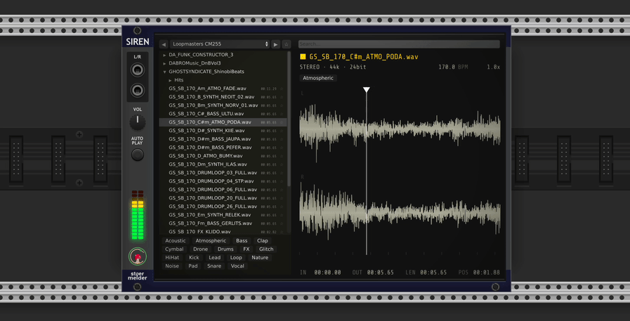
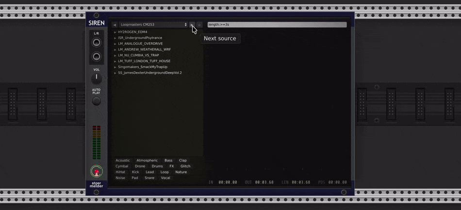
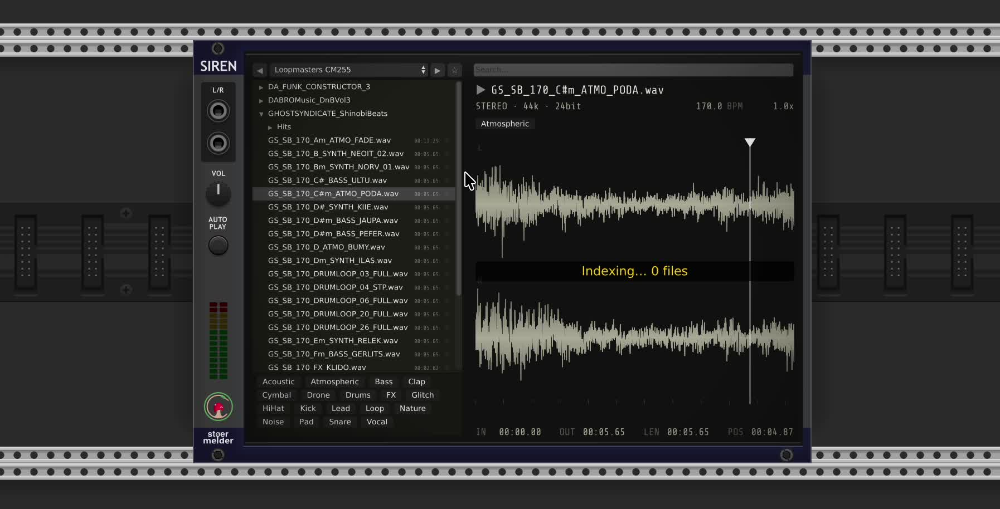
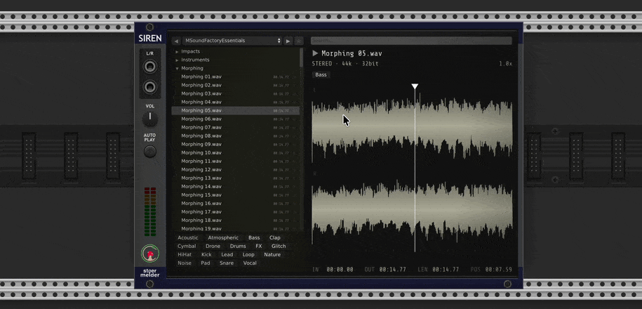
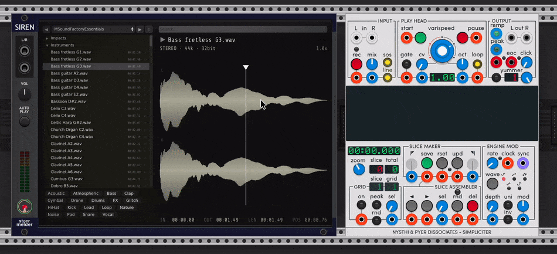
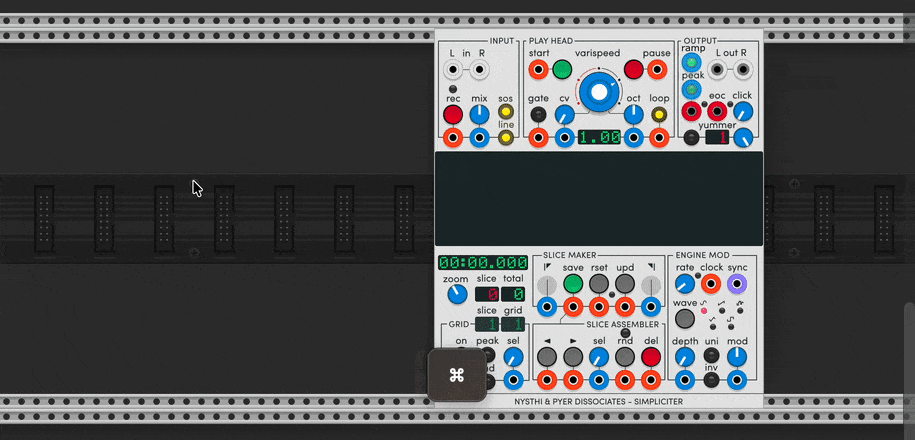
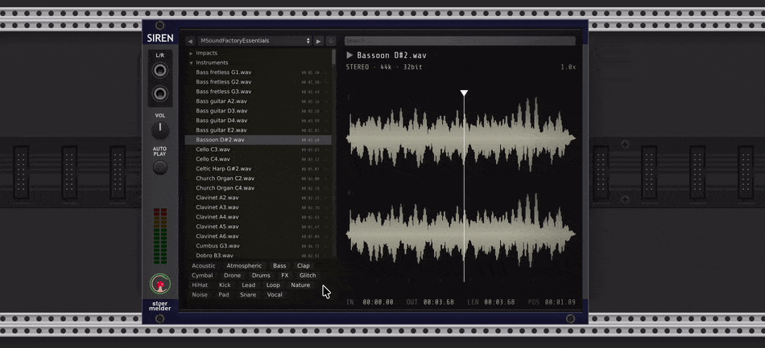
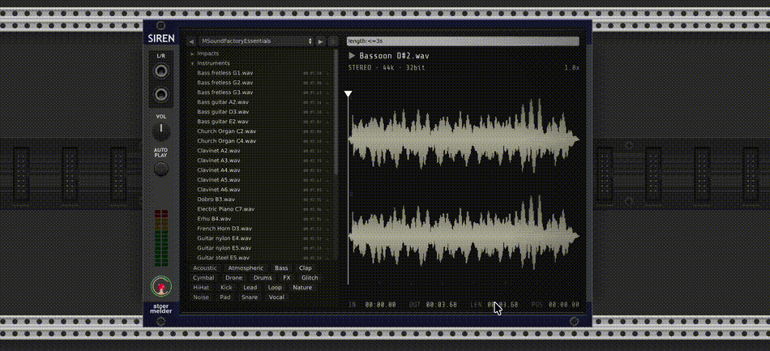
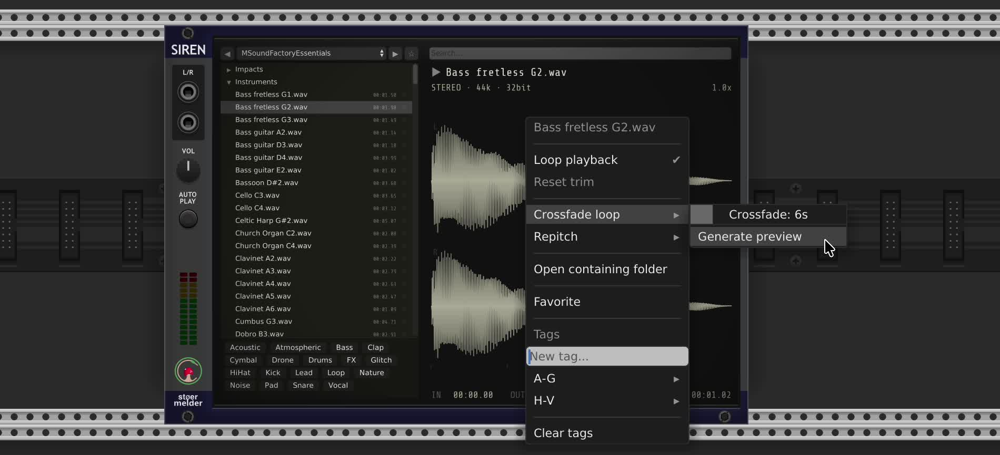
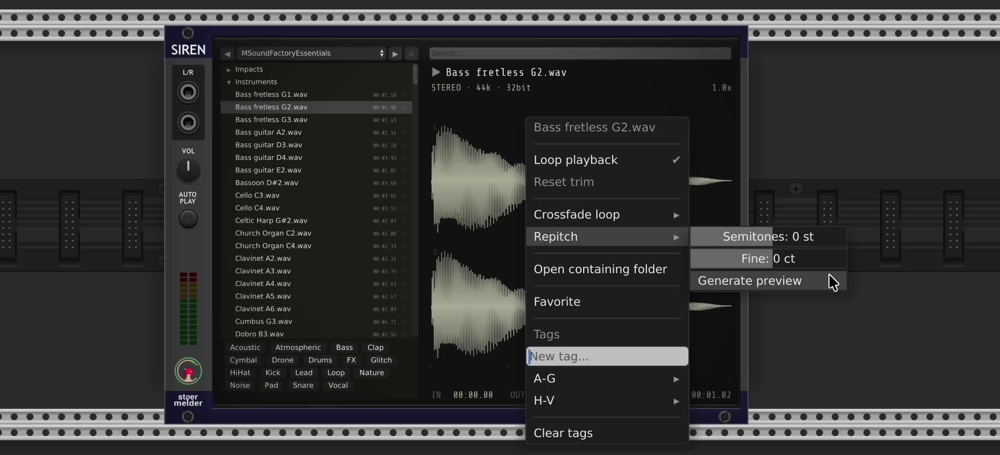

# stoermelder SIREN

SIREN is an audio file browser and playback module - a collaboration with [Omri Cohen](https://omricohen-music.com/): you can drop samples out of the browser onto your sampler modules. SIREN is not a sampler module - it helps you organizing your samples and improving the workflow with sampler modules in VCV Rack.

**Features**

- Streams WAV, FLAC, and MP3 from disk; no full-file loading.
- Waveform preview with trim IN/OUT handles, looping, zoom, and scrubbing.
- Drag-and-drop onto any compatible module, with optional resampling or WAV conversion.
- Multiple root folders, switchable from the source menu.
- Favorites and a per-root metadata store (tags, favorites) shared between SIREN instances.
- Search by file or folder name with live filtering and keyboard navigation.
- Resampling on playback and on drop, with selectable quality.
- Tag filter with include and exclude states; per-file or per-folder tag editing.
- Automatic tag suggestions driven by an on-device audio classifier (18-tag vocabulary).
- Repitch: shift a sample's pitch by semitones without changing its length, audition it in-place, then drop the repitched result.
- Crossfade loop: rotate and crossfade the sample into a seamless loop, audition it in-place, then drop the result directly onto a sampler.
- Configurable output destination for generated files: next to the source, a custom folder, or the module's per-patch storage so the sample travels with the patch. An **Always copy** mode forces a copy into the target on every drop, even when no processing is needed.

## Setting Up

SIREN browses one folder at a time, called a *root container*. To add one:

1. Click the **source button** (top-left of the display) to open its menu.
2. Select **Add root…** and choose a folder.

You can add as many roots as you like and switch between them via the same menu. Use **Remove current root** to delete the currently active root. Tags and favorites are stored per root and recalled automatically.

The **◀** and **▶** arrow buttons flanking the source button cycle through your roots without opening the menu.

The lower part of the source menu controls how audio is processed:

- **Resample on playback** — resample on the fly to Rack's current sample rate while SIREN plays through its own outputs. Has no effect on the file on disk.
- **Resample on drop** — resample to Rack's current sample rate before handing the file to another module. Prevents pitch shifting in modules that don't resample themselves.
- **Resample quality** — choose between **Fast** (lowest CPU), **Default** (balanced), and **Best** (highest quality, most CPU). Affects resampling on drop only.
- **Convert to WAV on drop** — convert FLAC or MP3 files to WAV before dropping. Useful for modules that only accept WAV.
- **Folder for converted/trimmed files** — when SIREN has to generate a new file (resampling, format conversion, or trimming), it is normally written next to the source file. Use this submenu to redirect those generated files to a single custom folder of your choice. The original file is never modified. Three targets are available:
  - **Same folder as source file** — write the generated file next to the original (the default).
  - **Custom folder…** — choose a single folder where every generated file is written. The folder path is shown in the menu once it is set.
  - **Patch storage** — write the generated file into the module's per-patch storage directory, so the file is bundled with the saved patch and travels with it. Please note, that these files get deleted, if the SIREN module is removed from the patch.
- **Always copy** — when one of the two non-source targets is selected, force a copy of the source file into that target on every drop, even when no conversion, resampling, or trimming is required. The original file is left untouched. Disabled when **Same folder as source file** is selected, since copying a file on top of itself serves no purpose.

### Indexing

Select **Index metadata for all files** from the source menu to scan the active root in the background: SIREN reads each file's audio info (duration, sample rate, bit depth, channels) and detects BPM from filenames where possible, storing the results in the root's metadata file. A status overlay ("Indexing… N files") shows progress.

Indexing is optional — file infos and BPM are also picked up automatically as you browse, but the search function is limited to files which are known in the index. Indexing a data source ensures, that all files are considered while searching.

To stop a scan before it finishes, select **Cancel indexing** in the source menu (only visible while a scan is running).

## Playing Files

**Click** a file to load it. **Shift-click** (or click while the **Autoplay** button is lit) to load *and* start playback immediately.

The **Autoplay button** toggles automatic playback on every selection. When lit, any file you click starts playing straight away. Shift-click always plays regardless of the Autoplay setting.

Press **Space** to toggle play/stop from anywhere.

### Trim Points

Two handles at the top edge of the waveform define the playback range:

- Drag the **left handle** holding *Shift* to set the start point.
- Drag the **right handle** holding *Shift* to set the end point.

The highlighted region between them is the active playback range.

### Loop

Click the **Loop** context menu option to repeat playback between the IN and OUT points. When loop is off, playback stops at the OUT point.

## Drag and Drop

**Drag** any file from the browser onto a compatible module to load it there. If a trim region is set, only that region is prepared for the drop.

You can also start a drag from anywhere in your patch: hold `Ctrl/Cmd + Shift` and click, then drag — SIREN will load the last selected sample and start a drag-and-drop from that point.

The **Resample on drop**, **Resample quality**, **Convert to WAV on drop**, **Folder for converted/trimmed files**, and **Always copy** options in the source menu (see [Setting Up](#setting-up)) control how the file is prepared when it is handed to another module. **Resample on playback** applies to SIREN's own L/R outputs and has no effect on drops.

## Browsing Files

Click any audio file to load it into the preview pane. Hovering over a file shows a tooltip with its name, duration, and any tags assigned to it.

### Tags

The **tag bar** at the bottom of the browser lists all known tags as chips. Clicking a chip cycles its state through three modes:

| State | Appearance | Effect |
|---|---|---|
| Off | dim chip | tag is ignored when filtering |
| Included | highlighted chip | browser shows only files carrying this tag |
| Excluded | red, strike-through chip | browser hides files carrying this tag |

Multiple chips can be active at once, and include and exclude states can be mixed. When several included tags are active, only files carrying **all** of them are shown; any excluded tag further removes files that carry it. **Right-click** the tag bar for filter actions.

Right-click a file to open its context menu. Under **Tags**:

- Type in the text field and press **Enter** to create and apply a new tag.
- Click any tag name in the list to toggle it on or off for that file. A checkmark indicates the tag is currently applied.

Tags are case-insensitive — "Kick" and "kick" are treated as the same tag.

To tag all audio files inside a folder at once, right-click the folder and use **Tag all files**.

To remove every tag from a file at once, or from every file inside a folder, right-click and choose **Clear tags**.

#### Suggest Tags

SIREN can suggest tags automatically from the audio itself. Right-click any file or folder in the browser and pick **Suggest tags** to start a one-shot analysis.

SIREN analyses the first 30 seconds of audio, extracts a feature vector, and proposes up to five tags from a fixed vocabulary of 18 entries: **Acoustic, Atmospheric, Bass, Clap, Cymbal, Drone, Drums, FX, Glitch, HiHat, Kick, Lead, Loop, Nature, Noise, Pad, Snare, Vocal**. Each proposal shows the file it would be applied to and a confidence score. SIREN also considers the filename for hints on matching tags - the string "kick" in the filename will result in a *Kick* suggestion.

The dialog groups suggestions by tag. **Check** the ones you want to apply and confirm — checked tags are added to the matching files in the active root. Already-applied tags are filtered out of the proposal list, so you only see tags that are genuinely new for each file. Right-click a proposal to remove it from its group before confirming.

#### Running the Tag Classifier on all files

Select **Suggest tags on all files** from the source menu to analyse every audio file in the active root and apply automatic tag suggestions in one pass. This is the bulk equivalent of right-clicking individual files and choosing **Suggest tags** — SIREN processes each file using the same 18-tag classifier and adds the resulting tags directly to the metadata without a confirmation dialog.

### Favorites

Click the **star** at the right edge of any file row to toggle it as a favorite. Use the ☆ button in the top bar to show only favorites.

### Search

Type in the **Search** field to filter the tree. Search matches:
- file names
- folder names — a folder is shown if its name matches, along with all its contents

Press **Escape** or double-click the field to clear the search.

### Filtering by Length and BPM

Alongside plain text, the search field accepts numeric filter terms:

- `length:<1s` — files shorter than 1 second. `length` (or `duration`/`len`) accepts seconds (`s`) or minutes (`m`), e.g. `length:>=2.5m`.
- `bpm:140` — files with a detected BPM of ~140 (small tolerance applied).
- `bpm:>120`, `bpm:<=90` — BPM above/below a threshold. Operators `<`, `<=`, `>`, `>=`, and `=` are supported.

Filter terms can be combined with each other and with plain text, e.g. `kick bpm:140 length:<1s`. A folder matches a filter if any file inside it does. Files for which the relevant info hasn't been read yet (see [Indexing](#indexing)) won't match a filter — run **Index metadata for all files** first if filters seem to miss results.

**Note** - BPM information is extracted from the filename.

## Crossfade Loop

SIREN can process the current sample or the current trim region into a seamless loop and let you audition it before committing. Right-click the preview pane and select **Generate crossfade loop**.

**Crossfade duration** — the slider in the context menu sets the blend length in seconds (default 6s, range 0.01–60s). Longer crossfades produce a smoother join at the cost of shortening the output slightly.

**Dragging from loop preview mode** drops the loop-processed file. SIREN writes a new WAV to the destination selected under **Folder for converted/trimmed files** (next to the source by default) and hands that file to the receiving module — the same crossfade that you heard during preview is baked in.

**Note:** If the trim region is large, SIREN shows a confirmation dialog estimating how much temporary memory the preview will use before it begins decoding. Confirm to proceed or cancel to abort.

## Repitch

SIREN can shift the pitch of the current sample or trim region without changing its duration, and let you audition the result before committing. Right-click the preview pane and select **Generate repitch preview**.

**Repitch** / **Repitch fine** — the sliders in the context menu set the pitch shift: **Repitch** in semitones (range -24 to +24, default 0) and **Repitch fine** in cents (range -100 to +100, default 0). The two combine into a single pitch shift. Positive values raise the pitch, negative values lower it.

**Dragging from repitch preview mode** drops the repitched file. SIREN writes a new WAV to the destination selected under **Folder for converted/trimmed files** (next to the source by default) and hands that file to the receiving module — the same pitch shift that you heard during preview is baked in.

**Note:** If the trim region is large, SIREN shows a confirmation dialog estimating how much temporary memory the preview will use before it begins decoding. Confirm to proceed or cancel to abort.

## Keyboard Shortcuts

| Key | Action |
|---|---|
| `Space` | Play / Stop |
| `↑` / `↓` / `←` / `→` | Navigate browser |
| `+` or `]` | Zoom in |
| `−` or `[` | Zoom out |
| `0` | Fit waveform to width |
| `Escape` | Clear search / cancel loop preview |

## Tips

- **Searching large libraries** — The search field filters live as you type and also matches folder names, so you can find a subfolder quickly without expanding the whole tree.

- **Trimming before drop** — Set IN/OUT trim points first, then drag the file. The receiving module gets only the trimmed segment.

- **Metadata location** — Tags, favorites, and cached audio info (duration, sample rate, BPM, etc.) are saved as a JSON file alongside each root container. They survive module removal and can be backed up or shared.

- **Waveform cache** — The first time a file is previewed, SIREN builds a waveform cache in your Rack user folder (`Stoermelder-P1/siren-cache/`). Subsequent opens are instant.

## Changelog

- v2.5.0
  - Initial release
- v2.x.x
  - Added support for multi-channel files on Re-pitch and Crossfade-loop
  - Fixed crash when playing multi-channel files