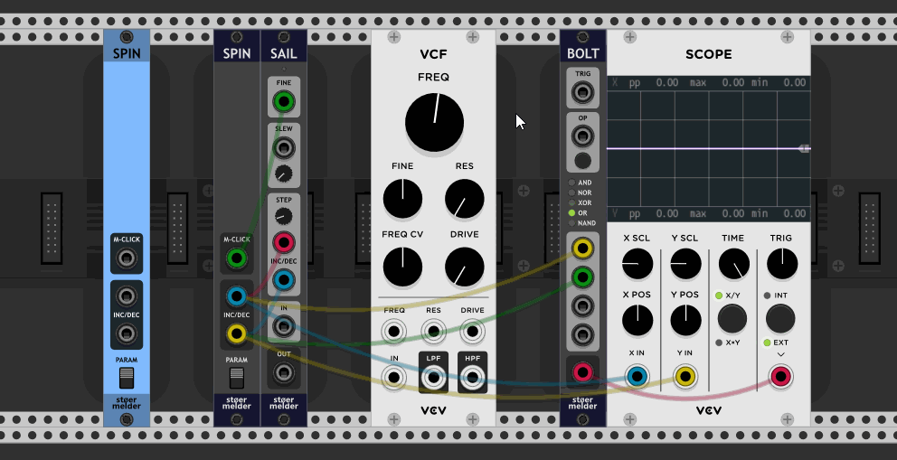
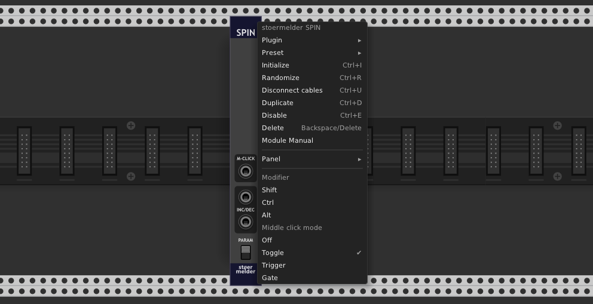

# stoermelder SPIN

SPIN is a utility module that converts mouse‑wheel events or middle mouse‑button clicks into triggers. It is especially useful with [SAIL](../sail/Sail.md): together they provide mouse‑wheel control of hovered parameters and fine‑control via the middle mouse‑button.

All ports of the module output a voltage of **10 V**. _INC_ and _DEC_ are used for positive and negative mouse‑wheel changes, respectively, while **M‑CLICK** outputs 10 V for middle‑mouse‑button events.

The _PARAM_ switch controls whether events are handled only while hovering over a parameter of any module. If _
_PARAM_ is switched to the lower position, events are handled constantly (according to the used modifiers, see the passage below).

There are several options available in the context menu:

- The mouse wheel is primarily used in Rack to scroll the current view. The module provides modifiers: when enabled, mouse‑wheel events are only caught if the keyboard keys are held while scrolling. Modifiers can be combined or disabled entirely.

- The middle click can be used to generate triggers, to generate gates (as long as the button is held), or to toggle the output value. Additionally, middle‑click handling can be disabled. Note that modifiers also apply to the middle click.

Please note that you cannot use multiple instances of this module with the same settings; only the first instance will receive and handle events. However, you can use multiple instances with different modifiers.

## Changelog

- v1.7.0
    - Initial release
- v1.9.0
    - Improved transition between scrolling and parameter adjustments on hover (#260)
- v2.0.0
    - Fixed middle mouse button handling in Rack v2 (#372)