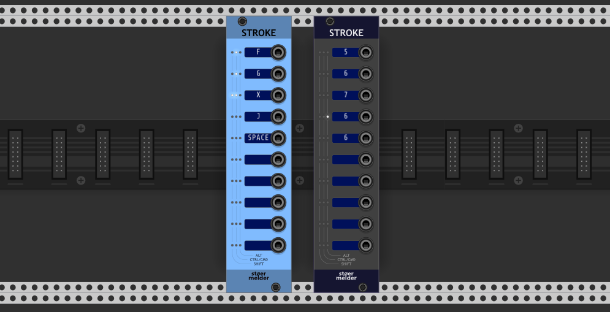
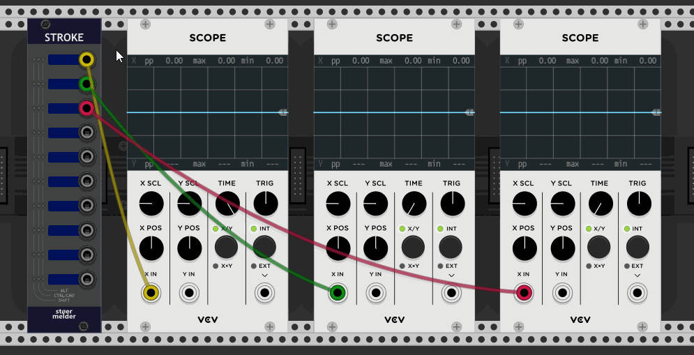

# stoermelder STROKE

STROKE is a utility module which converts any hotkey command (assuming it is not used anywhere else in Rack) into triggers or gates. Additionally, the module provides some special commands which aren't available anywhere else in Rack.

The module provides ten independent mapping slots which are unmapped by default. A slot needs to be "learned" for a hotkey using the context menu option _Learn_. The currently assigned key is visible on the display and its modifiers (ALT, CTRL/CMD and SHIFT) on the LEDs.

The module also supports mouse-button events: If your mouse has more than three buttons, these can be mapped the same way as hotkeys; modifiers apply as well. Since v1.9.0, the left, right, and middle mouse buttons can be mapped in STROKE when used with modifiers.

### Commands

| Category | Command | Description | Notes |
|----------|---------|-------------|-------|
| | **Off** | The hotkey is caught by the module, but no action is executed. | |
| **CV** | **Trigger** | The hotkey generates a 10V trigger signal on the output port. | |
| **CV** | **Gate** | The hotkey generates a 10V gate signal on the output port for as long as the key is pressed. | |
| **CV** | **Toggle** | The hotkey toggles a 10V signal on the output port on and off. | |
| **View** | **Zoom to module** | Fits the module that is currently hovered by the mouse pointer on the screen. | |
| **View** | **Zoom to module (smooth)** | Same as **Zoom to module**, but transitions smoothly. | added in v1.9.0 |
| **View** | **Zoom to module 1/3** | Centers the hovered module and adjusts zoom so it occupies one third of the screen height. | |
| **View** | **Zoom to module 1/3 (smooth)** | Same as **Zoom to module 1/3**, but transitions smoothly. | added in v1.9.0 |
| **View** | **Zoom level to module** | Centers the hovered module; zoom level can be set in the context menu. | |
| **View** | **Zoom level to module (smooth)** | Same as **Zoom level to module**, but transitions smoothly. | added in v1.9.0 |
| **View** | **Zoom to specific module** | Centers a specific module of the patch on the screen. | added in v2.0.0; requires "learning" a module; slot display turns red while learning |
| **View** | **Zoom to specific module (smooth)** | Same as **Zoom to specific module**, but transitions smoothly. | added in v2.0.0 |
| **View** | **Zoom out** | Zooms out so that everything fits on the screen. | |
| **View** | **Zoom out (smooth)** | Same as **Zoom out**, but transitions smoothly. | added in v1.9.0 |
| **View** | **Zoom toggle** | If zoom <100% view is zoomed out to fit all; if >100% the hovered module is fitted on the screen. | |
| **View** | **Zoom toggle (smooth)** | Same as **Zoom toggle**, but transitions smoothly. | added in v1.9.0 |
| **View** | **Scroll left / right / up / down** | Scrolls the current view in the specified direction. | added in v1.9.0; same as cursor keys |
| **Parameter** | **Randomize** | Randomizes the value of a parameter (hover required). | |
| **Parameter** | **Value copy** | Copies the value of a parameter (hover required). | |
| **Parameter** | **Value paste** | Pastes the previously copied parameter value (hover required). | |
| **Module** | **Add module** | Adds a module with a preset to the patch. | added in v1.9.0; requires "learning" a module; slot display turns red while learning |
| **Module** | **Add random module** | Adds a random module to the patch. | added in v2.0.0 |
| **Module** | **Send hotkey to module** | Sends a learned hotkey to a learned module (e.g., "Ctrl+R" for Randomize) even if the module is not hovered. | added in v1.9.0; experimental; requires learning a module and a hotkey |
| **Module** | **Save preset** | Triggers the hovered module's **Preset → Save as** to save the current preset. | added in v2.0.0 |
| **Module** | **Save default preset** | Triggers the hovered module's **Preset → Save default** to store the module's default preset. | added in v2.0.0 |
| **Cable** | **Toggle opacity** | Toggles cable opacity between 0% and the current level. | The slider in the "View" menu can be used to undo this change. |
| **Cable** | **Toggle visibility** | Hides or shows all cables internally. | Undo only via this module. |
| **Cable** | **Next color** | Sets the cable color to the next color in Rack's cable palette. | Hover a cable plug to use. |
| **Cable** | **Color** | Sets a cable to a user-defined hexadecimal color code. | Set via the context menu; hover a cable plug to use. |
| **Cable** | **Rotate ordering** | Moves the next cable to the top of a stacked cable on an output plug. | Honors the physical order of plugged cables; hover a cable plug to use. |
| **Special** | **Toggle framerate widget** | Toggles Rack's built-in framerate widget in the top-right window corner. | Disabled for Rack v2 |
| **Special** | **Toggle busboard** | Hides the busboard graphics in the background. | added in v1.8.0; disabled for Rack v2 |
| **Special** | **Toggle engine pause** | Triggers Engine → Sample rate → Pause. | added in v1.8.0; disabled for Rack v2 |
| **Special** | **Toggle lock modules** | Triggers View → Lock modules. | added in v1.8.0 |
| **Special** | **Minimize window** | Minimizes the VCV Rack window. | added in v2.0.0 |

### Tips

- While you can assign duplicate hotkeys, only one of them will work.

## Changelog

- v1.7.0
    - Initial release of STROKE
- v1.8.0
    - Added commands _Toggle engine pause_ and _Toggle lock modules_
    - Added command _Toggle busboard_
    - Added LEDs for signaling an activated hotkey
    - Allow loading presets (#187)
    - Improved behavior of command _Cable opacity_ across restarts of Rack (#197)
- v1.9.0
    - Allow mapping mouse buttons 0/1/2 (left/right/middle) in use with modifiers
    - Fixed not working mappings caused by Num Lock state (#220)
    - Fixed not working mappings caused by use of numpad keys (#220)
    - Added view-commands using smooth transitions (#139)
    - Added _Add module_ command
    - Added _Send hotkey to module_ command
    - Added scroll-commands (#252)
    - Added tooltips for mapped commands
- v1.10.0
    - Improved behavior of parameter copy/paste commands (#273)
- v2.0.0
    - Added commands _Add random module_, _Save module preset_ and _Save module default preset_ (#345)
    - Added commands _Zoom to specific module_ and _Zoom to specific module (smooth)_ (#357)
    - Added command _Minimize window_
    - Fixed wrong hotkey modifier on Mac (Ctrl instead of Cmd)
    - Fixed broken _Zoom to module_ and _Zoom toggle_ commands (#382)
- v2.2.0
    - Fixed cables' _Toggle visibility_ command
- v2.3.0
    - Fixed broken _Zoom out_ command