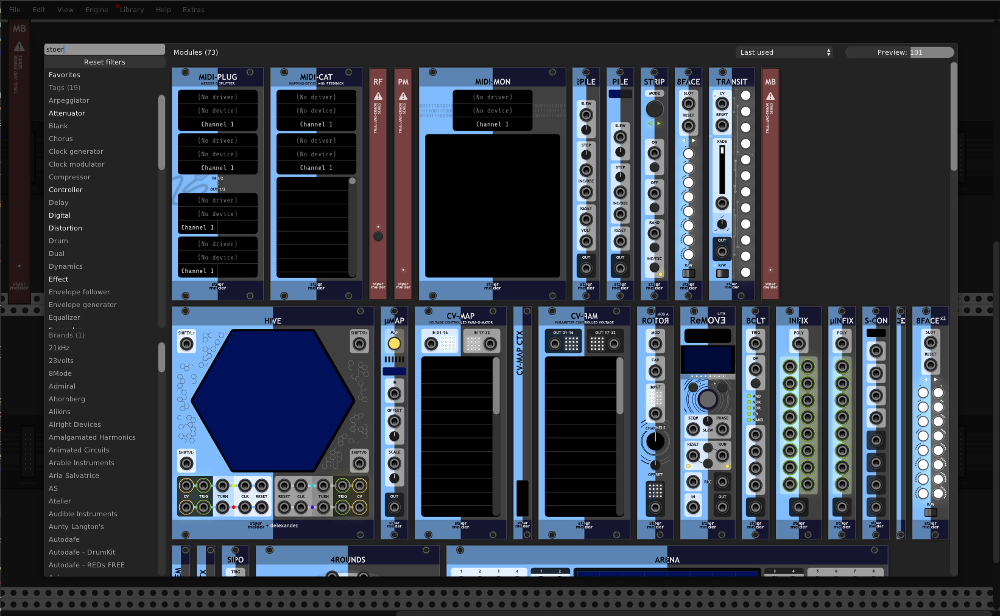

# stoermelder MB

MB is a module for experimental replacement for Rack's module browser, formerly available in stoermelder's PackTau. It brings back the browser from Rack v0.6x and has a modified browsers from Rack v1.x and v2.x with adjustable preview size, favorites, extended filtering options, custom tags and more.

### Introduction by Omri Cohen

## Custom tags

MB maintains its own custom tag system separate from Rack's built-in tags. Custom tags are stored in your local Rack directory and can be exported/shared like favorites and hidden module settings.

**Adding custom tags** — Use the auto-generate functions described below, or add tags manually through the context menu of individual modules in the browser.

**Viewing and managing tags** — The context menu on the module lists all existing custom tags with options to delete them.

### Auto-generate custom tags

MB can automatically assign custom tags to modules using keyword matching. The context menu offers three auto-tagging options:

**Auto-generate custom tags** — Uses a curated rule set with ~70 tag categories covering synthesis techniques (Wavetable, FM Synthesis, Phase Modulation), filter types (Ladder Filter, Comb Filter), modulation utilities (Attenuverter, Comparator, Shift Register), effects (Bitcrusher, Tape, Spring Reverb), and more. Keywords are matched via fuzzy substring search against module names and descriptions.

**Auto-generate 'MetaModule' tag** — Connects to https://metamodule.info to download a list of MetaModule-compatible plugins and assigns the "MetaModule" tag to matching modules.

**Auto-generate tag from search** — Enter a custom search term (which becomes the tag name) and modules matching that query are tagged accordingly. For example, searching "Sequencer" would show all untagged modules containing "sequencer" in name/description.

All three options show a confirmation dialog listing the proposed tag assignments, allowing you to verify or adjust individual assignments before applying.

## Predefined tags

MB allows you to add or remove predefined tags (the classic VCV Rack tag aliases like "Attenuator", "Mixer", "MIDI", etc.) on individual modules. This is useful if a module has incorrect or incomplete tags. Please note, that modification on predefined tags are only visible within the module browsers of the MB module.

## Width filter (*v2 mod*)

The *v2 mod* browser includes a **Width** filter button in the header bar. Module widths are measured in HP (horizontal pitch units) and are determined from each module's actual panel widget — this information is not stored in the plugin manifest.

### Filtering by width

Click the **Width** button to open a dropdown listing all HP values known for installed modules. Clicking an entry cycles through three filter modes:

| Click | Mode | Effect |
|-------|------|--------|
| 1st | `=` | Show only modules of exactly this width |
| 2nd | `≤` | Show all modules this width or narrower |
| 3rd | `≥` | Show all modules this width or wider |
| 4th | — | Clear the width filter |

The active entry shows the mode symbol (`=`, `≤`, `≥`). All other HP values currently passing the filter are marked with a checkmark (✔). The Width button label reflects the active filter, for example *Width: ≤ 8 HP*.

A **Filter by N HP** shortcut is also available in the right-click context menu of any module whose width is already known — it sets an exact-match filter for that module's HP value.

### Populating width data

Width data is determined lazily: it is captured automatically the first time a module preview is rendered in the browser. To populate widths for all installed modules at once (making the full HP range available in the dropdown without browsing through everything first), use **Determine width for all modules**. This re-scans every model and saves the result immediately.

## Sorting (*v2 mod*)

The *v2 mod* browser's **Sort** button offers several ordering options, one of which is **Newest** — sorting modules by the date each was first added to its plugin, rather than by the date the plugin itself was last updated (as "Recently updated" does).

This information is not part of the plugin manifest and is not available locally, so MB downloads it separately from the [VCV Rack Library](https://github.com/VCVRack/library) and caches it in your local Rack directory. The **Newest** entry stays disabled (greyed out) in the Sort menu until this data has been downloaded at least once.

**Auto-download data for 'Newest' sort** — a menu option (disabled by default) that automatically downloads this data in the background whenever a new or updated plugin is detected in your plugins folder. Enabling it shows a confirmation dialog, since it connects to an external service.

The Sort menu also has two **Width** entries (*narrow → wide* / *wide → narrow*), which sort modules by their HP width instead of by the selected sort option above. Clicking an active width entry again disables it and returns to the previous sort option. Modules with unknown width (see [Width filter](#width-filter-v2-mod)) are sorted to the end. 

## *v2_mod* keyboard shortcuts

The *v2-mod* browser variant supports keyboard navigation and shortcuts:

**Navigation** (when search field is focused or in the module grid):
| Key | Action |
|-----|--------|
| *Click* | Add module | 
| `Shift`+*Click* | Add module, keep browser open |
| `↓` | Move down in the module grid |
| `↑` | Move up in the module grid |
| `→` | Move to the next module in the row |
| `←` | Move to the previous module in the row |
| `Enter` | Add the selected module to the rack |
| `Escape` | Close the browser |
| `Backspace` | Clear search and filters (when search is empty) |
| `Space` | Toggle Favorites filter (when search is empty) |
| `Ctrl/Cmd`+`Space` | Toggle listing of hidden modules
| `Ctrl/Cmd`+`1` | Open Brand filter dropdown |
| `Ctrl/Cmd`+`2` | Open Tag filter dropdown |
| `Ctrl/Cmd`+`3` | Open Custom Tag filter dropdown |

**Module hover shortcuts** (hover over a module):
| Key | Action |
|-----|--------|
| `Ctrl/Cmd`+`F` | Toggle favorite status of the hovered module |
| `Ctrl/Cmd`+`H` | Toggle hidden status of the hovered module |

**Dropdown menus** (Brand, Tag, Custom Tag filters):
| Key | Action |
|-----|--------|
| `↓`/`↑` | Navigate up/down through items |
| `←`/`→` | Navigate to previous/next row |
| *Any key* | Filter items by typing (incremental filter) |
| `Backspace` | Clear filter text (show all items) |
| `Enter` | Toggle selection of the highlighted item |

## Patch browser for .vcv/.vcvs

In addition to the browsers *v0.6*, *v1_mod*, and *v2_mod* module browsers, MB includes a **Patch browser** for browsing saved patches and selections.

**Accessing the Patch browser** — Hold `Ctrl` (or `Cmd` on Mac) and right-click anywhere on the MB module to open the Patch browser.

**Adding sources** — The Patch browser supports multiple source types:
- **.vcvs folder** — Add a folder containing saved `.vcvs` patches as a source
- **.vcv folder** — Add a folder containing patches in the legacy `.vcv` format
- **PatchStorage** — Connect to the PatchStorage online service to browse and download shared patches

**Managing sources** — From the context menu you can:
- Add new sources using the dedicated menu items
- Remove the currently selected source
- Switch between active sources — each source appears as a checkbox item; checked sources are active

**Per-source options** — When a source is active, its specific menu items appear below a separator. These options vary by source type (e.g., filesystem sources offer cache clearing, PatchStorage may offer additional filtering).

**Persistence** — All configured sources and the selected favorite source are saved automatically and restored when Rack restarts. Sources can be exported and shared via MB's import/export function on the context menu.

### Filesystem source indexing

The filesystem sources (`.vcvs` and `.vcv` folders) maintain a persistent **index file** (`mb-index.json`) in the root of the source folder. This index stores metadata for each patch file:

- **Description** — User-editable text description of the patch
- **Tags** — Predefined VCV Rack tags (Attenuator, Mixer, MIDI, etc.)
- **Custom tags** — User-defined tags for organizing patches
- **Favorite** — Whether the patch is marked as favorite

**How indexing works** — On source attach, MB scans the folder recursively for patch files and syncs with the stored index:
- New files are added to the index automatically
- Deleted files are removed from the index
- **Moved files are detected** by filename matching — metadata is preserved and transferred to the new location
- Changes take effect immediately without manual intervention

**Fuzzy search** — The index builds a cached fuzzy search database on first use. Search matches against both filename and description, with filename weighted higher for relevance. The database rebuilds lazily when the index changes.

### PatchStorage.com source

The **PatchStorage** source connects to [patchstorage.com](https://patchstorage.com) to browse and download shared patches. Categories from the site (e.g., "Synthesizers", "Effects", "Utilities") are used as containers, with patches organized by the VCV Rack platform filter.

**How it works** — On first attach, MB fetches:
1. Platform ID for VCV Rack from the API
2. All categories from PatchStorage
3. Patch metadata on demand

All data retrieved from PatchStorage is cached until the next restart of Rack.

**Containers** — Categories are sorted alphabetically and used as the folder hierarchy.

**Pages** — Each category contains multiple pages of patches (e.g., "Page 1", "Page 2", ...). Pages are dynamically created based on the total number of patches in that category, with typically 100 patches per page. Open a category to see its available pages in the file list.

**Patch metadata** — Patches display their name, author, description, download count, and tags from PatchStorage.

**Downloading patches** — Click a patch to download it from PatchStorage and load it into Rack. Downloads are cached locally to avoid repeated network requests.

**Read-only** — Unlike filesystem sources, PatchStorage is read-only. You cannot edit descriptions, tags, or favorites directly in MB.

**Lazy loading** — Categories, patches, and tags are loaded on demand to minimize API calls. Status messages update in real-time during fetches.

**API endpoint** — Uses `https://patchstorage.com/api/beta`.

### Keyboard shortcuts

The Patch browser supports keyboard navigation and shortcuts:

**Navigation** (when search field is focused or in the file list):
| Key | Action |
|-----|--------|
| **↓** | Move down in the file list |
| **↑** | Move up in the file list |
| **→** | Enter/open a folder or load a patch |
| **←** | Go back to parent folder |
| **Backspace** | If text search is empty, clears all filters (same as Escape) |
| **Ctrl/Cmd+2** | Open Tag filter dropdown |
| **Ctrl/Cmd+3** | Open Custom Tag filter dropdown |
| **Ctrl/Cmd+F** | Toggle favorites filter |

**Dropdown menus** (Tag, Custom Tag):
| Key | Action |
|-----|--------|
| **↓/↑** | Navigate up/down through items |
| **←/→** | Navigate to previous/next row |
| *Any key* | Filter items by typing (incremental filter) |
| **Backspace** | Clear filter text (show all items) |
| **Enter** | Toggle selection of the highlighted item |

## Tips

- Display of hidden modules can be toggled by hotkey `Shift`+`Space`.

- Hitting the `Space`-key will toggle the _Favorites_ category.

- Favorites and hidden modules are stored in your local Rack-directory. You can share them or copy them to another computer by MB's export/import function on the context menu.

- For _v1 mod_ and _v2 mod_, by context menu option the "brands"-section can be hidden (added in v1.9.0).

- For _v1 mod_ and _v2 mod_, by context memu option also the modules' description can be searched (added in v1.9.0).

- **Search threshold** — Controls how fuzzy the fuzzy search matching is. Lower values (default 0.5) show more results with looser matching, while higher values (1.0) require closer matches.

- **Favorite modes** — MB supports two favorite modes (VCV Rack / MB) controlling how favorites are stored and displayed.

- **Magnifier overlay** — When enabled, hovering over a module preview in the browser shows a zoomed magnification loupe following the cursor. 

## Changelog

- v1.8
    - Initial release
- v1.9
    - Added option to hide the "brands" section of the V1-browser (#223)
    - Added option to search module descriptions (https://github.com/stoermelder/vcvrack-packtau/pull/9)
- v2.0.0
    - Fixed usage in multiple plugin-instances
    - Fixed crash on exiting Rack after adding MB (#352)
    - Fixed wrong hotkey modifier on Mac (Ctrl instead of Cmd) on Space-key
    - Added missing template loading after adding a module (#369)
- v2.4.0
    - Added custom tags for user-defined module grouping
        - with auto-tagging using a curated list of tags
        - with auto-tagging for available modules on MetaModule
    - Added "v2 mod" browser variant
        - with improved drop-down menus, also with keyboard-filtering
        - with keyboard-navigation using cursor-keys
        - with hotkeys Ctrl/Cmd+1/2/3 for Brand/Tags/Custom Tag drop-down menus
        - with keyboard-navigation and filtering within the drop-down menus
    - Added ability to add/remove predefined tags (only within MB)
    - Added fuzzy search (similar to the default module browser)
        - with setting for the fuzzy search threshold
    - Added an option to select "Favorite" handling (Legacy (MB) / Built-in VCV Rack)
    - Added an option to highlight favorites
    - Added model magnifier loupe option
    - Added integration into Rack's menu bar
    - Added Shift+Click to add a module without closing the browser
    - Added option to apply VCV Library whitelisting
    - Added option to show deprecated module models (now hidden by default) (#440)
    - Changed hotkey to toggle hidden modules to Shift+Space (because of Spotlight on Mac)
    - Fixed broken button of "Favorites" category
- v2.5.0
    - Added width (HP) filter and sorting to *v2 mod* browser
    - Fixed *v2 mod* scroll position when reopening the browser overlay
    - Fixed module placement to trace back to the right click mouse position
- v2.x.x
    - Added sorting option "Newest" to *v2 mod* browser