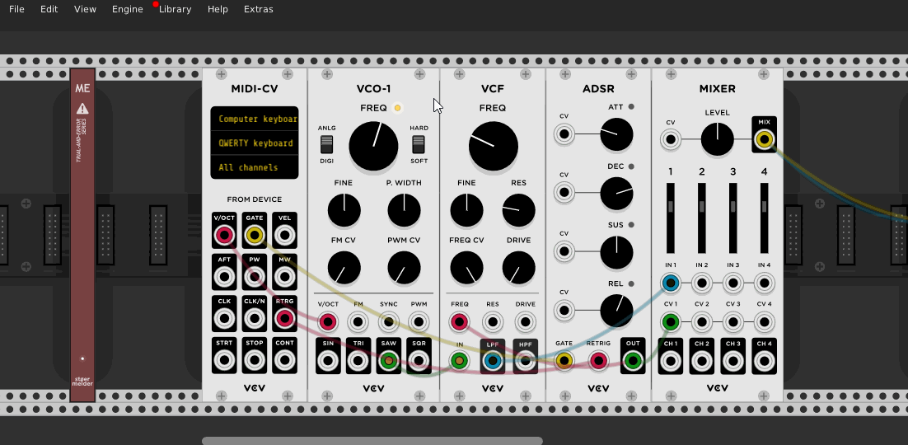
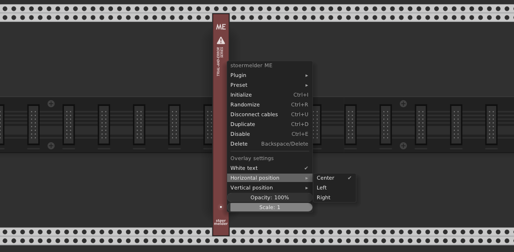

# stoermelder ME

ME (_mouse enhancements_) is an experimental utility module which provides a screen overlay on parameter changes made by mouse.

### Overlay settings

The screen overlay is used by different stoermelder modules (like [MIDI-CAT](../midicat/MidiCat.md) and [SAIL](../sail/Sail.md)) and ME allows some graphical settings for the overlay which are applied globally.

### Magnifier settings

The magnifier is a circular screen loupe that captures and magnifies the area around the mouse cursor when the assigned hotkey is held. When triggered, the captured area is displayed in a circle offset from the cursor.

- **Hotkey**: Click _Learning_ then press a key combination (with optional modifiers) to assign a new hotkey. Click _Clear hotkey_ to remove the binding.
- **Size (radius)**: Controls the radius of the display circle in pixels.
- **Zoom factor**: Controls the magnification level.

## Changelog

- v2.1.0
    - Added magnifier feature
- v2.0.0
    - Fixed usage in multiple plugin-instances